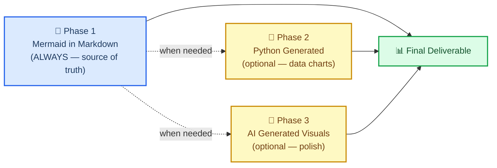
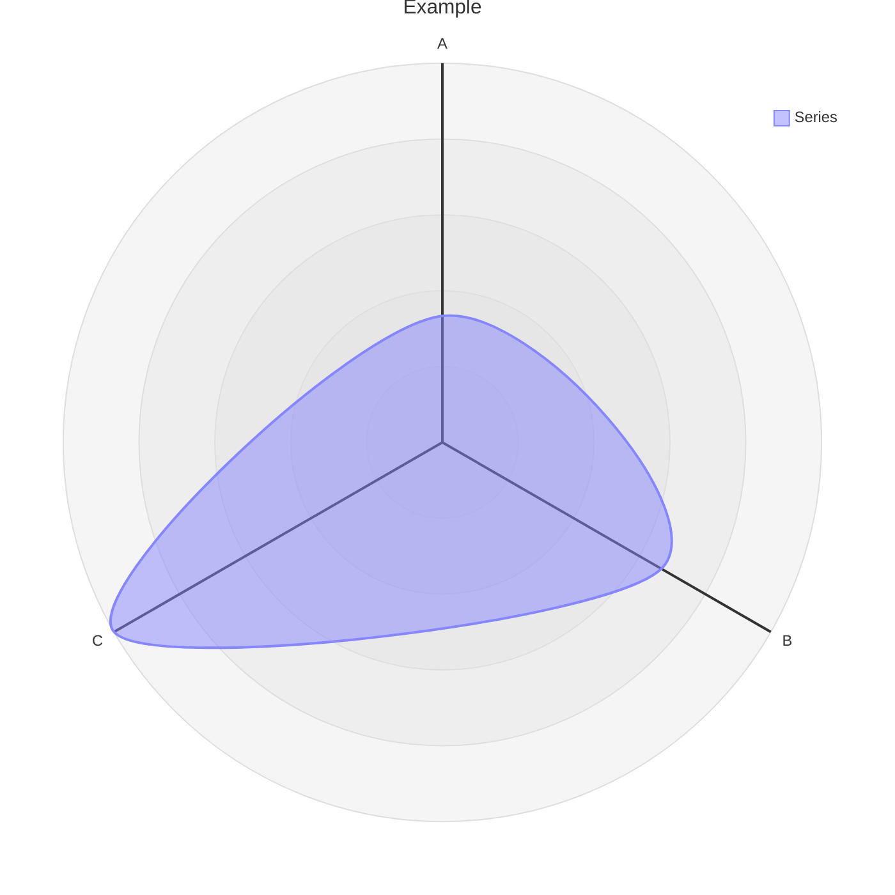

# Markdown 和美人鱼写作

## 概述

这项技能教您创建科学文档，并强制执行标准
使用 **markdown 并嵌入美人鱼图作为默认和规范格式**。

核心赌注：在 `.md` 文件中以美人鱼图表示的关系是
比任何图像都更有价值。它是文本，因此它在 git 中的差异很明显。它不需要构建步骤。
它可以在 GitHub、GitLab、Notion、VS Code 和任何 Markdown 查看器上本地呈现。它使用的标记比相同关系的散文描述要少。而且它总是可以在以后转换为精美的图像 - 但文本版本仍然是事实的来源。

> “您越多地以常规文本形式获得 .md 中的报告和文件，美人鱼就是 
> 以及简单的“脚本语言”。这有助于任何下游渲染
> ，尤其是 AI 生成的图像（使用美人鱼而不是仅仅使用美人鱼）长格式文本到
> 描述关系<tokens>此外，美人鱼可以与
> 一起渲染，几乎可以在任何地方由人类或AI轻松使用。“
>
> - Clayton Young（@borealBytes），K-Dense Discord，2026-02-19

## 何时使用此技能

在以下情况下使用此技能：

- 创建**任何科学文档** - 报告、分析、手稿、方法部分
- 编写**任何文档** - 自述文件、操作方法、决策记录、项目文档
- 生成**任何图表** - 工作流程、数据管道、架构、时间线、关系
- 生成**任何将进行版本控制的输出** - 如果要进入 git，则应该是 markdown
  - 与 **任何其他技能** 一起使用 - 该技能定义了包装所有其他输出的文档层
  - 有人要求你“添加图表”或“可视化关系” - 美人鱼第一，总是

不要从 Python matplotlib、seaborn 或用于结构图或关系图的 AI 图像生成开始。
 这些是第 2 阶段和第 3 阶段 - 仅当 Mermaid 无法表达所需内容时使用（例如，具有真实数据的散点图、照片级真实感图像）。

## 🎨 源格式哲学

### 为什么基于文本的图表获胜

|重要的是| Markdown 中的美人鱼 | Python / AI 图像 |
| -------------------------------------- | :-----------------: | :----------------: |
| Git diff 可读 | ✅ | ❌ 二进制 blob |
|可编辑，无需重新生成 | ✅ | ❌ |
|令牌效率与散文 | ✅ 更小 | ❌更大|
|无需构建步骤即可渲染 | ✅ | ❌需要托管|
|无需视觉即可由人工智能解析 | ✅ | ❌ |
|在 GitHub / GitLab / Notion 中工作 | ✅ | ⚠️如果托管|
|无障碍（屏幕阅读器）| ✅ accTitle/accDecr | ⚠️需要替代文本|
|稍后转换为图像 | ✅ 随时 | — 已经图像 |

### 三阶段工作流程



* *第 1 阶段是强制性的。** 即使您继续进行第 2 或第 3 阶段，Mermaid 源代码仍保持承诺。

### Mermaid 可以表达什么

Mermaid 涵盖 24 种图表类型。几乎每一种科学关系都适合一个：

|使用案例|图表类型|文件|
| -------------------------------------------------------- | ---------------- | ---------------------------------------------------------------- |
|实验工作流程/决策逻辑|流程图| `references/diagrams/flowchart.md` |
|服务交互/API调用/消息传递|序列| `references/diagrams/sequence.md` |
|数据模型/模式| ER图| `references/diagrams/er.md` |
|状态机/生命周期|状态| `references/diagrams/state.md` |
|项目时间表/路线图 |甘特图 | `references/diagrams/gantt.md` |
|比例/成分|馅饼 | `references/diagrams/pie.md` |
|系统架构（缩放级别）| C4| `references/diagrams/c4.md` |
|概念层次/头脑风暴|思维导图 | `references/diagrams/mindmap.md` |
|按时间顺序排列的事件/历史|时间轴 | `references/diagrams/timeline.md` |
|类层次结构/类型关系|班级 | `references/diagrams/class.md` |
|用户旅程/满意度地图|用户旅程 | `references/diagrams/user_journey.md` |
|两轴比较/优先级 |象限| `references/diagrams/quadrant.md` |
|需求追溯|要求 | `references/diagrams/requirement.md` |
|流量大小/资源分布|桑基 | `references/diagrams/sankey.md` |
|数字趋势/条形图+折线图| XY 图表 | `references/diagrams/xy_chart.md` |
|组件布局/空间布置|块| `references/diagrams/block.md` |
|工作项状态/任务列 |看板| `references/diagrams/kanban.md` |
|云基础设施/服务拓扑|建筑| `references/diagrams/architecture.md` |
|多维度对比/技能雷达|雷达| `references/diagrams/radar.md` |
|层级比例/预算|树形图 | `references/diagrams/treemap.md` |
|二进制协议/数据格式 |数据包| `references/diagrams/packet.md` |
| Git 分支/合并策略 | Git 图表 | `references/diagrams/git_graph.md` |
|代码式序列（编程语法）| ZenUML | `references/diagrams/zenuml.md` |
|多图构图模式 |复杂的例子 | `references/diagrams/complex_examples.md` |

> 💡 **选择正确的类型，而不是简单的类型。** 不要默认所有事情都使用流程图。
> 对于按时间顺序排列的事件，时间线胜过流程图。对于 
> 服务交互来说，序列胜过流程图。扫描表格并匹配。

- --

## 🔧 核心工作流程

### 步骤一：识别文档类型

从头开始写入之前检查模板是否存在：

|文件类型 |模板|
| ------------------------------------------ | ----------------------------------------------------------- |
|拉取请求记录 | `templates/pull_request.md` |
|问题/错误/功能请求 | `templates/issue.md` |
|冲刺/项目委员会| `templates/kanban.md` |
|架构决策（ADR）| `templates/decision_record.md` |
|演示/简报 | `templates/presentation.md` |
|研究论文/分析 | `templates/research_paper.md` |
|项目文档| `templates/project_documentation.md` |
|操作方法/教程 | `templates/how_to_guide.md` |
|状态报告| `templates/status_report.md` |

### 步骤 2：阅读样式指南

在编写任何 `.md` 文件之前：阅读 `references/markdown_style_guide.md`.

 内化的关键规则：

- **每个文档一个 H1** — 标题。 
- **仅 H2 标题上的表情符号** - 每个 H2 一个表情符号，H3/H4
 中没有 - **引用所有内容** - 每个外部声明都有一个脚注 `[^N]` 和完整的 URL
- **谨慎粗体** - 每段最多 2-3 个粗体术语，从不完整句子
- **每个 `</details>` 之后的水平规则** — 强制 
- **散文上的表格**，用于比较、配置、结构化数据
- **文本墙上的图表** — 如果描述流程、结构或关系，请添加 Mermaid

### 步骤 3：选择图表类型并阅读其指南

在创建任何 Mermaid 之前图表：读取`references/mermaid_style_guide.md`.

然后打开示例、提示和复制粘贴模板的特定类型文件（例如`references/diagrams/flowchart.md`）。

每个图表的强制规则：

```
accTitle: Short Name 3-8 Words
accDescr: One or two sentences explaining what this diagram shows.
```

- **无 `%%{init}` 指令** — 破坏 GitHub 暗模式
- **无内联 `style`** — 仅使用 `classDef`
- **每个节点最多一个表情符号** — 在标签开头
- **`snake_case` 节点 ID** — 匹配标签

### 步骤 4：编写文档 

从模板开始。应用 Markdown 风格指南。将图表与相关文本内联放置，而不是放在单独的“图表”部分中。

### 步骤 5：以文本形式提交

提交的内容是嵌入了 Mermaid 的 `.md` 文件。如果您还生成了 PNG 或 AI 图像，则这些是补充 — 降价是源。

- --

## ⚠️ 常见陷阱

### 雷达图语法(`radar-beta`)

* *错误：**
```mermaid
radar
title Example
x-axis ["A", "B", "C"]
"Series" : [1, 2, 3]
```

* *正确：**


- **使用 `radar-beta`** 而不是 `radar` （裸关键字不存在）
- **使用 `axis`** 定义维度，**不** `x-axis`
- **使用 `curve`** 定义数据系列，**不**用冒号引用标签
- **不使用 `accTitle`/`accDescr`** — 雷达测试版不存在支持可访问性注释；始终在图表上方添加描述性斜体段落

### XY 图与雷达混淆

|图表|关键词 |轴语法 |数据语法 |
| -------- | -------- | ----------- | ----------- |
| **XY 图表**（条形图/折线图）| `xychart-beta` | `x-axis ["Label1", "Label2"]` | `bar [10, 20]` 或 `line [10, 20]` |
| **雷达**（蜘蛛/网）| `radar-beta` | `axis id["Label"]` | `curve id["Label"]{10, 20}` |

### 在支持的类型上忘记 `accTitle`/`accDescr`

仅某些图表类型支持 `accTitle`/`accDescr`。对于那些不这样做的人，请始终在代码块正上方放置一个描述性斜体段落：

> _Radar 图表比较跨五个性能维度的三种方法。注意：雷达图不支持 accTitle/accDescr._


- --

## 🔗 与其他技能集成

### 使用 `scientific-schematics`

`scientific-schematics` 生成人工智能驱动的出版质量图像 (PNG)。使用美人鱼图作为原理图的**简要**：

```
Workflow:
1. Create the concept as Mermaid in .md (this skill — Phase 1)
2. Describe the same concept to scientific-schematics for a polished PNG (Phase 3)
3. Commit both — the .md as source, the PNG as a supplementary figure
```

### 与`scientific-writing`

`scientific-writing`出稿时，所有图表和结构图都应使用该技能的标准。写作技巧处理散文和引文；该技能处理视觉结构。

```
Workflow:
1. Use scientific-writing to draft the manuscript
2. For every figure that shows a workflow, architecture, or relationship:
   - Replace placeholder with a Mermaid diagram following this skill's guide
3. Use scientific-schematics only for figures that truly need photorealistic/complex rendering
```

### 使用 `literature-review`

文献综述会生成包含大量关系数据的摘要。使用此技能可以：

- 创建文献景观的概念图（思维导图）
- 显示出版时间线（时间线或甘特图）
- 比较方法（象限或雷达）
- 论文中描述的数据流图（序列或流程图）

### 使用任何产生输出的技能文档

在最终确定任何技能的任何文档之前，请应用该技能的清单：

- [ ]该文档是否使用模板？如果是的话，我是从正确的开始吗？
- [ ]美人鱼中的所有图都是 `accTitle` + `accDescr` 吗？
- [ ]没有 `%%{init}`，没有内联 `style`，只有 `classDef`？
- [ ]外部声明是否全部用`[^N]`引用？
- [ ]一个H1，只有H2上的表情符号？
- [ ]每个`</details>`后的横向规则？

- --

## 📚 参考索引

### 样式导轨

|指南|路径|线路 |涵盖什么|
| ----------------------- | ------------------------------------------- | -----| -------------------------------------------------- |
| Markdown 风格指南 | `references/markdown_style_guide.md` | 〜733 |标题、格式、引文、表格、Mermaid 集成、模板、质量检查表 |
|美人鱼风格指南| `references/mermaid_style_guide.md` | 〜458 |辅助功能、表情符号集、颜色类别、主题中立性、类型选择、复杂性级别 |

### 图类型指南（24 种）

E每个文件包含：生产质量示例、特定于该类型的提示以及复制粘贴模板。

`references/diagrams/` — 架构、块、c4、类、复杂\_示例、呃、流程图、甘特图、git\_graph、看板、思维导图、数据包、饼图、象限、雷达、需求、桑基、序列、状态、时间轴、树形图、用户旅程、xy图表、zenuml

### 文档模板（9 种）

`templates/` — 决策\_记录、如何\_to\_指南、问题、看板、演示、项目\_文档、拉\_请求、研究\_论文、状态\_报告

### 示例

`assets/examples/example-research-report.md` - 一份完整的科学研究报告，展示正确的标题层次结构、多种图表类型（流程图、序列、甘特图）、表格、脚注引用、可折叠部分以及应用的所有样式指南规则。

- --

## 📝 归属

本技能中的所有样式指南、图表类型指南和文档模板都是根据 Apache-2.0 许可证从 `SuperiorByteWorks-LLC/agent-project` 存储库移植。

- **来源**：https://github.com/SuperiorByteWorks-LLC/agent-project
- **作者**：Clayton Young / Superior Byte Works, LLC (@borealBytes)
- **许可证**： Apache-2.0

此技能（作为科学代理技能的一部分）根据 MIT 许可证分发。包含的 Apache-2.0 内容与下游使用兼容，并保留了归属，如本技能中文件头中所保留的那样。

- --

[^1]：GitHub 博客。 （2022）。 “使用 Mermaid 将图表包含在 Markdown 文件中。” https://github.blog/2022-02-14-include-diagrams-markdown-files-mermaid/

[^2]：美人鱼。 “美人鱼图表和图表工具。” https://mermaid.js.org/
