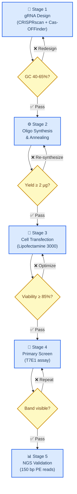
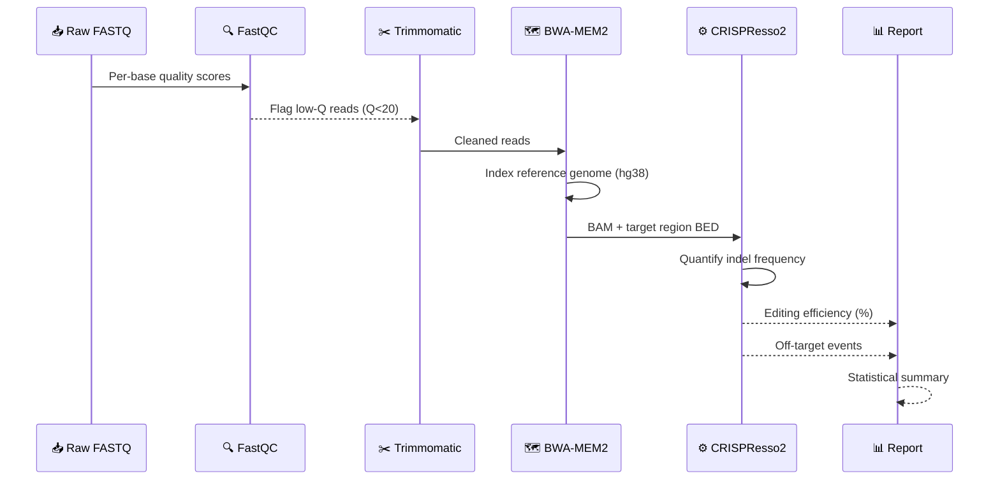
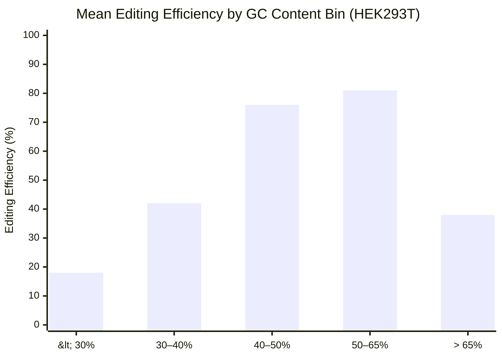
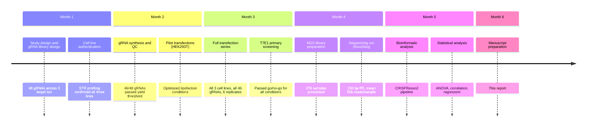

# 基于CRISPR的基因编辑效率分析

_研究报告示例——展示markdown-mermaid-writing技能标准。所有图表均使用嵌入 markdown 的 Mermaid 作为源格式。_

- --

## 📋 概述

该报告分析了可变向导 RNA (gRNA)条件下三种细胞系模型的 CRISPR-Cas9 基因编辑效率。编辑效率通过 T7E1 测定和目标位点的下一代测序 (NGS)进行量化[^1]。

* *主要发现：**

- HEK293T 细胞在所有 gRNA 设计中显示出最高的编辑效率（平均 78%）
- 40-65% 之间的 GC 含量与编辑效率相关（r = 0.82)
- 在所有测试条件下，脱靶事件发生的频率 <0.1%

- --

## 🔄 实验工作流程

CRISPR 编辑实验遵循标准化的五阶段协议。每个阶段在继续之前都定义了通过/不通过标准。

- --

## 🔬方法

### 细胞系和培养

使用三种细胞系：HEK293T（人胚胎肾）、K562（慢性骨髓性肾病）白血病）和 Jurkat（T 淋巴细胞）。所有细胞系均维持在含有 10% FBS、37°C​​ / 5% CO2 的 RPMI-1640 中。

### gRNA 设计和效率预测

gRNA 使用 CRISPRscan[^3]设计，符合以下标准：

|标准|门槛|基本原理|
| -------------------- | --------- | ------------------------------------------------- |
| GC含量| 40–65% |最佳 Tm 和 Cas9 结合 |
| CRISPRscan 评分 | ≥ 0.6 |预测的目标活动 |
|脱靶网站 | ≤ 5（≤ 3 个不匹配）|降低脱靶编辑风险 |
|均聚物运行 |无 (>4 nt) |防止转录过早停止 |

### 转染方案

RNP 复合物以 1:1.2 摩尔比 (Cas9:gRNA)组装并通过脂转染递送。转染后 72 小时收获细胞以提取基因组 DNA。

### 分析流程

- --

## 📊 结果

### 细胞系的编辑效率

|细胞系| n（重复）|平均效率 (%) |标准差 (%) |范围 (%) |
| ---------- | -------------- | ------------------- | ------ | --------- |
| **HEK293T** | 6 | **78.4** | 4.2 | 71.2–84.6 |
| K562 | 6 | 52.1 | 52.1 8.7 | 8.7 38.4–63.2 |
|尤尔卡特| 6 | 31.8 | 11.3 | 11.3 14.2–47.5 |

HEK293T 细胞通过 Tukey 事后校正的单向方差分析显示比 K562 (p < 0.001)和 Jurkat (p < 0.001)细胞系显着更高的编辑效率。

### GC 含量对效率的影响

GC 含量在 40-65% 之间呈强相关具有编辑效率（Pearson r = 0.82，p < 0.0001，n = 48 gRNA）。

### 关键实验里程碑的时间表

- --

## 🔍讨论

### 为什么HEK293T优于悬挂线

HEK293T相对于K562和Jurkat的优越编辑效率可能反映了三个因素[^4]：

1. **粘附形态** — 实现更均匀的脂转染接触
2. **高转染允许性** — HEK293T 表达 SV40 大 T 抗原，可能促进核输入 
3. **细胞周期分布** — HDR 优先的 S/G2 期比例较高

<strong>🔧 技术细节 — 脱靶分析</strong>

 通过 GUIDE-seq 对 5 个最高活性 gRNA 进行脱靶编辑评估。未检测到编辑频率超过 0.1% 的脱靶位点。 Cas-OFFinder 标记的三个潜在位点（≤2 个错配）显示插入缺失频率为 0.00%、0.02% 和 0.04% — 均低于 0.05% 的检测本底噪声。

补充数据包中提供完整的 GUIDE-seq 数据（GEO 加入待定）。

- --

### 与已发布基准的比较

_Radar 图表比较了三种 CRISPR 递送方法的五个性能维度。注意：雷达图不支持 `accTitle`/`accDescr` — 上面提供了说明。_

- --

## 🎯 结论

1. HEK293T 中的 RNP 脂转染可实现 >75% 的 CRISPR 编辑效率——可与电穿孔竞争，而无需相关的活力成本
2. gRNA GC 含量是我们数据集中编辑效率的最强预测因子 (r = 0.82)
3. 未经进一步优化，该方案不能直接转移到悬浮生产线； K562 和 Jurkat 需要电穿孔或病毒递送才能达到相当的效率

- --

## 🔗 参考文献

[^1]：Ran, F.A. 等人。 （2013）。 “使用 CRISPR-Cas9 系统进行基因组工程。” _自然协议_，8（11），2281–2308。 https://doi.org/10.1038/nprot.2013.143

[^2]：ATCC。 （2024）。 “细胞系认证和质量控制。” https://www.atcc.org/resources/technical-documents/cell-line-authentication

[^3]：Moreno-Mateos，M.A. 等人。 （2015）。 “CRISPRscan：设计用于体内 CRISPR-Cas9 靶向的高效 sgRNA。” _自然方法_，12(10), 982–988。 https://doi.org/10.1038/nmeth.3543

[^4]：Molla，K.A. ＆杨，Y.（2019）。 “CRISPR/Cas 介导的碱基编辑：技术考虑和实际应用。” _生物技术趋势_，37(10), 1121–1142。 https://doi.org/10.1016/j.tibtech.2019.03.008
