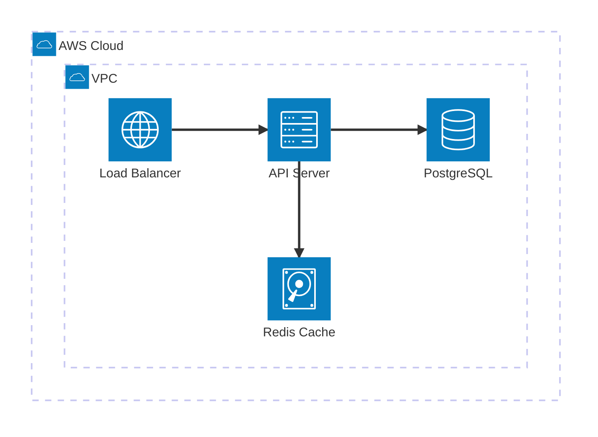
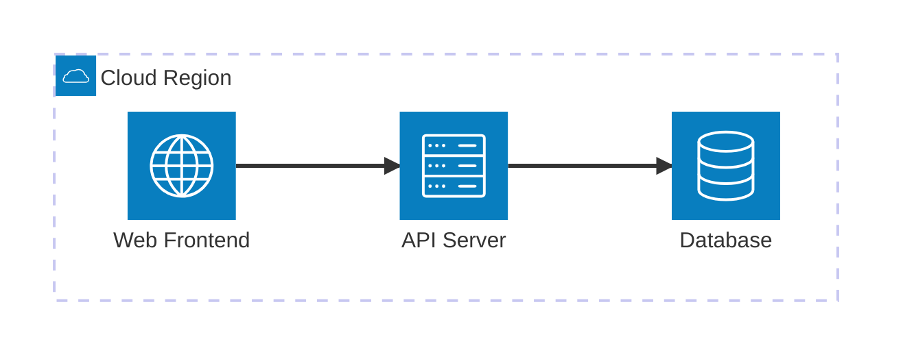
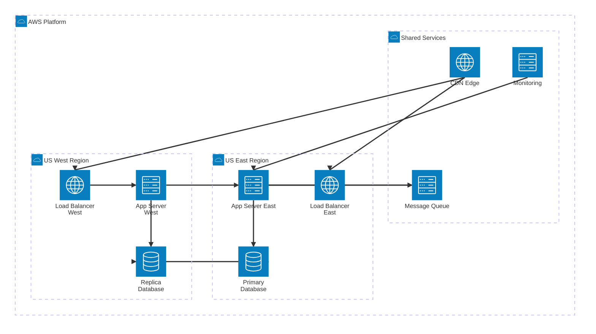

<!-- 来源：https://github.com/SuperiorByteWorks-LLC/agent-project |许可证：Apache-2.0 |作者：Clayton Young / Superior Byte Works, LLC (Boreal Bytes) -->

# 架构图

> **返回[风格指南](../mermaid_style_guide.md)** — 首先阅读风格指南了解表情符号、颜色和可访问性规则。

* *语法关键字：** `architecture-beta`
* *最佳用于：**云基础设施、服务拓扑、部署架构、网络布局
* *何时不使用：**逻辑系统边界（使用[C4](c4.md)）、无云语义的组件布局（使用[Block](block.md)）

> ⚠️ **可访问性：**架构图**不**支持`accTitle`/`accDescr`。始终将描述性_斜体_ Markdown 段落直接放在代码块上方。

- --

## 示例图

_架构图显示云托管的 Web 应用程序，其中部署了负载均衡器、API 服务器、数据库和缓存。 VPC:_

- --

## 提示

- 使用 `group` 作为逻辑边界（VPC、区域、集群、可用区）
- 对各个组件使用 `service`
- 连接上的方向注释： `:L`（左）、`:R`（右）、`:T`（上）、`:B`（下）
- 内置图标类型：`cloud`、`server`、`database`、`internet`、 `disk`
- 使用 `in parent_group`
 嵌套组 - **标签必须是纯文本** - `[]` 标签中没有表情符号和连字符（解析器将 `-` 视为边缘运算符）
- 使用 `-->`方向箭头，`--` 用于无向边缘
- 每个图表保持 **6-8 个服务**
- **始终** 与屏幕阅读器上面的 Markdown 文本描述配对

- --

## 模板

_基础设施拓扑和密钥的描述组件：_

- --

## 复杂示例

_多区域云部署，3个嵌套组（2个区域集群+共享服务），显示9个服务，跨区域数据库复制，CDN分发，集中监控。演示嵌套 `group` + `in` 语法如何创建清晰的基础架构边界：_

### 为什么有效

- **嵌套组镜像真实基础架构** — 云 > 区域 > 服务正是团队考虑多区域部署的方式。嵌套创建了清晰的爆炸半径边界。
- **仅限纯文本标签** - 架构图解析失败，并在 `[]` 标签中显示表情符号。所有视觉区别均来自组嵌套和图标类型（`internet`、`server`、`database`）。
- **方向注释防止重叠** — `:B --> T:`（从下到上）、`:R --> L:`（从右到左）控制边缘连接的位置。如果没有这些，Mermaid 将边缘堆叠在一起。
- **跨区域复制是明确的** — `db_primary:R --> L:db_replica` 边缘是最重要的基础设施细节，可以清楚地理解为区域之间的水平连接。
