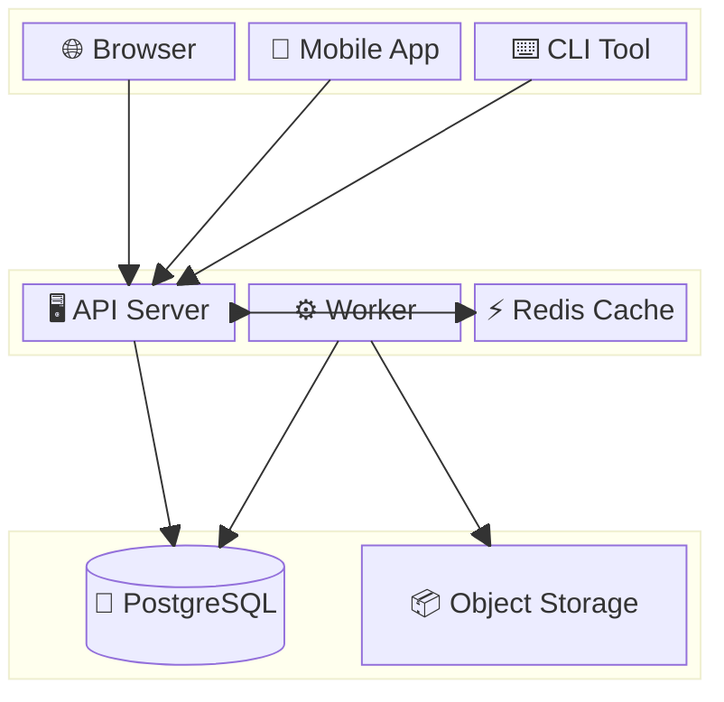
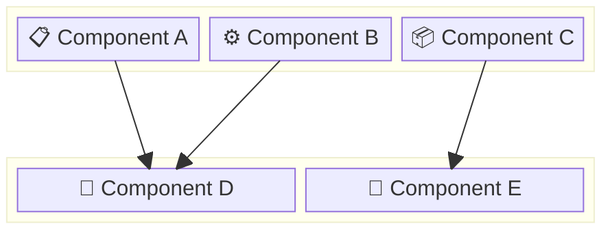
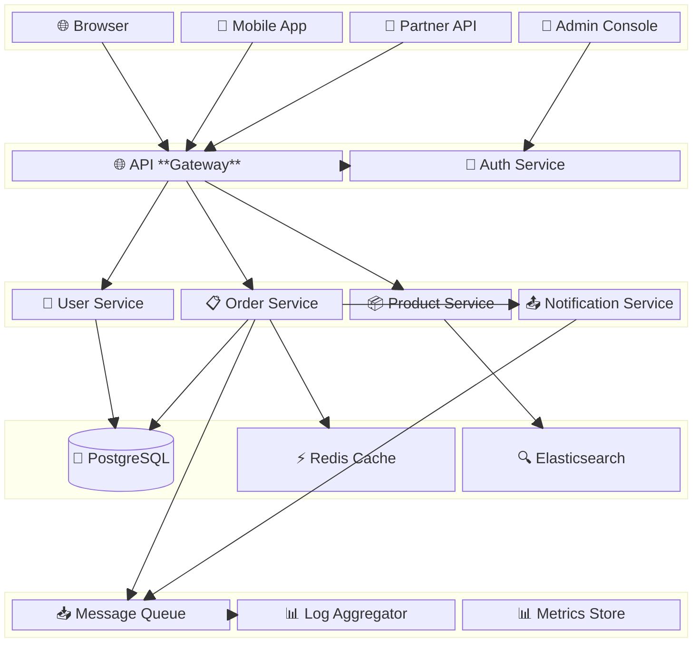

<!-- 来源：https://github.com/SuperiorByteWorks-LLC/agent-project |许可证：Apache-2.0 |作者：Clayton Young / Superior Byte Works, LLC (Boreal Bytes) -->

# 框图

> **返回[样式指南](../mermaid_style_guide.md)** — 首先阅读样式指南以了解表情符号、颜色和可访问性规则。

* *语法关键字：** `block-beta`
* *最佳用于：**系统块组成、分层架构、空间布局很重要的组件拓扑
* *何时不使用：**流程（使用[流程图](flowchart.md)）、带有云图标的基础设施（使用[架构](architecture.md)）

> ⚠️ **可访问性：**框图**不**支持`accTitle`/`accDescr`。始终在代码块正上方放置描述性的_斜体_ Markdown 段落。

- --

## 示例图

_框图显示从面向客户端的界面到应用程序服务再到数据存储的三层 Web 应用程序架构，并使用表情符号标签指示组件types:_

- --

## Tips

- 使用`columns N`控制布局网格
- 使用`space:N`用于空单元格（对齐/间距）
- 嵌套`block:name:span { ... }`分组部分
- 使用`-->`箭头连接块
- 在标签中使用**表情符号** `["🔧 Component"]`进行视觉区分
- 对块内的数据库使用圆柱体`("text")`语法
- 保持**3–4行**和**3–4列**可读性
- **始终**与屏幕阅读器上面的 Markdown 文本描述配对

- --

## 模板

_系统层的描述以及组件如何连接：_

- --

## 复杂示例

_企业平台架构呈现为包含 15 个组件的 5 层框图。每层都是一个跨越整个宽度的块组，内部列控制组件布局。连接显示各层之间的主要数据流路径：_

### 为什么有效

- **5 层从上到下**就像网络图一样 — 客户端、网关、服务、数据、基础设施。每层都是一个跨越整个宽度的块，具有自己的列布局。
- **`space:4` 在层之间创建视觉分隔**，没有不必要的线条或边框，保持图表干净且可扫描。
- **数据库的圆柱体语法 `("text")`** — PostgreSQL 呈现为圆柱体，可立即识别为数据存储。其他组件使用标准矩形。
- **连接显示真实的数据路径** - 不是每个可能的连接，只是主要流。完全连接的图是不可读的；这显示了工程师在调试期间将跟踪的关键路径。
