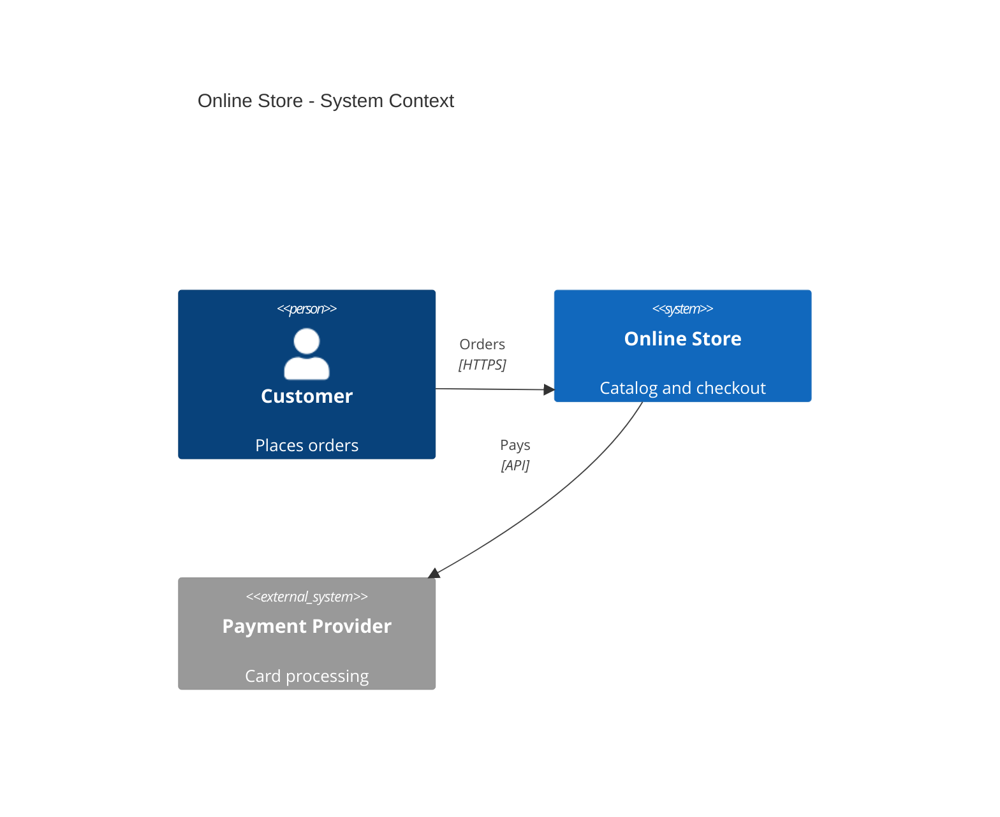
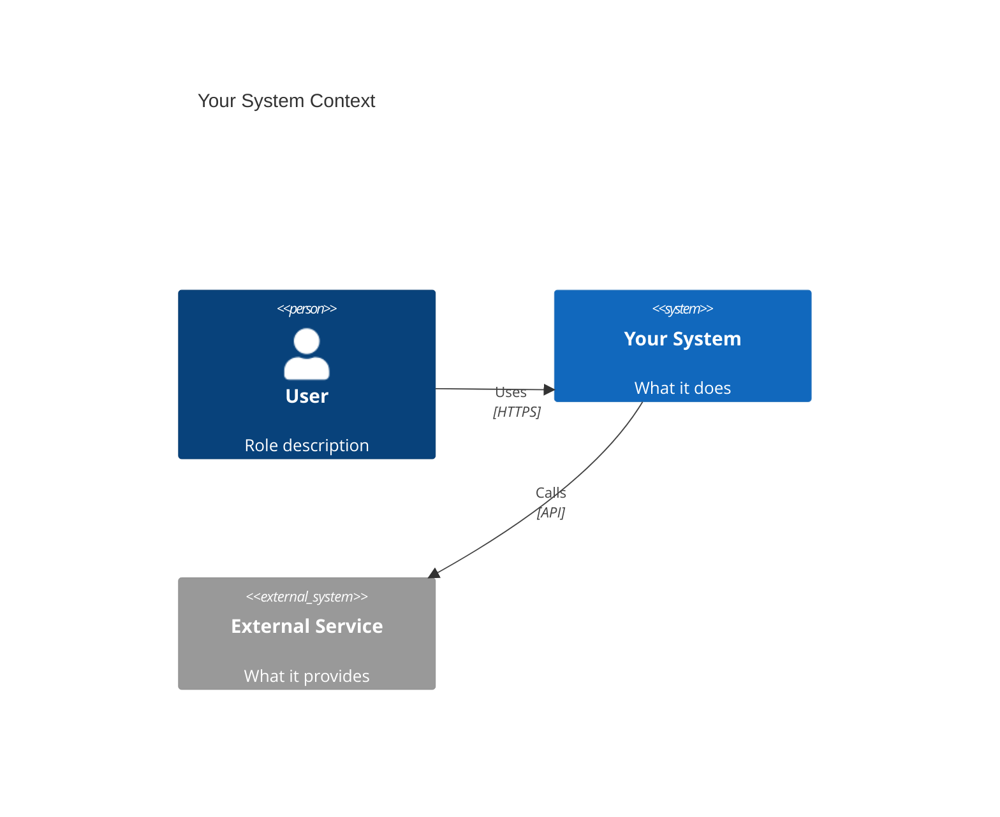
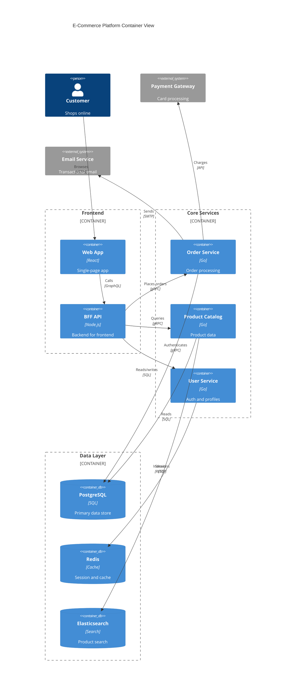

<!-- 来源：https://github.com/SuperiorByteWorks-LLC/agent-project |许可证：Apache-2.0 |作者：Clayton Young / Superior Byte Works, LLC (Boreal Bytes) -->

# C4 图

> **返回[样式指南](../mermaid_style_guide.md)** — 首先阅读样式指南以了解表情符号、颜色和可访问性规则。

* *语法关键字：** `C4Context`， `C4Container`、`C4Component`
* *最适合：**不同缩放级别的系统架构 - 上下文、容器、组件
* *何时不使用：**基础设施拓扑（使用 [Architecture](architecture.md)）、运行时序列（使用 [Sequence](sequence.md)）

- --

## 示例图表 — 系统上下文

- --

## C4 缩放级别

|水平|关键词 |演出 |观众|
| ------------- | ------------- | --------------------------------------- | --------------- |
| **背景** | `C4Context` |系统+外部参与者|大家|
| **集装箱** | `C4Container` |系统内的应用程序、数据库、队列 |技术线索|
| **组件** | `C4Component` |容器内的内部模块 |开发人员 |

## 提示

- 对人类演员使用 `Person()`
- 对内部系统使用 `System()`，对外部系统使用 `System_Ext()`
- 在容器处使用 `Container()`、`ContainerDb()`、`ContainerQueue()` level
- 标签与 **动词** 和 **协议** 的关系： `"Reads from", "SQL/TLS"`
- 使用 `Container_Boundary(id, "name") { ... }` 对容器进行分组
- **保持描述简短** - 长文本导致标签重叠
- **在上下文级别限制为 4-5 个元素**，以避免拥挤
- **避免C4标签中的表情符号** - C4渲染器处理自己的样式
- 如果发生重叠，使用`UpdateRelStyle()`调整标签位置

- --

## 模板

- --

## 复杂示例

电子商务平台的 C4 容器图，具有 3 个 `Container_Boundary` 组、10 个容器和 2 个外部系统。展示如何使用边界按层组织服务，并使用 `UpdateRelStyle` 偏移量防止标签重叠。

### 为什么有效

- **Container_Boundary 组映射到部署单元** — 前端、核心服务和数据层各自对应于真实的基础设施边界（CDN、Kubernetes 命名空间、托管数据库）
- **每个 `Rel` 都有 `UpdateRelStyle`** — C4 的自动布局默认将标签堆叠在一起。偏移每个关系以防止重叠，即使一开始看起来很好（稍后添加元素会改变事情）
- **描述保持在 1-3 个单词** - “卡处理”，“会话和缓存”，“身份验证和配置文件”。长描述是 C4 渲染问题的第一大原因
- **容器类型是语义的** — 用于数据库的 `ContainerDb` 为它们提供圆柱体图标，用于服务的 `Container`。 C4渲染器提供自己的视觉区分
