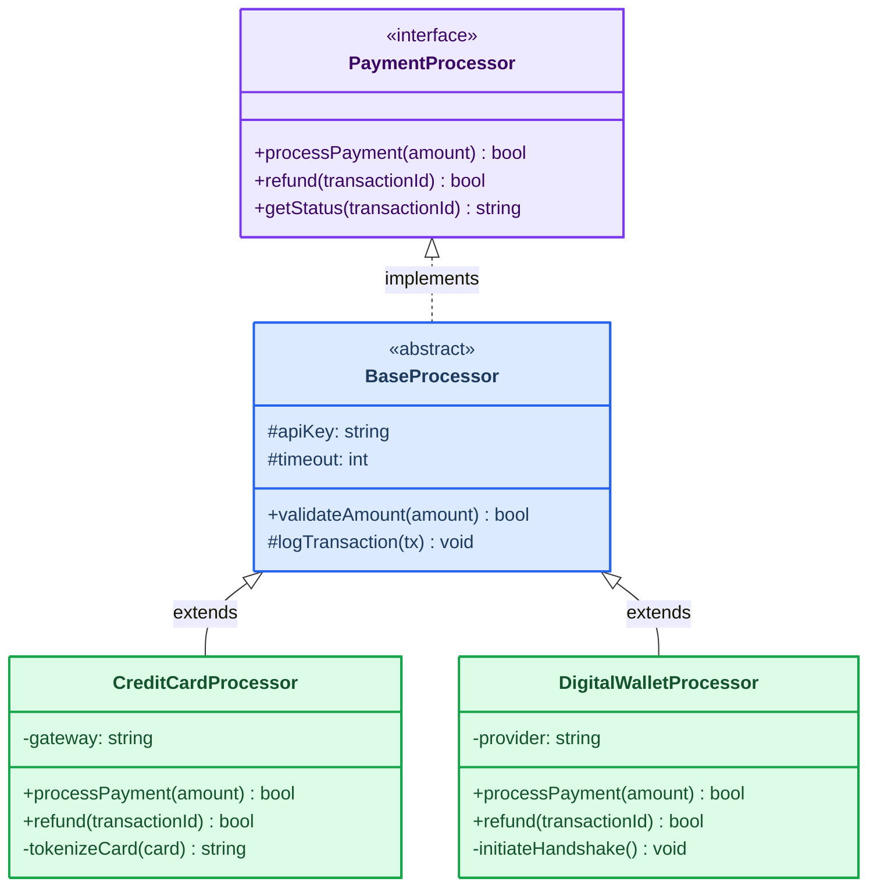
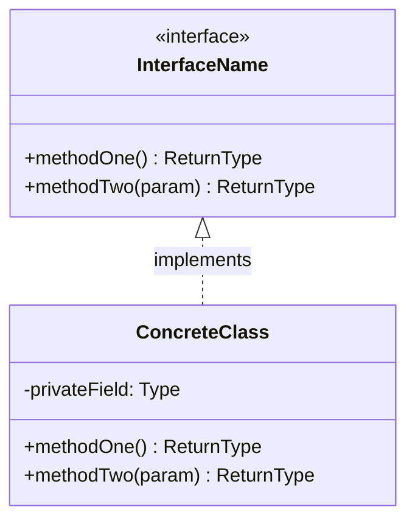
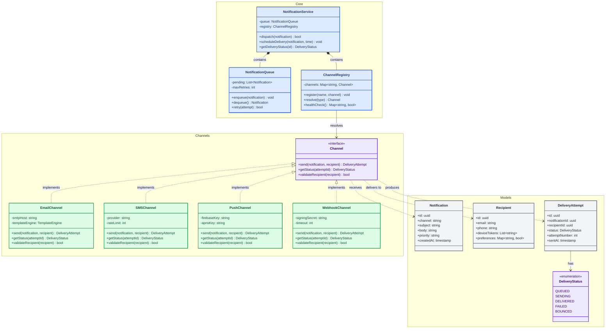

<!-- 来源：https://github.com/SuperiorByteWorks-LLC/agent-project |许可证：Apache-2.0 |作者：Clayton Young / Superior Byte Works, LLC (Boreal Bytes) -->

# 类图

> **返回[样式指南](../mermaid_style_guide.md)** — 首先阅读样式指南以了解表情符号、颜色和可访问性规则。

* *语法关键字：** `classDiagram`
* *最佳用于：**面向对象设计、类型层次结构、接口契约、域模型
* *何时不使用：**数据库模式（使用 [ER](er.md)）、运行时行为（使用 [Sequence](sequence.md)）

- --

## 示例图

- --

## 提示

- 使用 `<<interface>>` 和 `<<abstract>>` 构造型以保持清晰
- 显示可见性：`+` public、`-` private、`#` protected
- 每个图保持 **4-6 个类** - 分割更大的层次结构
- 使用 `style ClassName fill:...,stroke:...,color:...` 进行浅语义着色：
  - 🟣 紫色表示接口/抽象
  - 🔵 蓝色表示基础/抽象类
  - 🟢 绿色表示具体实现
- 关系箭头：
  - `<|--`继承（扩展）
  - `<|..`实现（实现）
  - `*--`组合·`o--`聚合·`-->`依赖项

- --

## 模板

- --

## 复杂示例

一个事件驱动的通知平台，包含11个类，组织成3个`namespace`组——核心编排、交付通道和数据模型。显示跨层的接口实现、组合和依赖关系。

### 为什么这样工作

- **3 个命名空间镜像架构层** — 核心（编排）、通道（交付实现）、模型（数据）。开发人员可以扫描一个名称空间，而无需阅读其他名称空间。
- **颜色对角色进行编码** - 紫色表示接口/枚举，蓝色表示核心服务，绿色表示具体实现，灰色表示数据模型。该模式可以立即识别。
- **关系类型是经过深思熟虑的** - 组合（`*--`）用于“拥有和管理”，实现（`<|..`）用于“履行合同”，依赖关系（`..>`）用于“运行时使用”。每个箭头类型都具有含义。
