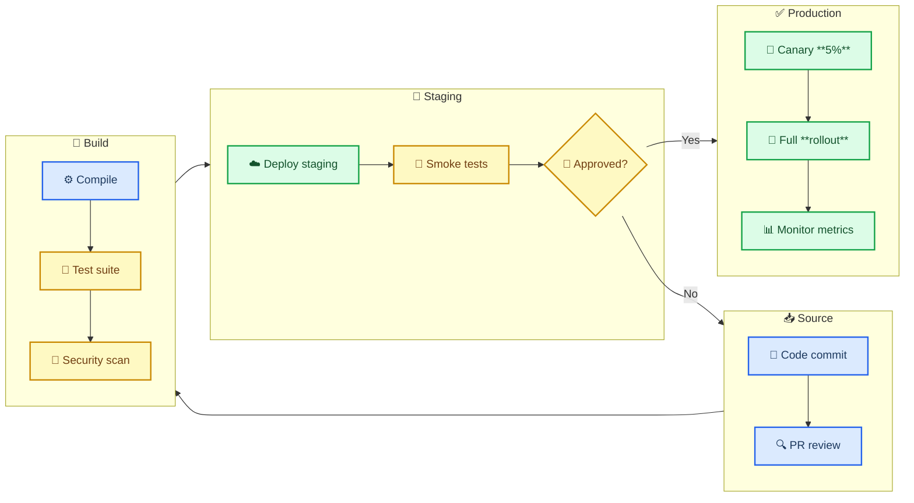
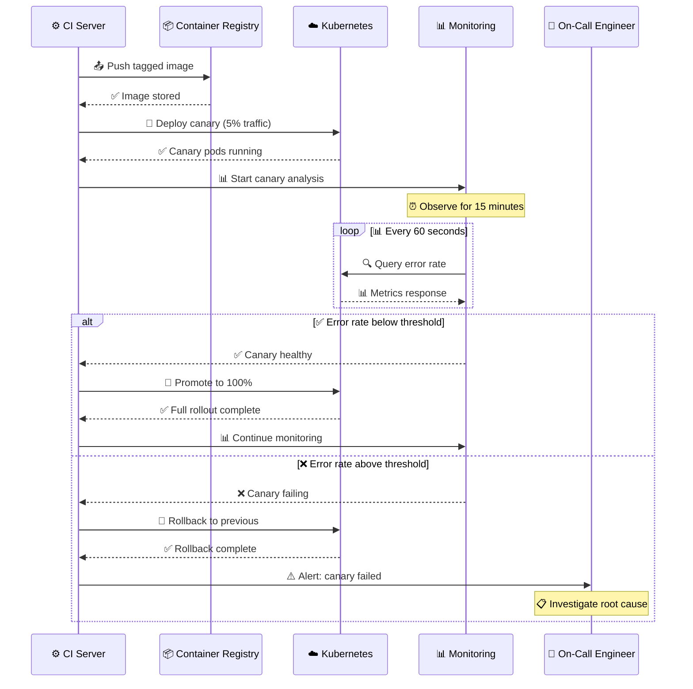
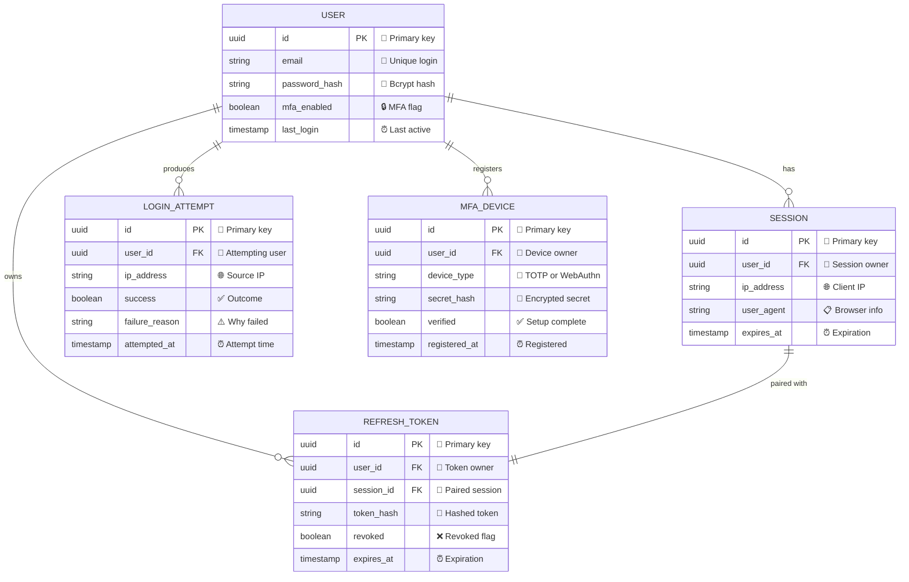
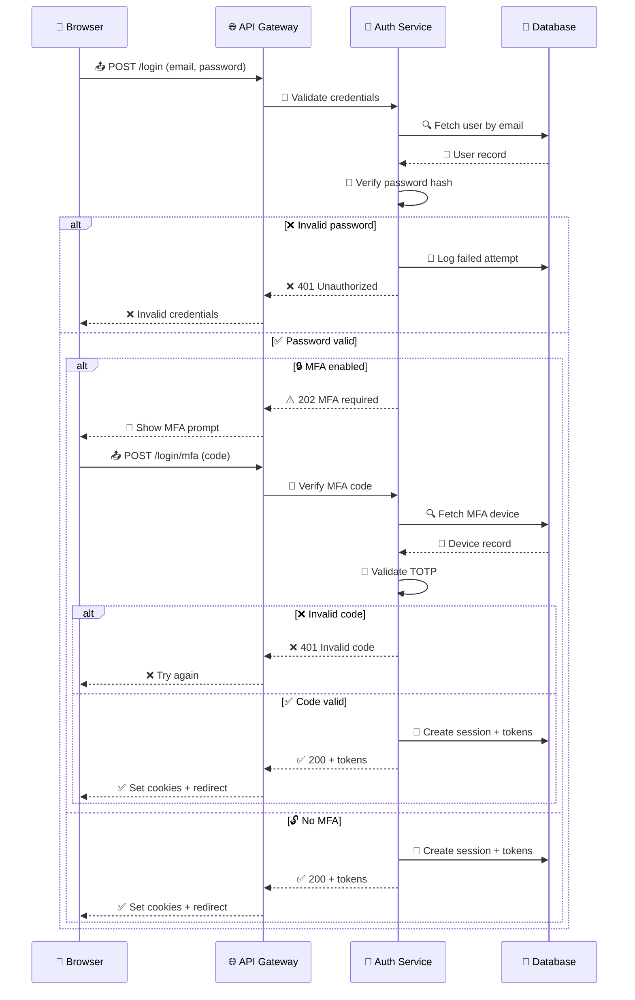
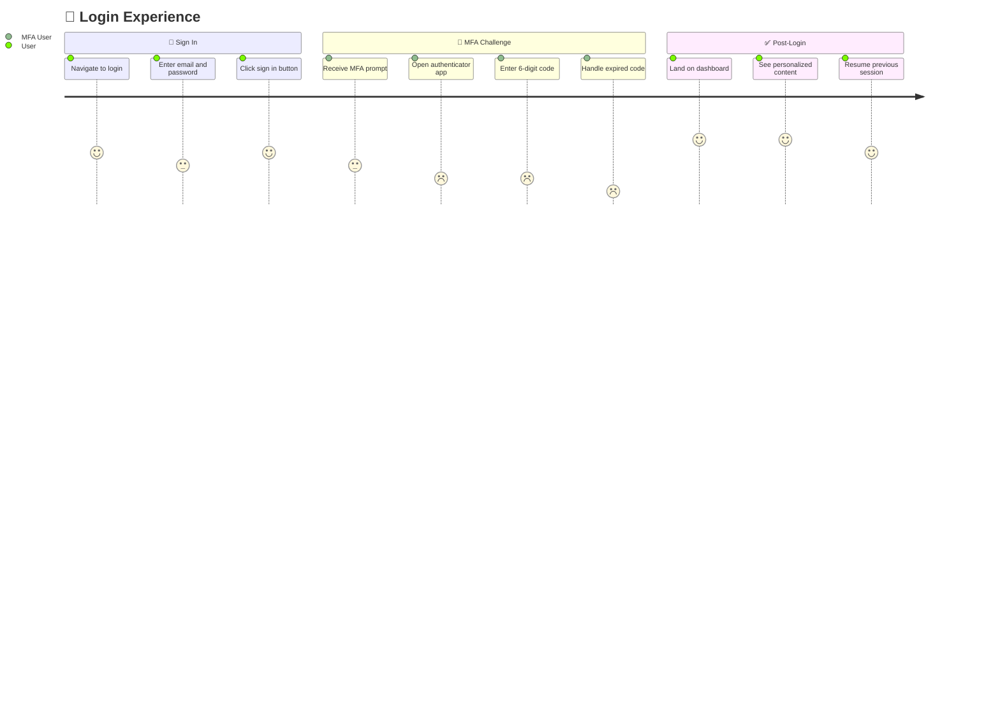
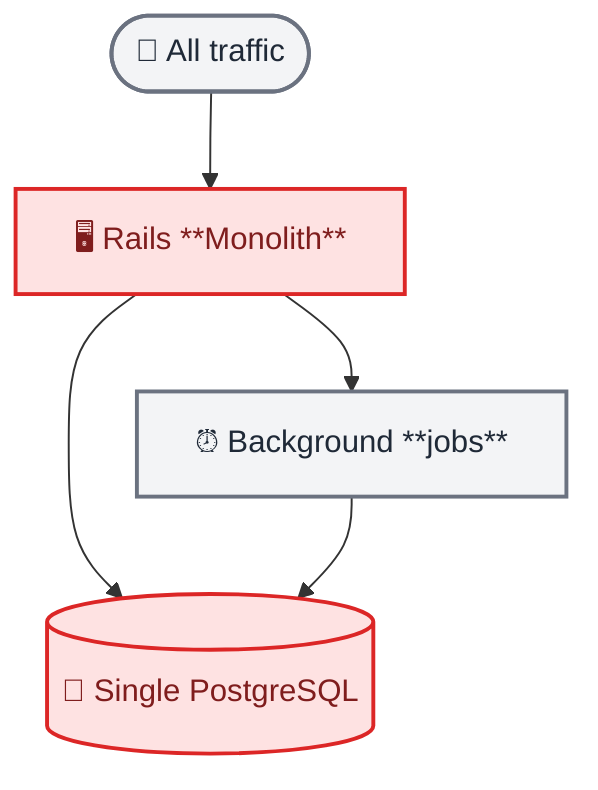
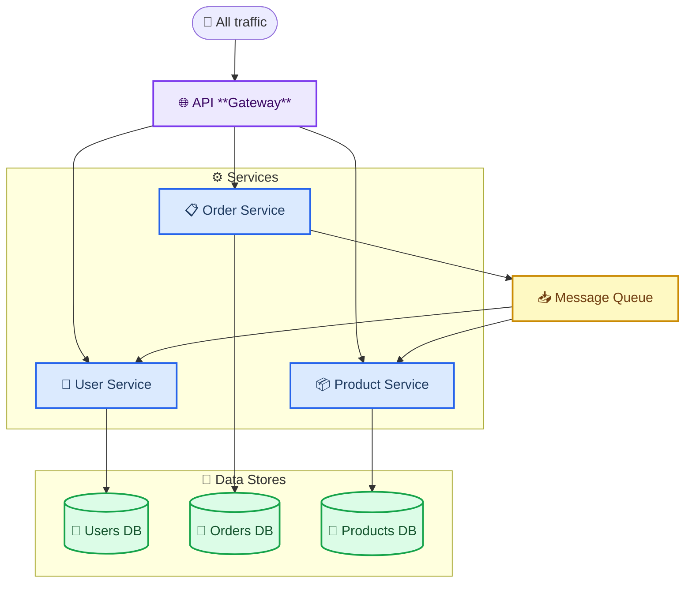
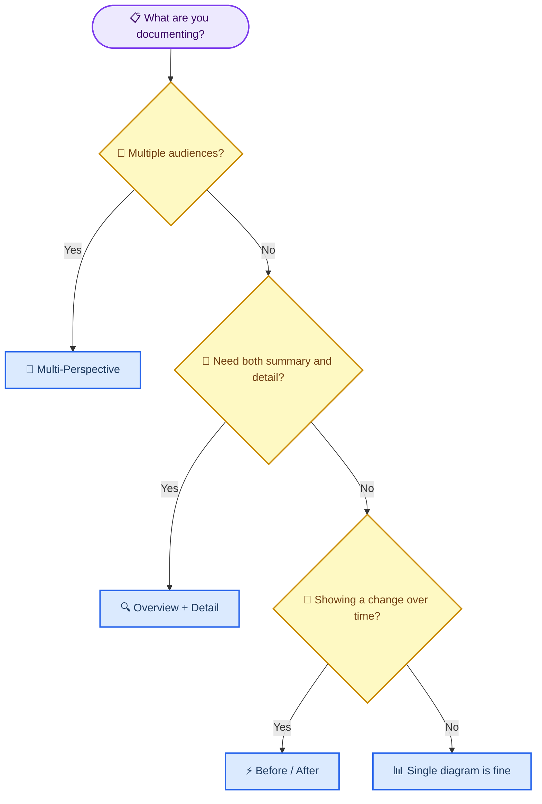

<!-- 来源：https://github.com/SuperiorByteWorks-LLC/agent-project |许可证：Apache-2.0 |作者：Clayton Young / Superior Byte Works, LLC (Boreal Bytes) -->

# 组合复杂图表集

> **返回[风格指南](../mermaid_style_guide.md)** — 该文件介绍了如何组合多种图表类型来全面记录复杂系统。

* *目的：** 单个图表捕获单个视角。真实的文档通常需要多种图表类型一起工作——链接到详细序列图的概述流程图、与显示实体生命周期的状态机配对的 ER 模式、由架构前/后视图补充的甘特时间线。该文件教您何时以及如何构建最清晰的图表。

- --

## 何时构建多个图表

|您正在记录的内容 |图解组合|为什么它有效 |
| ------------------------ | -------------------------------------------------------------------------------- | -------------------------------------------------------------------------------------- |
|完整的系统架构| C4 上下文 + 架构 + 顺序（关键流程） |利益相关者的上下文、操作的基础设施、开发人员的序列 |
| API设计文档| ER（数据模型）+序列（请求流）+状态（实体生命周期）|数据库团队的架构、后端的交互、业务逻辑的状态 |
|功能规格|流程图（快乐路径）+序列（服务交互）+用户旅程（UX）| PM的流程、工程师的实施、设计的经验|
|移民项目|甘特图（时间线）+架构（之前/之后）+流程图（迁移过程）|领导安排、基础设施拓扑、迁移团队步骤 |
|入职文档 |用户旅程 + 流程图（设置步骤）+ 顺序（第一次 API 调用）|产品体验地图、新员工清单、开发人员技术演练 |
|事件响应 |状态（警报生命周期）+序列（升级流程）+流程图（决策树）|待命状态跟踪、管理沟通、响应者分类 |

- --

## 模式 1：概述 + 详细信息

* *何时使用：** 您需要大局和细节。领导看全局；工程师深入细节。

概览图显示了高级阶段或组件。一个或多个详细图放大显示内部交互的特定阶段。

### 概述 — 发布管道

_生产部署阶段涉及多个服务交互。请参阅下面的金丝雀推出过程的详细序列。_

### 详细信息 — 金丝雀部署序列

### 这些如何连接

- **概述流程图**显示了具有子图到子图连接的完整管道 — 领导层阅读此内容以了解发布过程
- **详细序列**从生产子图中放大到“Canary 5% → Full rollout”，显示工程师将调试的实际服务交互
- **命名一致** - “Canary”和“Monitor Metrics”出现在两个图中，在概述和细节之间建立了清晰的桥梁

- --

## 模式2：多视角文档

* *何时使用：**相同的系统需求为不同的受众（数据库团队、后端工程师和产品经理）记录同一功能。

此示例从三个角度记录了 **用户身份验证** 功能。

### 数据模型 — 用于数据库团队

### 身份验证流程 — 用于后端team

### 登录体验 — 针对产品团队

### 这些如何连接

- **相同的实体，不同的视图** — “用户”、“会话”、“MFA 设备”作为表格出现在 ER 图中，按照参与者/操作的顺序，在旅程中作为体验接触点
- **每个受众都获得可操作的信息** — 数据库团队看到索引和基数，后端团队看到 API 合同和错误代码，产品团队看到满意度分数和摩擦点
- **旅程揭示了序列隐藏**——序列图显示 MFA 作为一个干净的条件分支，但旅程图显示它实际上是 UX 中最糟糕的部分（得分 1-2）。这促使产品决定投资 WebAuthn/passkeys

- --

## 模式 3：架构之前/之后

* *何时使用：** 利益相关者需要查看当前状态、目标状态并了解转换的迁移文档。

### 当前状态 — Monolith

> ⚠️ **问题：** 单一数据库是瓶颈。单体应用无法水平扩展。部署 = 完全重新启动。

### 目标状态 — 微服务

> ✅ **结果：** 每个服务独立扩展。每个服务数据库消除了共享瓶颈。异步消息传递解耦服务依赖关系。

### 这些如何连接

- **相同​​的布局，不同的复杂性** - 两个图都使用 `flowchart TB`，因此结构转换在视觉上是显而易见的。整体架构有 4 个节点；目标是带有子图的 11 个节点。
- **颜色讲述故事** — 整体在瓶颈组件上使用红色（危险）。目标使用蓝色/绿色/紫色来显示健康、差异化的组件。
- **Prose 连接图表** — ⚠️ 问题标注和 ✅ 结果标注解释_为什么_架构发生变化，而不仅仅是_发生变化。

- --

## 文档中的链接图

在真实文档中编写图表时，请遵循以下做法：

|实践|示例|
| ---------------------------- | -------------------------------------------------------------------------------------------------------------------------------------------------- |
| **使用标题作为锚点** | `See [Authentication Flow](#authentication-flow-for-backend-team) for the full login sequence` |
| **参考特定节点** | “概述中的 **API 网关** 连接到下面详细介绍的服务” |
| **一致的命名** |相同的实体 = 每个图中的名称相同（用户服务，不是一个图中的“用户 Svc”，另一个图中的“用户 API”）|
| **相邻放置** |将相关图表保留在连续的部分中，不要分散在文档中 |
| **桥接散文** |图表之间的一句话解释了它们如何连接：“下面的序列从上面的管道放大到部署阶段”|
| **受众标签** |标记部分：“### 数据模型 — _数据库团队_”，以便读者跳到他们的视图 |

- --

## 选择您的组合策略

