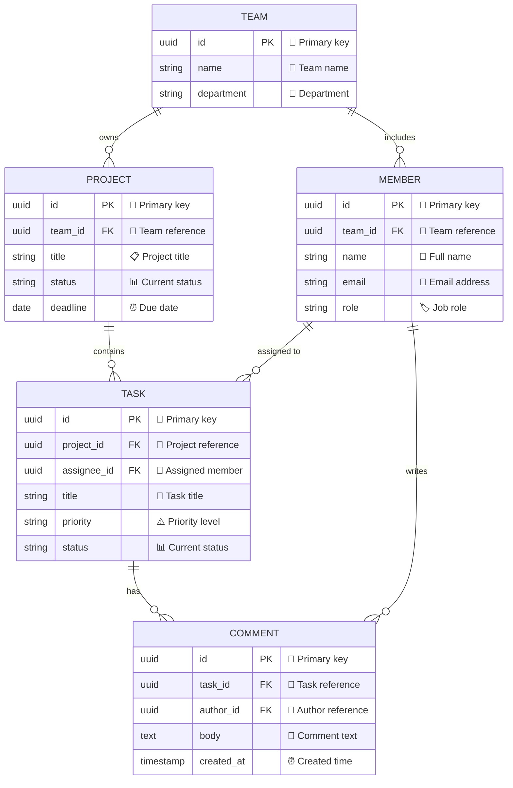
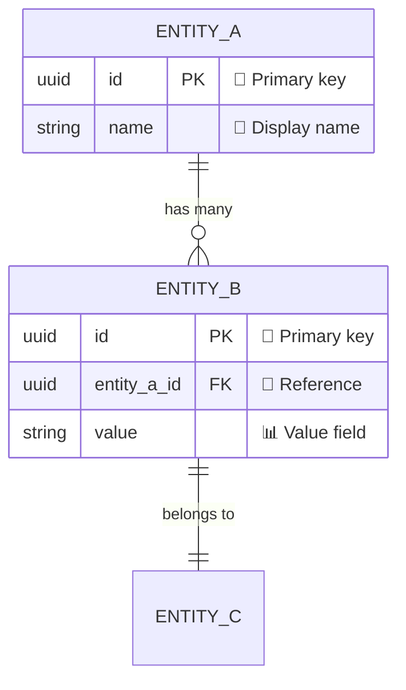
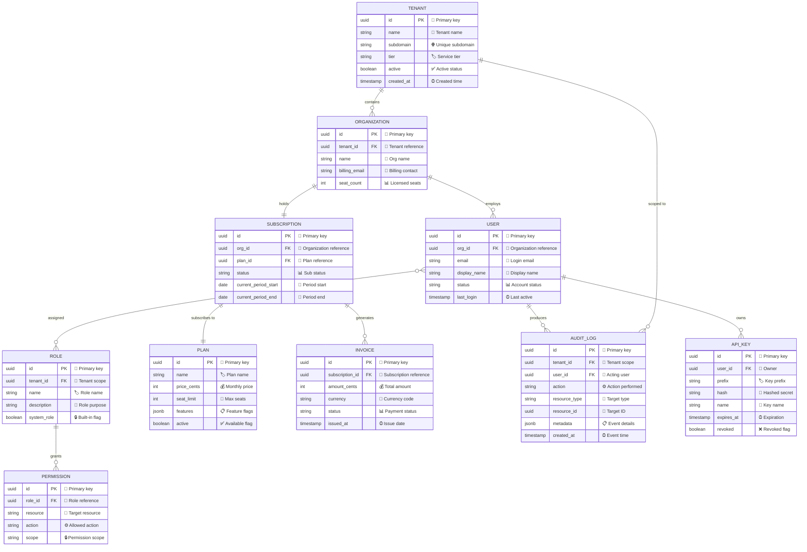

<!-- 来源：https://github.com/SuperiorByteWorks-LLC/agent-project |许可证：Apache-2.0 |作者：Clayton Young / Superior Byte Works, LLC (Boreal Bytes) -->

# 实体关系 (ER)图

> **返回[样式指南](../mermaid_style_guide.md)** — 首先阅读样式指南以了解表情符号、颜色和可访问性规则。

* *语法关键字：** `erDiagram`
* *最适合：**数据库模式、数据模型、实体关系、API 数据结构
* *何时不使用：**带有方法的类层次结构（使用 [Class](class.md)）、流程（使用 [Flowchart](flowchart.md)）

- --

## 示例图

- --

## 提示

- 包括数据类型、`PK`/`FK` 注释以及带有上下文表情符号的**注释字符串**
- 使用清晰的动词短语关系标签：`"owns"`， `"contains"`、`"assigned to"`
- 基数表示法：
  - `||--o{` 一对多
  - `||--||` 一对一
  - `}o--o{` 多对多
  - `o` = 零个或多个，`|` = 恰好一个
- 每个图表限制为 **5–7 个实体** — 按域分割大型模式
- 实体名称：`UPPER_CASE`（SQL 约定）

- --

## 模板

- --

## 复杂示例

A 多租户 SaaS 平台架构，具有跨越三个域的 10 个实体 - 身份和访问、计费和订阅以及审计和安全。关系显示了从租户隔离到用户权限再到发票生成的完整基数图。

### 为什么有效

- **按域组织的 10 个实体** — 身份（租户、组织、用户、角色、权限）、计费（计划、订阅、发票）和安全性（审核日志、API 密钥）。关系线自然地将相关实体聚集在一起。
- **完整基数告诉业务规则** - 组织订阅的 `||--||`（一对一）意味着每个组织一个订阅。 User-Role 的 `}o--o{`（多对多）意味着灵活的 RBAC。每个关系符号都编码一个约束。
- **每个字段都有类型、注释和用途** - 用于模式生成的 PK/FK，用于人工扫描的表情符号注释。开发人员可以阅读此图并直接编写迁移脚本。
