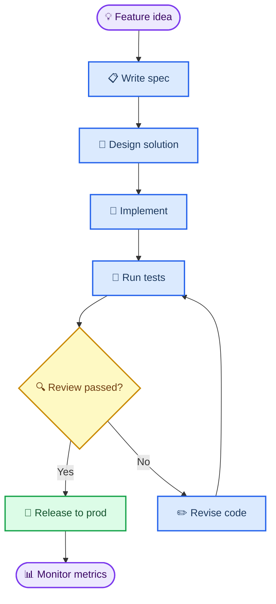
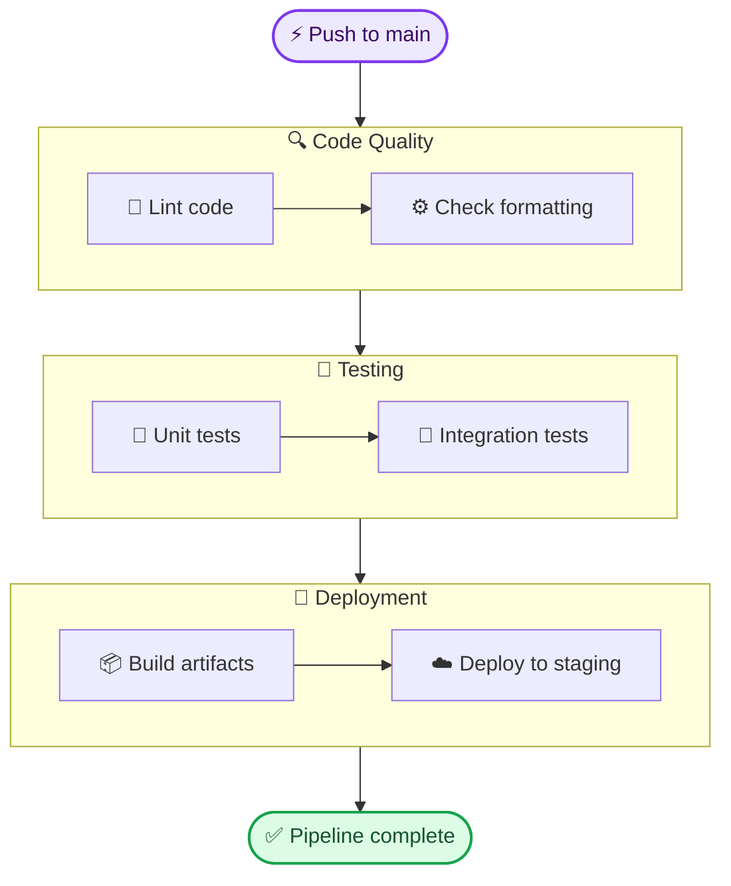
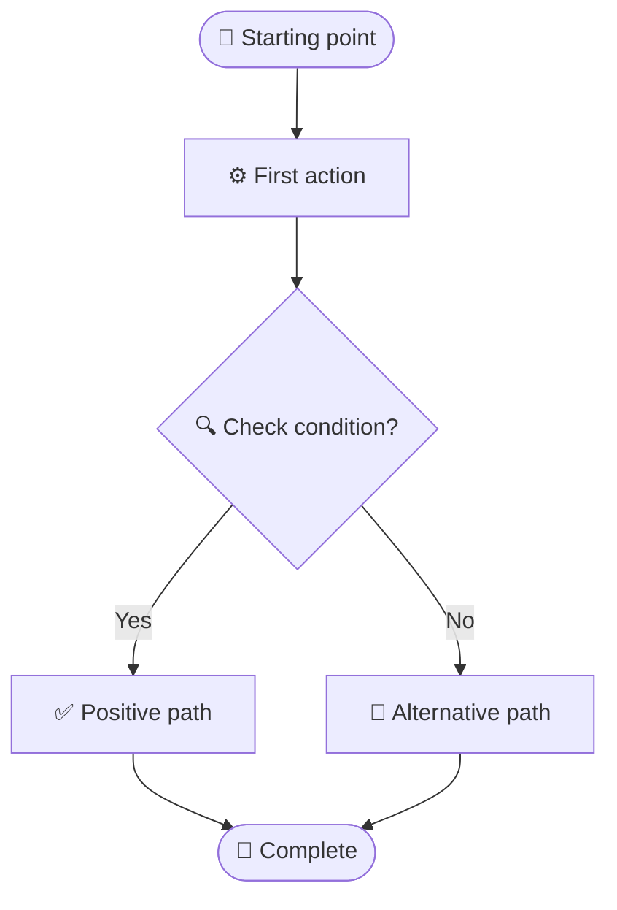
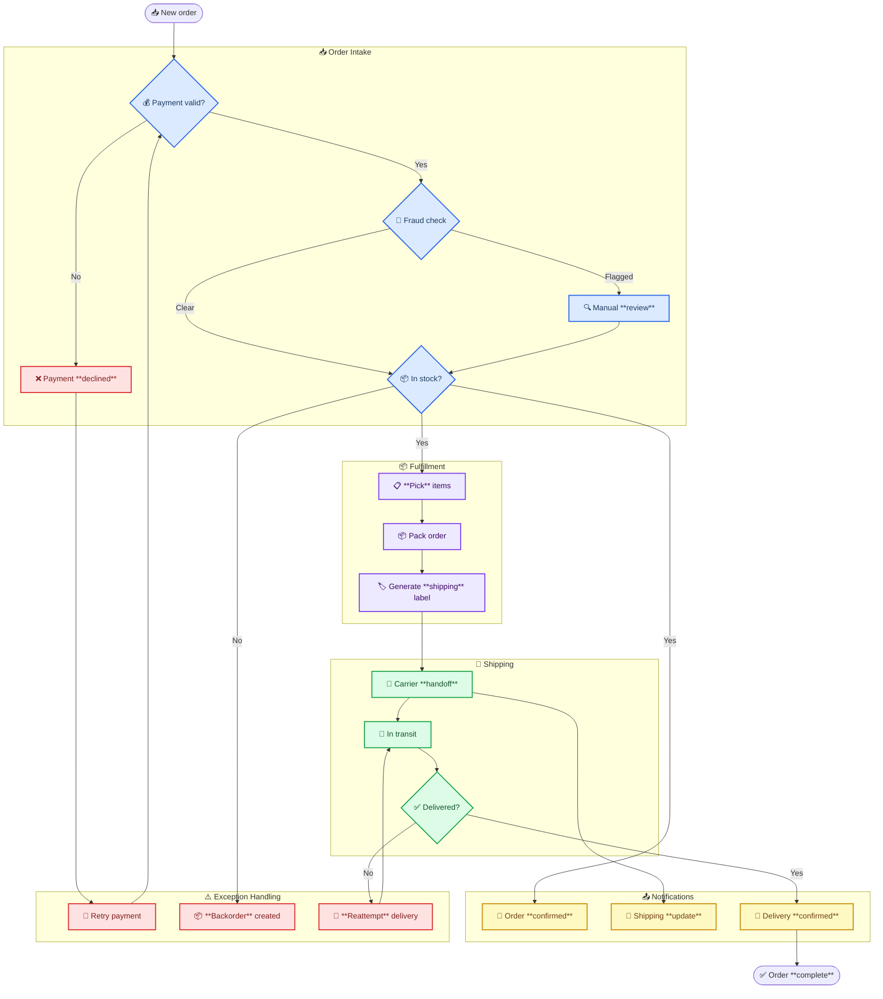

<!-- 来源：https://github.com/SuperiorByteWorks-LLC/agent-project |许可证：Apache-2.0 |作者：Clayton Young / Superior Byte Works, LLC (Boreal Bytes) -->

# Flowchart

> **返回[样式指南](../mermaid_style_guide.md)** — 首先阅读样式指南以了解表情符号、颜色和可访问性规则。

* *语法关键字：** `flowchart`
* *最适合：**顺序流程、工作流程、决策逻辑、故障排除树
* *何时不使用：**参与者之间的复杂时序（使用[Sequence](sequence.md)）、状态机（使用[State](state.md)）

- --

## 示例图

- --

## 提示

- 使用`TB`（从上到下）表示流程，`LR`（从左到右）表示管道
- 圆角矩形`([text])`表示开始/结束，菱形`{text}` 用于决策
- 最多 10 个节点 — 将较大的流拆分为“第 1 阶段”/“第 2 阶段”图表
- 每个图表最多 3 个决策点
- 边缘标签应为 1–4 个字：`-->|Yes|`、`-->|All green|`
- 使用`classDef` 用于 **语义** 着色 — 琥珀色为决策，绿色为成功，蓝色为行动

## 子图模式

当您需要分组阶段时：

- --

## 模板

- --

## 复杂示例

A 20+节点电子商务订单管道组织成5个子图，每个子图代表一个处理阶段。子图通过内部节点连接，决策点将订单路由到异常处理，颜色类一目了然地区分阶段。

### 为什么会起作用

- **5 个子图映射到实际业务阶段** - 接收、履行、运输、通知和异常是运营团队实际考虑订单的方式
  - **异常处理是它自己的子图** - 不分散在各个阶段。代理和读者可以在一处看到所有故障路径
- **颜色类别强化结构** - 蓝色表示摄入，紫色表示履行，绿色表示运输，琥珀色表示通知，红色表示例外。即使不阅读标签，颜色模式也会告诉您正在查看哪个阶段
- **子图之间的决策路线** - 菱形（`{Payment valid?}`、`{In stock?}`、`{Delivered?}`）是流程分支的点，每个分支都通向一个明确标记的目的地
