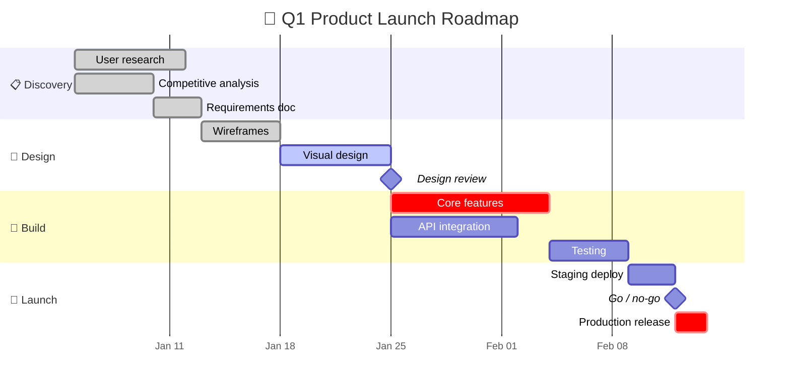
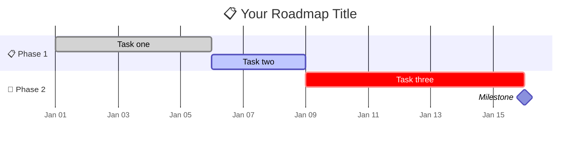
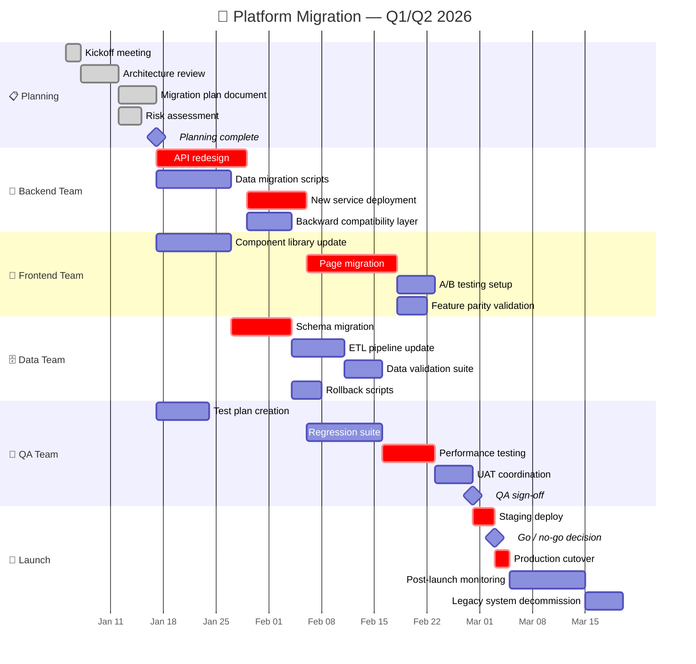

<!-- 来源：https://github.com/SuperiorByteWorks-LLC/agent-project |许可证：Apache-2.0 |作者：Clayton Young / Superior Byte Works, LLC (Boreal Bytes) -->

# 甘特图

> **返回[样式指南](../mermaid_style_guide.md)** — 首先阅读样式指南以了解表情符号、颜色和可访问性规则。

* *语法关键字：** `gantt`
* *最适合：**项目时间表、路线图、阶段规划、里程碑跟踪、任务依赖性
* *何时不使用：**简单的时间顺序事件（使用[时间轴](timeline.md)）、流程逻辑（使用[流程图](flowchart.md)）

- --

## 示例图

- --

## 提示

- 使用带有表情符号前缀的`section`按阶段或团队进行分组
- 用`:milestone`和`0d`标记里程碑持续时间-前缀为🏁
- 状态标签：`:done`、`:active`、`:crit`（关键路径，突出显示）
- 使用 `after taskId` 作为依赖项
- 保持总时间线**低于 3 个月**以提高可读性
- 使用 `axisFormat`控制日期显示(`%b %d` = "Jan 05", `%m/%d` = "01/05")

- --

## 模板

- --

## 复杂示例

A跨团队平台迁移历时 4 个月，包含 6 个部分、24 项任务和 3 个里程碑。显示团队之间的依赖关系（后端迁移阻止前端迁移）、关键路径项以及从规划到启动监控的完整生命周期。

### 为什么有效

- **6 个部分映射到真实团队** — 每个团队一目了然地看到他们的工作流程。跨团队依赖关系（前端等待后端 API，QA 等待后端部署）通过 `after taskId`.
 明确 - **`:crit` 标记关键路径** - 决定总项目持续时间的任务链。如果任何关键任务出现延误，启动日期就会发生变化。 Mermaid 以红色突出显示这些内容。
- **3 个里程碑是决策门** - 计划完成、QA 签核和进行/不进行。这些是利益相关者做出决策的点，而不仅仅是状态更新。
- **4 个月内的 24 项任务** 是可读的，因为部分按团队分组。如果没有部分，这将是一堵无法阅读的酒吧墙。
