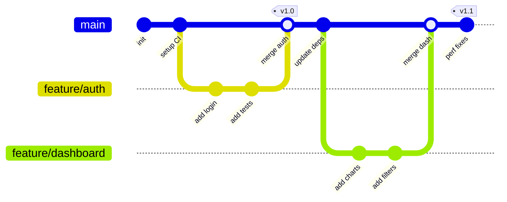
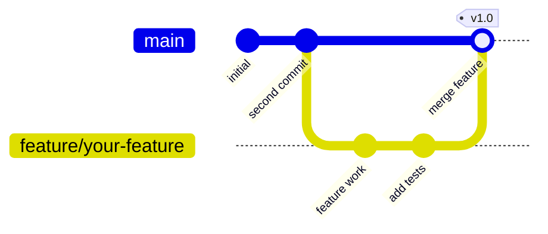

<!-- 来源：https://github.com/SuperiorByteWorks-LLC/agent-project |许可证：Apache-2.0 |作者：Clayton Young / Superior Byte Works, LLC (Boreal Bytes) -->

# Git Graph

> **返回[样式指南](../mermaid_style_guide.md)** — 首先阅读样式指南以了解表情符号、颜色和可访问性规则。

* *语法关键字：** `gitGraph`
* *最适合：**分支策略、合并工作流程、发布流程、git-flow可视化
* *何时不使用：**一般流程（使用[流程图](flowchart.md)）、项目时间表（使用[甘特图](gantt.md)）

- --

## 示例图

- --

## 提示

- 在提交上使用描述性`id:`标签
- 为发布版本添加`tag:`
- 分支名称应与您的实际约定匹配（`feature/`， `fix/`, `release/`)
- 显示 **理想** 工作流程 - 这是规定性的，而不是描述性的 
- 在重要的合并提交上使用 `type: HIGHLIGHT`
- 保持最大 **10–15 次提交**以提高可读性

- --

## 模板

