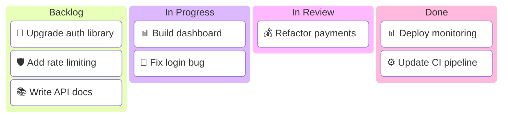
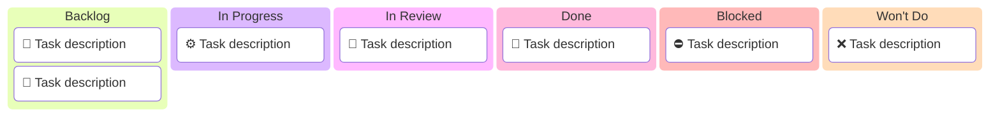
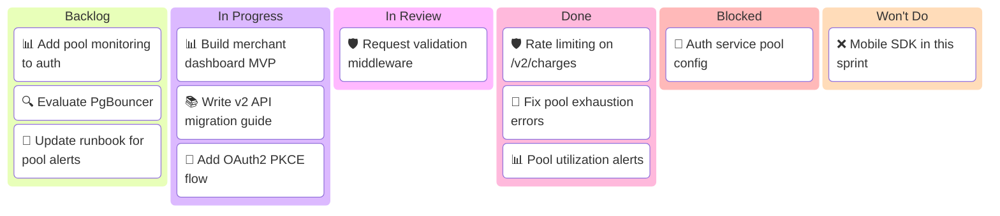

<!-- 来源：https://github.com/SuperiorByteWorks-LLC/agent-project |许可证：Apache-2.0 |作者：Clayton Young / Superior Byte Works, LLC (Boreal Bytes) -->

# Kanban Board

> **返回[样式指南](../mermaid_style_guide.md)** — 首先阅读样式指南以了解表情符号、颜色和可访问性规则。

* *语法关键字：** `kanban`
* *最适合：**任务状态板、工作流列、进行中的可视化、冲刺状态
* *何时不使用：**任务时间线/依赖关系（使用 [甘特](gantt.md)）、流程逻辑（使用 [流程图](flowchart.md)）

> ⚠️ **辅助功能：**看板**不**支持 `accTitle`/`accDescr`。始终在代码块正上方放置一个描述性的_斜体_ Markdown 段落。

- --

## 示例图

_看板显示当前冲刺的工作项分布在四个工作流列中，并用表情符号指示列状态：_

> ⚠️ **提示：** 每项任务一开始都会有一个域表情符号 - 这是您进行分类的主要视觉信号。列表情符号表示工作流程状态。

- --

## 提示

- 使用 **状态表情符号** 命名列以进行即时视觉扫描
- 将**域表情符号** 添加到任务中以进行快速分类
- 保持 **3–5 列**
- 限制为 **每列 3–4 项** （具有代表性，并非详尽无遗）
- 项目是简单的文本描述 - 保持简洁
- 适合文档中的冲刺快照
- **始终** 与屏幕阅读器上面的 Markdown 文本描述配对

- --

## 模板

_工作流程列和板代表的内容的描述。始终显示所有 6 列：_

> ⚠️ 始终包含所有 6 列 — Backlog、In Progress、In Review、Done、Blocked、Won't Do。即使列为空，也要包含一个占位符项，例如 [No items Yet]以使结构明确。

- --

## 复杂示例

_Sprint W07 支付团队的面板显示了工作项目在所有六个列中的真实分布，包括被阻止的项目：_

 复杂看板图的提示：

- 添加一个被阻止的列以显示停滞的工作 — 这是任何板上信号最高的列
- 保留即使在复杂的面板中，每列最多 3-4 个项目 — 图表是一个摘要，而不是详尽的列表
- 跨列的每个域使用相同的表情符号进行视觉跟踪（📊 = 仪表板，🛡️ = 安全性，🐛 = 错误）
- 始终显示所有 6 列 — 当列为空时使用占位符项目，例如 [无项目]
