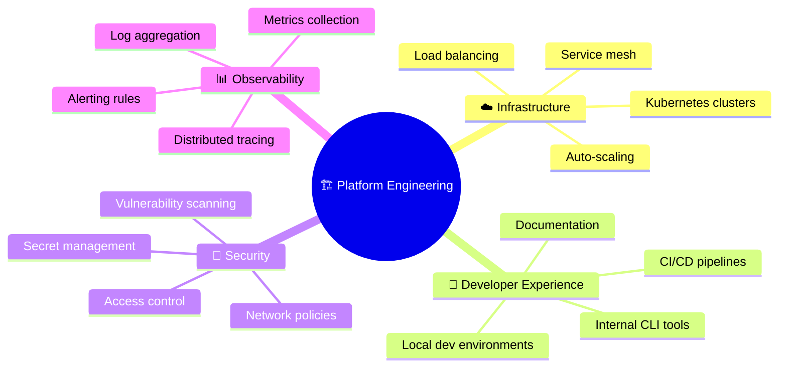
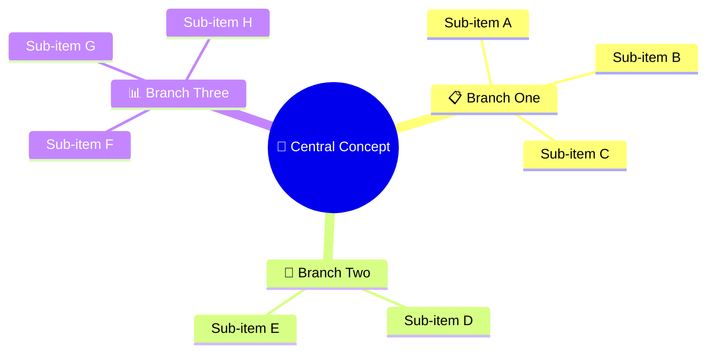

<!-- 来源：https://github.com/SuperiorByteWorks-LLC/agent-project |许可证：Apache-2.0 |作者：Clayton Young / Superior Byte Works, LLC (Boreal Bytes) -->

# Mindmap

> **返回[风格指南](../mermaid_style_guide.md)** — 首先阅读风格指南了解表情符号、颜色和可访问性规则。

* *语法关键字：** `mindmap`
* *最佳用于：**头脑风暴、概念组织、知识层次、主题分解
* *何时不使用：**顺序流程（使用[流程图](flowchart.md)）、时间线（使用[时间线](timeline.md)）

> ⚠️ **辅助功能：**思维导图**不**支持`accTitle`/`accDescr`。始终在代码块的正上方放置描述性的斜体 Markdown 段落。

- --

## 示例图

_Mindmap 显示平台工程团队的关键职责领域，分为基础设施、开发人员体验、安全性和可观察性域：_

- --

## 提示

- 保持**3-4个主分支**与**3-5个子项**每个
- 在分支标题上使用表情符号以进行视觉区分
- 嵌套深度不要超过3 level
- 根节点使用 `(( ))` 表示圆形
- **始终** 与屏幕阅读器上面的 Markdown 文本描述配对

- --

## 模板

_此思维导图显示内容及其涵盖的关键类别的描述：_

