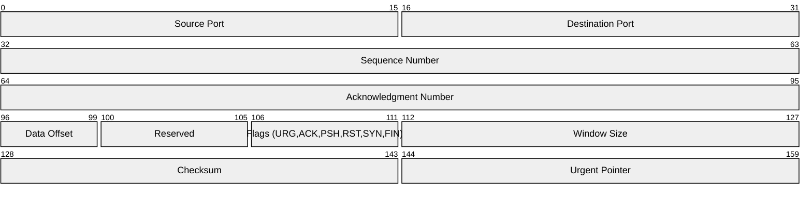
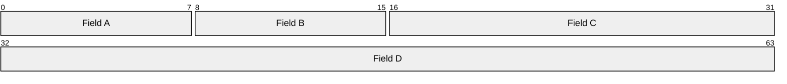

<!-- 来源：https://github.com/SuperiorByteWorks-LLC/agent-project |许可证：Apache-2.0 |作者：Clayton Young / Superior Byte Works, LLC (Boreal Bytes) -->

# 数据包图

> **返回[风格指南](../mermaid_style_guide.md)** — 首先阅读风格指南了解表情符号、颜色和可访问性规则。

* *语法关键字：** `packet-beta`
* *最适合：**网络协议头、数据结构布局、二进制格式文档、位级规范
* *何时不使用：**通用数据模型（使用[ER](er.md)）、系统架构（使用[C4](c4.md)或[Architecture](architecture.md)）

> ⚠️ **辅助功能：**数据包图**不**支持`accTitle`/`accDescr`。始终在代码块的正上方放置一个描述性的_斜体_ Markdown 段落。

- --

## 示例图

_数据包图，显示简化的 TCP 标头的结构，其中字段大小以位为单位：_

- --

## 提示

- 范围为 `start-end:`，以位为单位（0 索引）
- 保持字段标签简洁 - 如果需要则缩写
- 用于任何固定宽度的二进制格式，而不仅仅是网络数据包
- 行宽度默认为 32 位 - 字段自然换行
- **始终** 与 Markdown 配对屏幕阅读器上面的文本描述

- --

## 模板

_协议或数据格式及其字段结构的描述：_

