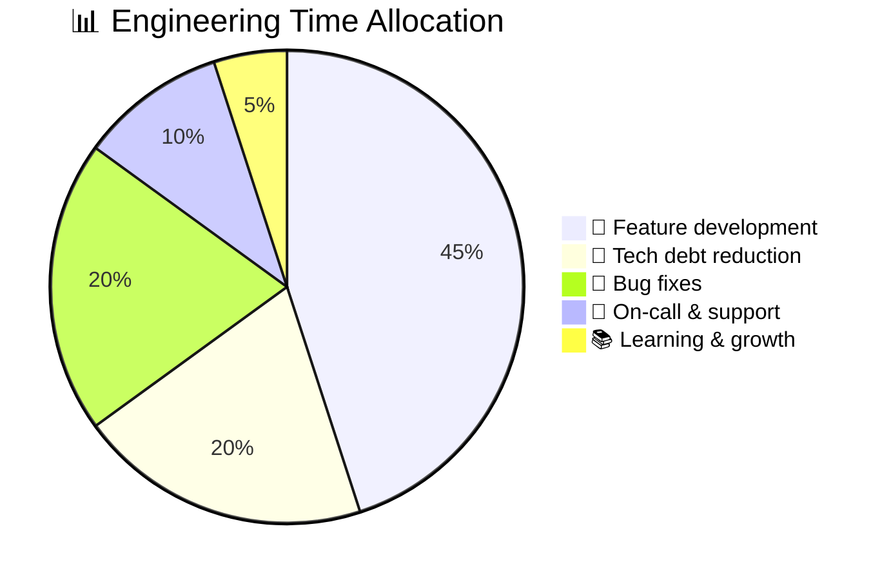
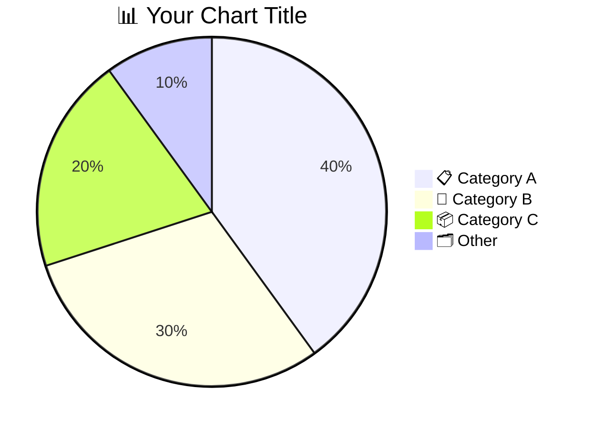

<!-- 来源：https://github.com/SuperiorByteWorks-LLC/agent-project |许可证：Apache-2.0 |作者：Clayton Young / Superior Byte Works, LLC (Boreal Bytes) -->

# Pie Chart

> **返回[样式指南](../mermaid_style_guide.md)** — 首先阅读样式指南以了解表情符号、颜色和可访问性规则。

* *语法关键字：** `pie`
* *最适合：**简单的比例细分、预算分配、构成、调查结果
* *何时不使用：**随时间变化的趋势（使用[XY图表](xy_chart.md)）、精确比较（使用表格）、超过7个类别

- --

## 示例图

- --

## 提示

- 值是成比例的-它们不需要总和为100
- 使用带有**表情符号前缀**的描述性标签进行视觉区分
- 限制为**最多7片**-将小片分组为“📦其他“
- 始终包含带有相关表情符号的 `title`
- 将切片从大到小排序以提高可读性

- --

## 模板

