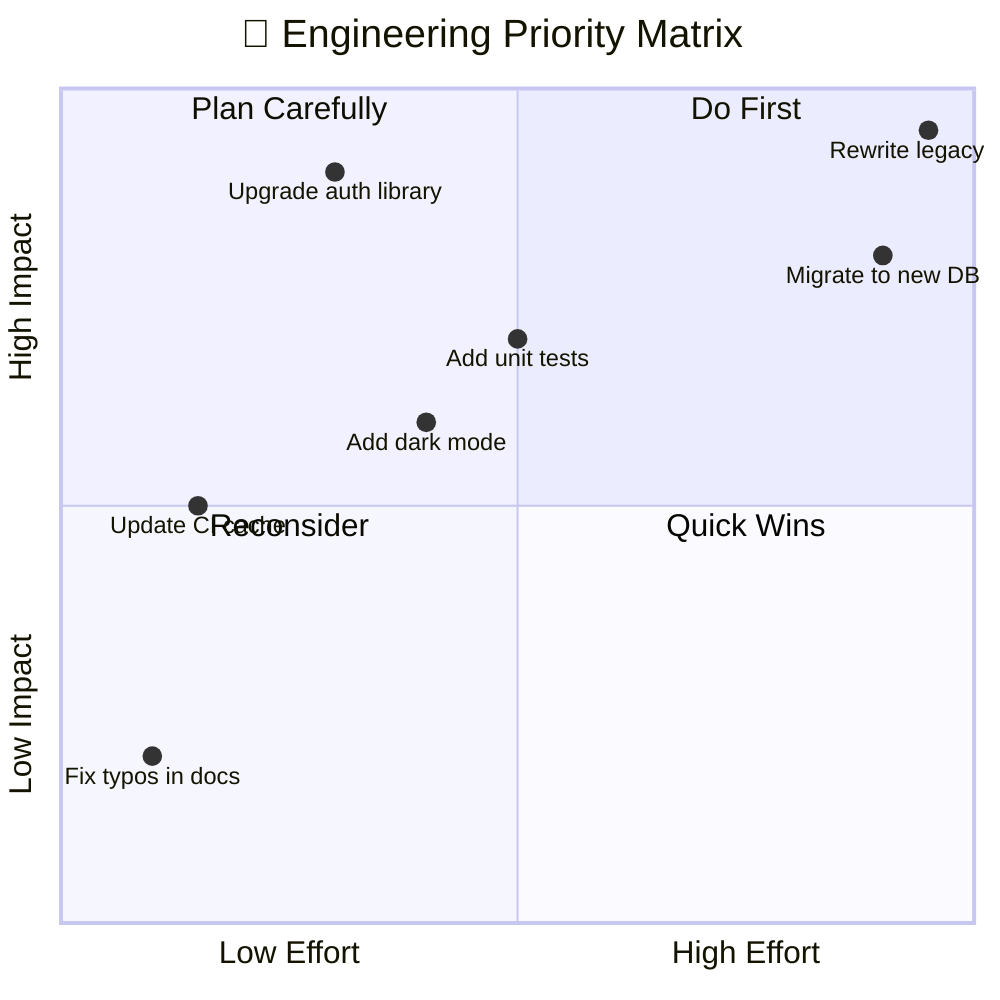
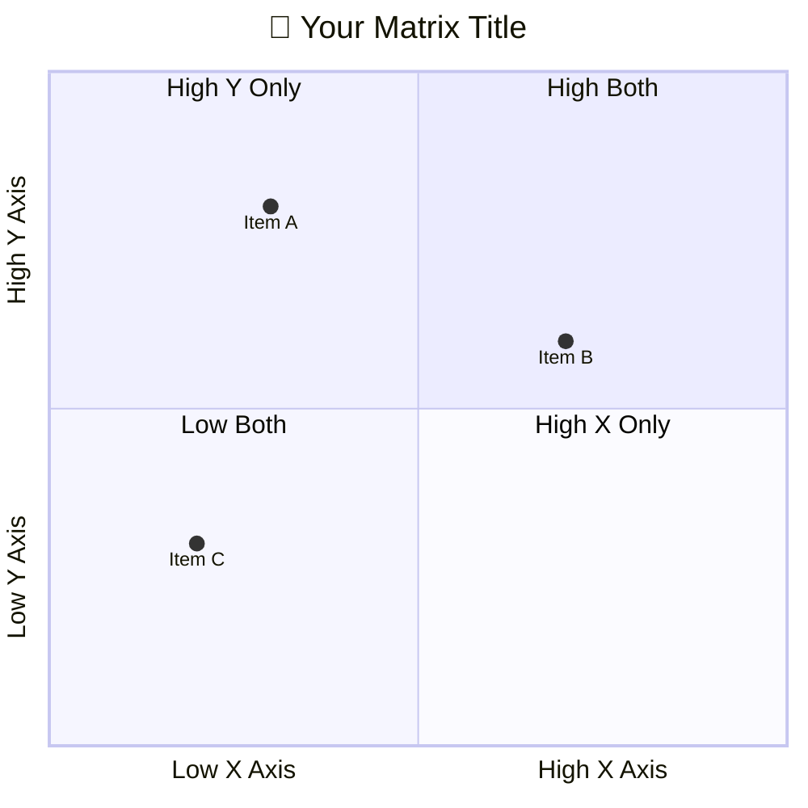

<!-- 来源：https://github.com/SuperiorByteWorks-LLC/agent-project |许可证：Apache-2.0 |作者：Clayton Young / Superior Byte Works, LLC (Boreal Bytes) -->

# 象限图

> **返回[样式指南](../mermaid_style_guide.md)** — 首先阅读样式指南以了解表情符号、颜色和可访问性规则。

* *语法关键字：** `quadrantChart`
* *最适合：**优先级矩阵、风险评估、两轴比较、努力/影响分析
* *何时不使用：**基于时间的数据（使用 [Gantt](gantt.md)或 [XY Chart](xy_chart.md)）、简单排名（使用表格）

> ⚠️ **辅助功能：**象限图**不**支持`accTitle`/`accDescr`。始终将描述性的_斜体_ Markdown 段落直接放在代码块上方。

- --

## 示例图

_按所需工作量与业务影响绘制工程计划的优先级矩阵，帮助团队决定下一步要构建什么：_

- --

## 提示

- 使用 `Low X --> High X` 格式标记轴
- 使用 **可操作** 标签命名所有四个象限
- 将项目绘制为 `Name: [x, y]`，值为 0.0–1.0
- 限制为 **5–10 个项目** — 更多会变得混乱
- 象限编号：1=右上、2=左上、3=左下、4=右下
- **始终**与屏幕阅读器上面的 Markdown 文本描述配对

- --

## 模板

_两个轴的描述以及象限位置意思是：_

