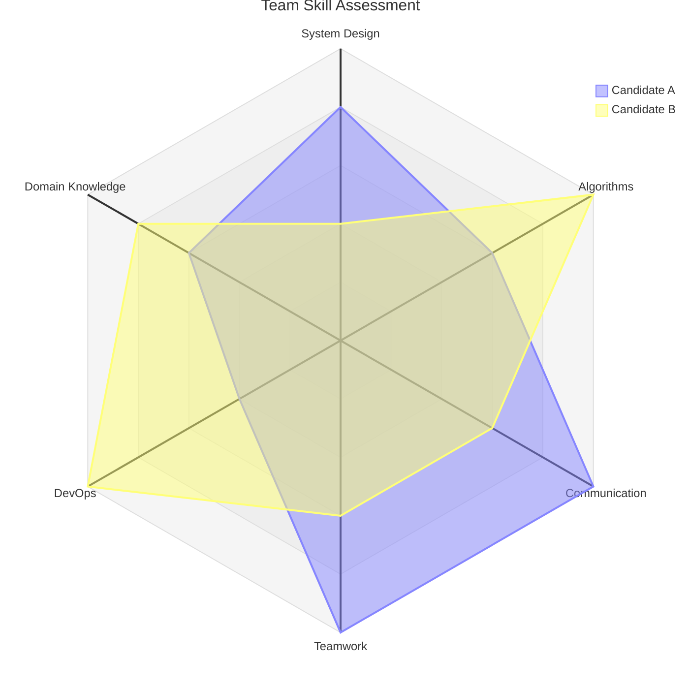
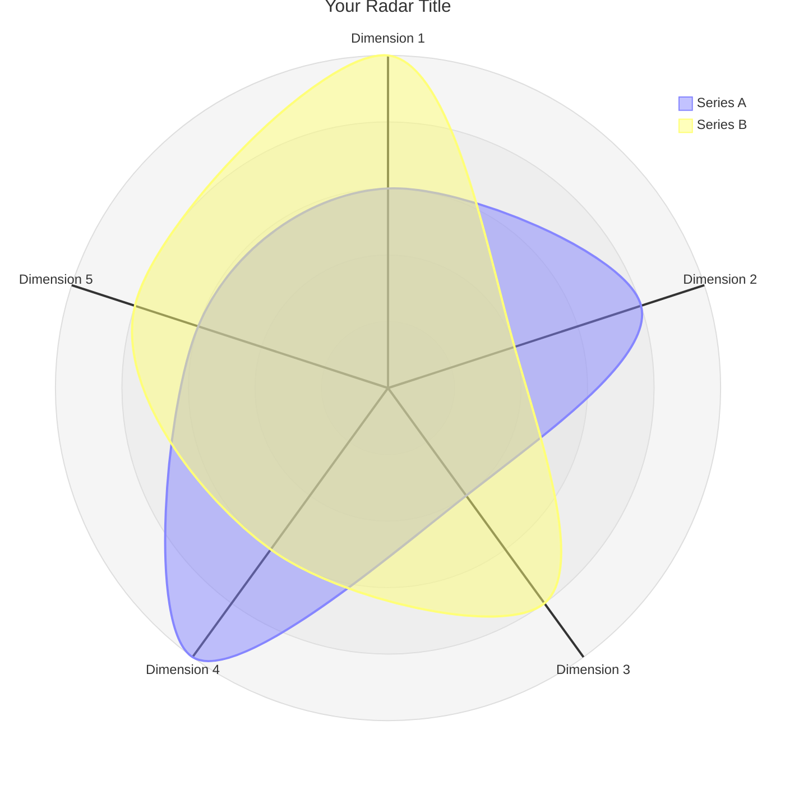

<!-- 来源：https://github.com/SuperiorByteWorks-LLC/agent-project |许可证：Apache-2.0 |作者：Clayton Young / Superior Byte Works, LLC (Boreal Bytes) -->

# Radar Chart

> **返回[风格指南](../mermaid_style_guide.md)** — 首先阅读风格指南了解表情符号、颜色和可访问性规则。

* *语法关键字：** `radar-beta`
* *美人鱼版本：** v11.6.0+
* *最适合：**多维度比较、技能评估、绩效概况、竞争分析
* *何时不使用：**时间序列数据（使用[XY图表](xy_chart.md)）、简单比例（使用[Pie](pie.md))

> ⚠️ **辅助功能：** 雷达图 **不** 支持 `accTitle`/`accDescr`。始终在代码块正上方放置一个描述性的_斜体_ Markdown 段落。

- --

## 示例图

_雷达图比较六个核心能力领域的两个工程候选人，显示互补的优势：_

- --

## 提示

- 使用 `axis id["Label"]` 定义轴 — 使用短标签（1–2 个字）
- 使用 `curve id["Label"]{val1, val2, ...}` 匹配轴顺序定义曲线
- 设置 `max` 将所有值标准化为相同比例
- `graticule` 选项：`circle` （默认）或 `polygon`
- `ticks` 控制同心环的数量（默认 5）
- `showLegend true` 为多条曲线添加图例
- 保持 **5–8 轴**和 **2–4 曲线** 以提高可读性
- **始终** 与 Markdown 文本配对屏幕阅读器的上述描述

- --

## 模板

_在哪些实体之间比较哪些维度的描述：_

