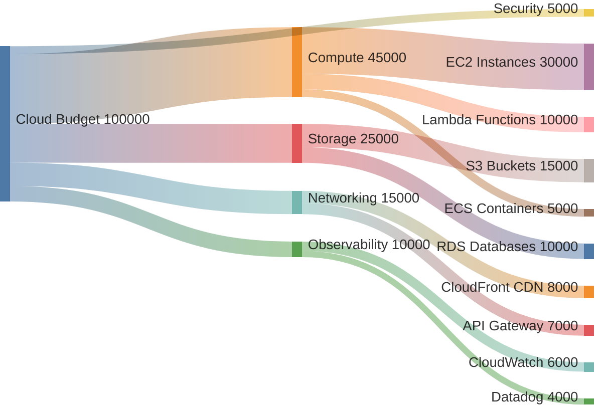
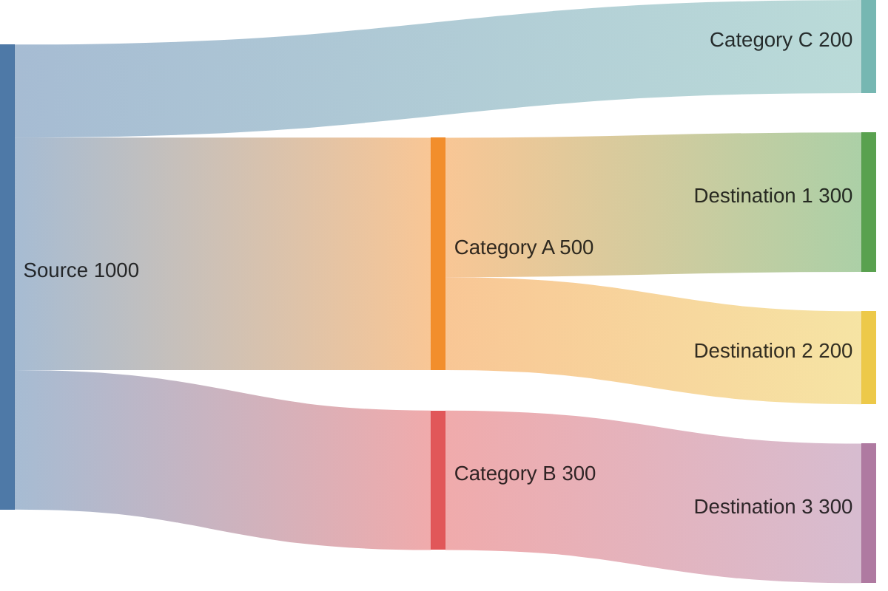

<!-- 来源：https://github.com/SuperiorByteWorks-LLC/agent-project |许可证：Apache-2.0 |作者：Clayton Young / Superior Byte Works, LLC (Boreal Bytes) -->

# Sankey 图

> **返回[样式指南](../mermaid_style_guide.md)** — 首先阅读样式指南以了解表情符号、颜色和可访问性规则。

* *语法关键字：** `sankey-beta`
* *最适合：**流量大小可视化、资源分配、预算分配、流量路由
* *何时不使用：**简单比例（使用[Pie](pie.md)）、流程步骤（使用[Flowchart](flowchart.md)）

> ⚠️ **可访问性：**桑基图**不**支持`accTitle`/`accDescr`。始终在代码块正上方放置描述性的斜体 Markdown 段落。

- --

## 示例图

_Sankey 图显示每月 10 万美元的云预算如何从总分配通过服务类别（计算、存储、网络、可观测性）流向特定的 AWS 服务，带宽与成本：_

- --

## 提示

- 格式：`Source,Target,Value` — 每行一个流
- 值决定每个流带的宽度
- 保持最大 **3 级**（来源 → 类别 →目的地）
- 组之间的空行提高了源代码的可读性
- 适合回答“💰去哪里？”问题
- 节点名称中没有表情符号（解析器限制）-使用描述性文本
- **始终**与屏幕阅读器上面的Markdown文本描述配对

- --

## 模板

_描述什么从哪里流到哪里以及大小代表：_

