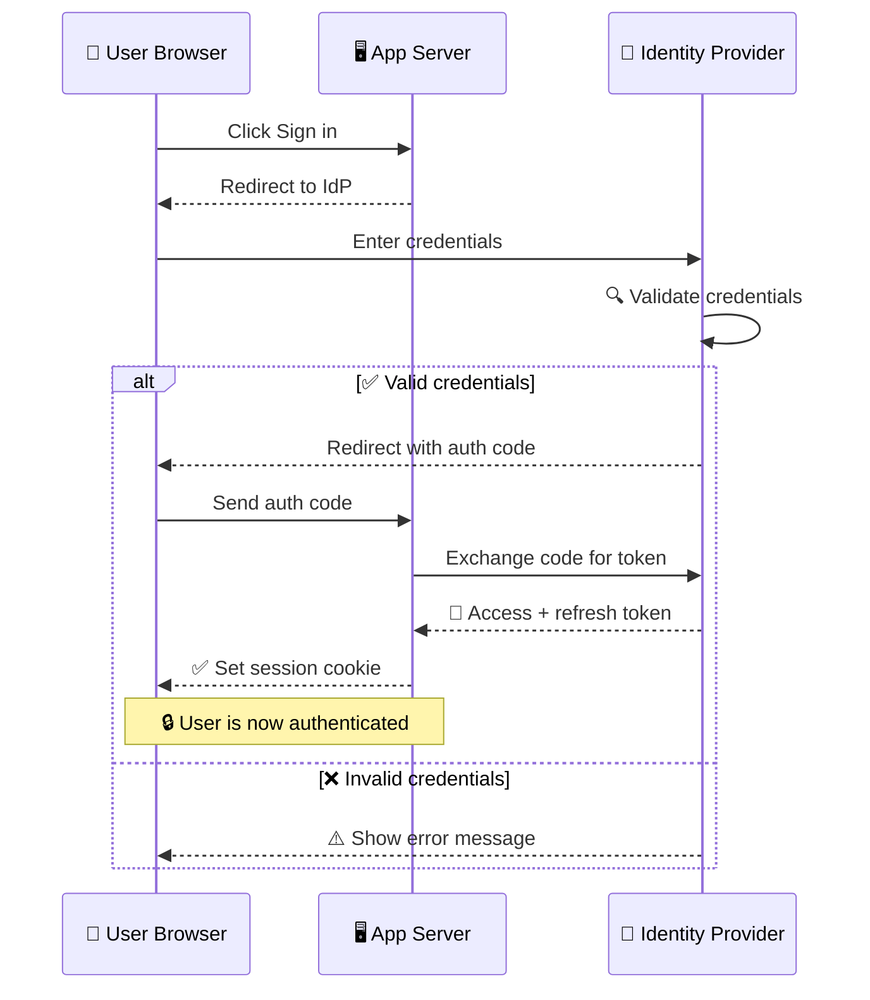
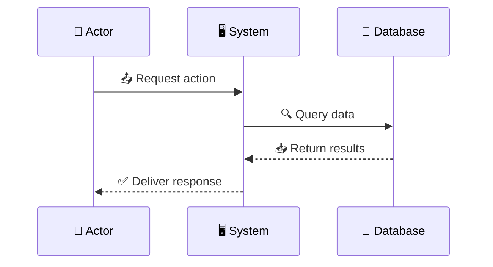
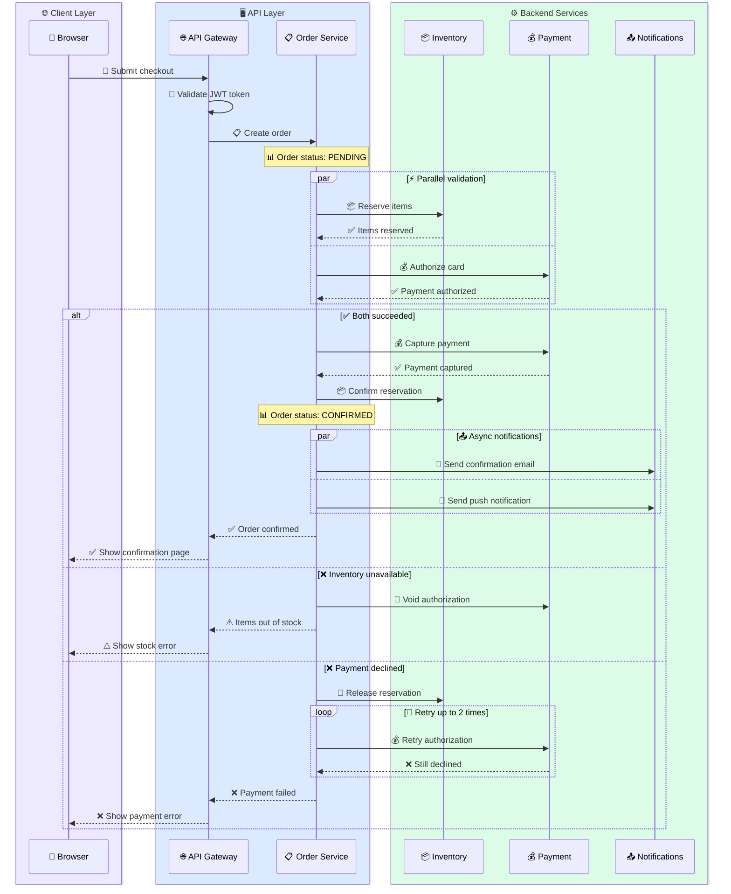

<!-- 来源：https://github.com/SuperiorByteWorks-LLC/agent-project |许可证：Apache-2.0 |作者：Clayton Young / Superior Byte Works, LLC (Boreal Bytes) -->

# 序列图

> **返回[样式指南](../mermaid_style_guide.md)** — 首先阅读样式指南以了解表情符号、颜色和可访问性规则。

* *语法关键字：** `sequenceDiagram`
* *最适合：** API 交互、时间流、多参与者通信、请求/响应模式
* *何时不使用：** 简单线性过程（使用 [Flowchart](flowchart.md)）、静态关系（使用 [Class](class.md)或 [ER](er.md)）

- --

## 示例图



- --

## 提示

- 限制为 **4–5 名参与者** — 更多则变得不可读
- 实线箭头 (`->>`)表示请求，虚线 (`-->>`)表示响应
- 使用`alt/else/end` 用于条件分支
- 使用 `Note over X,Y:` 进行带有表情符号的上下文注释
- 使用 `par/end` 进行并行操作
- 使用 `loop/end` 进行重复交互
- **消息文本**中的表情符号非常有助于状态清晰（✅， ❌, ⚠️, 🔐)

## 常见模式

* *并行调用：**

```
par 📥 Fetch user
    A->>B: GET /user
and 📥 Fetch orders
    A->>C: GET /orders
end
```

* *循环：**

```
loop ⏰ Every 30 seconds
    A->>B: Health check
    B-->>A: ✅ 200 OK
end
```

- --

## 模板



- --

## 复杂示例

A 微服务结账流程，有 6 个参与者分组在 `box` 区域。显示并行调用、条件分支、`break` 的错误处理、重试逻辑和上下文注释 - 用于复杂序列的完整工具包。



### 为什么有效

- **`box` 分组** 按架构层对参与者进行集群 - 读者可以立即看到哪些服务是面向客户的，哪些服务是后端的 
- **`par` 块** 显示同时发生的并行库存 + 付款检查，这就是真正的结帐系统如何提高性能
- **嵌套的 `alt`/`else`** 涵盖了幸福的道路和两个不同的失败模式，每种模式都有适当的清理（无效身份验证，释放保留）
- **`loop` 用于重试逻辑** 显示付款重试模式，而不会扰乱快乐路径
- **消息中的表情符号**使扫描速度更快 - 📦用于库存，💰用于付款，✅/❌用于结果
