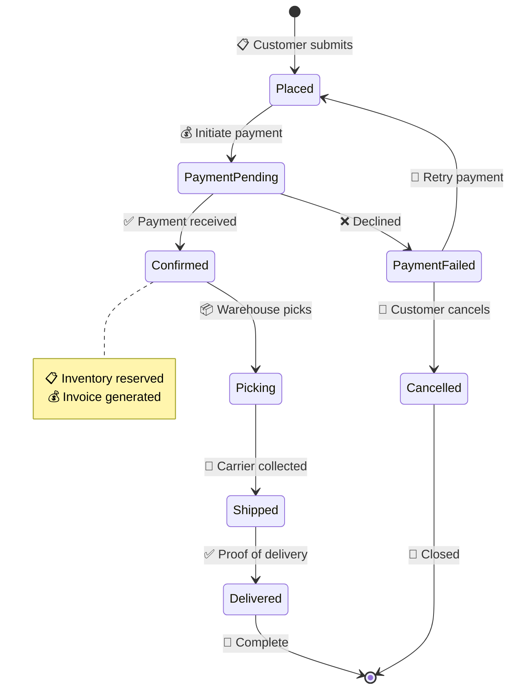
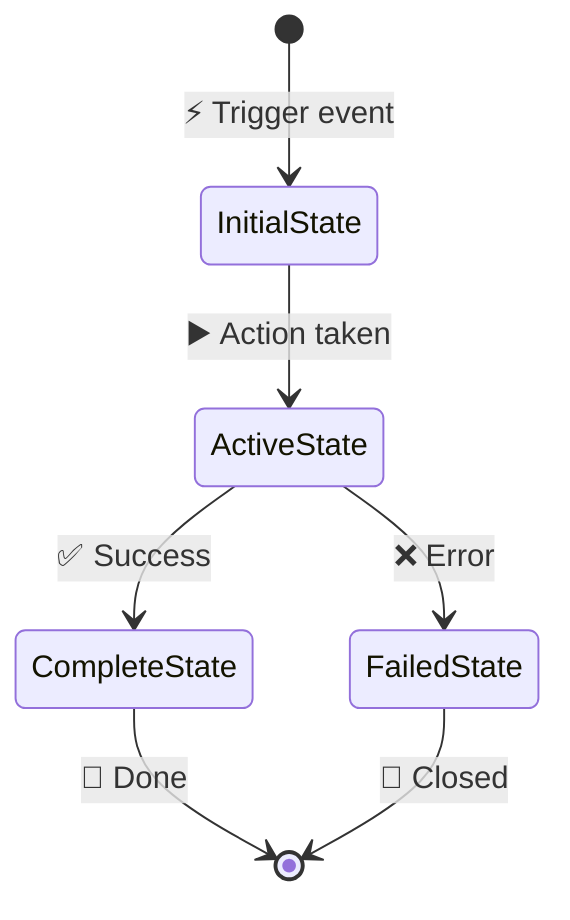
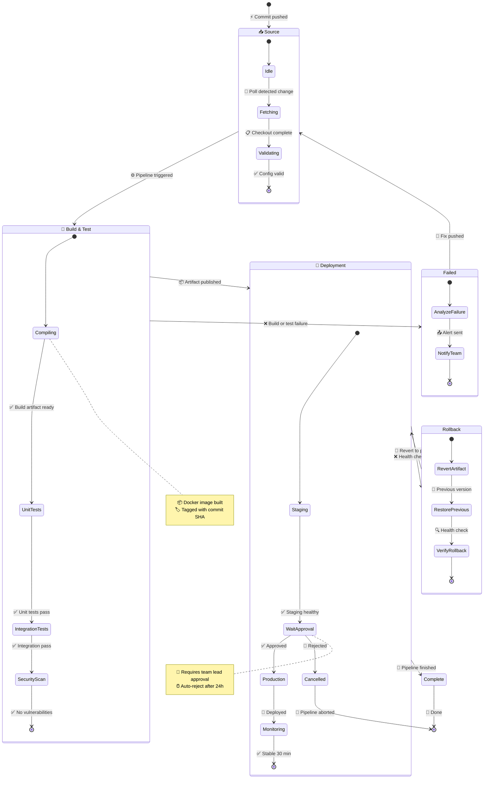

<!-- 来源：https://github.com/SuperiorByteWorks-LLC/agent-project |许可证：Apache-2.0 |作者：Clayton Young / Superior Byte Works, LLC (Boreal Bytes) -->

# 状态图

> **返回[样式指南](../mermaid_style_guide.md)** — 首先阅读样式指南以了解表情符号、颜色和可访问性规则。

* *语法关键字：** `stateDiagram-v2`
* *最佳用于：** 状态机、生命周期流程、状态转换、对象生命周期
* *何时不使用：** 具有多个步骤的顺序流程（使用 [Flowchart](flowchart.md)）、时序关键型交互（使用 [Sequence](sequence.md)）

- --

## 示例图

- --

## 提示

- 始终以`[*]`（初始状态）开始并以`[*]`（终端）结束
- 使用**表情符号+动作**来标记过渡以获得视觉清晰度
- 使用`note right of` / `note left of` 了解上下文详细信息
- 状态名称：`CamelCase`（状态图的美人鱼约定）
- 谨慎使用嵌套状态：`state "name" as s1 { ... }`
- 保持 **8–10 个状态** Maximum

- --

## 模板

- --

## 复杂示例

A CI/CD 管道建模为具有 3 个复合（嵌套）状态的状态机，每个状态都包含内部子状态。显示源更改如何通过构建、测试和部署阶段以及故障恢复和回滚转换流动。

### 为什么有效

- **复合状态组管道阶段** - 源、构建和测试以及部署各自包含其内部流程，可以单独阅读或作为整体的一部分
  - **失败和回滚是一流的状态** - 不仅仅是转换标签。失败和回滚状态有自己的内部子状态，显示恢复期间实际发生的情况
  - **关键状态注释**添加操作上下文 - 批准门有超时规则，编译步骤记录工件格式。这就是操作员需要的细节。
- **复合状态之间的转换**是高级流程（源 → 构建 → 部署 → 完成），而复合内的转换是详细步骤。两种读者的两种阅读水平。
