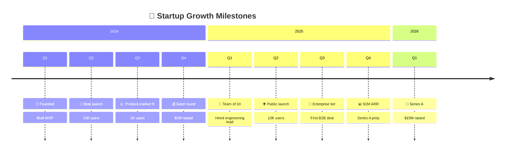
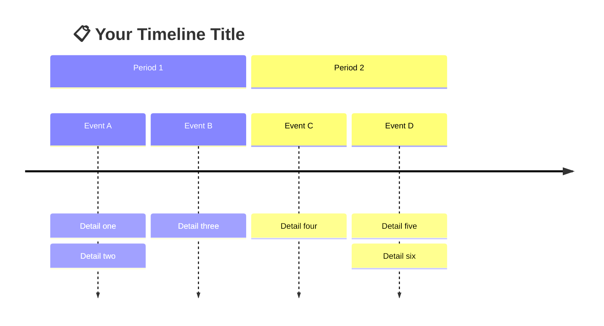
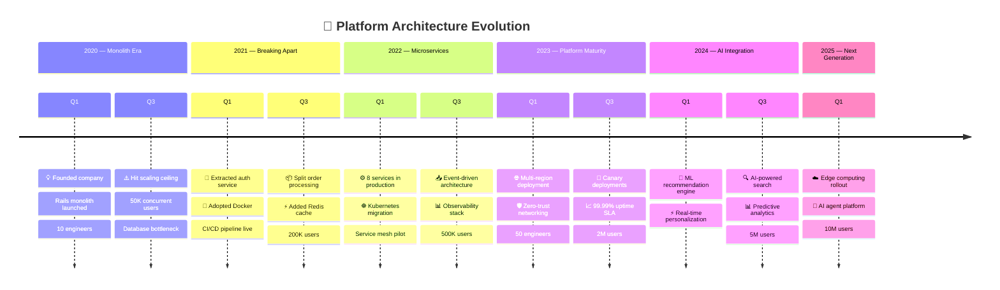

<!-- 来源：https://github.com/SuperiorByteWorks-LLC/agent-project |许可证：Apache-2.0 |作者：Clayton Young / Superior Byte Works, LLC (Boreal Bytes) -->

# Timeline

> **返回[样式指南](../mermaid_style_guide.md)** — 首先阅读样式指南以了解表情符号、颜色和辅助功能规则。

* *语法关键字：** `timeline`
* *最佳用于：** 按时间顺序排列的事件、历史进展、一段时间内的里程碑、发布历史
  * *何时不使用：** 任务持续时间/依赖性（使用 [Gantt](gantt.md)）、详细的项目计划（使用 [Gantt](gantt.md)）

> ⚠️ **可访问性：** 时间表 **不** 支持`accTitle`/`accDescr`。始终在代码块正上方放置一个描述性的_斜体_ Markdown 段落。

- --

## 示例图

_初创公司从成立到 A 轮的成长里程碑的时间线，按年份和季度组织：_

- --

## 提示

- 使用`section`按年、季度或阶段进行分组
- 每个条目可以有多个项目，用`:`
分隔-保持项目简洁-每个2-4个单词
- 关键项目开头的表情符号用于视觉锚定
- **始终**与上面针对屏幕阅读器的 Markdown 文本描述

- --

## 模板

_时间线及其涵盖的时期的描述：_

- --

## 复杂示例

_多年技术平台演变，跟踪初创公司从整体到整体的旅程微服务到人工智能驱动的平台。六个部分跨越 2020 年至 2025 年，每个部分都捕获了推动架构决策的关键技术里程碑和业务指标：_

### 为什么有效

- **6 个部分是时代，而不仅仅是年份** - “整体时代”、“分裂”、“微服务”讲述了架构发生变化的原因，而不仅仅是_when_
  - **业务指标与技术里程碑一起** - 用户数量和团队规模出现在架构决策旁边。这显示了推动每次演变的_压力_（50K 用户 → 扩展上限 → 提取服务）
- **每个时间点多个项目** — 每个季度包含 2-3 个项目，由 `:` 分隔，提供并行发生的所有事情的密集但可扫描的视图
- **表情符号锚定扫描** — 目光落在 🧠 ML、🌐 多区域、 ⚡ 在阅读正文之前先了解 Redis。快速浏览一下，表情符号本身就讲述了故事
