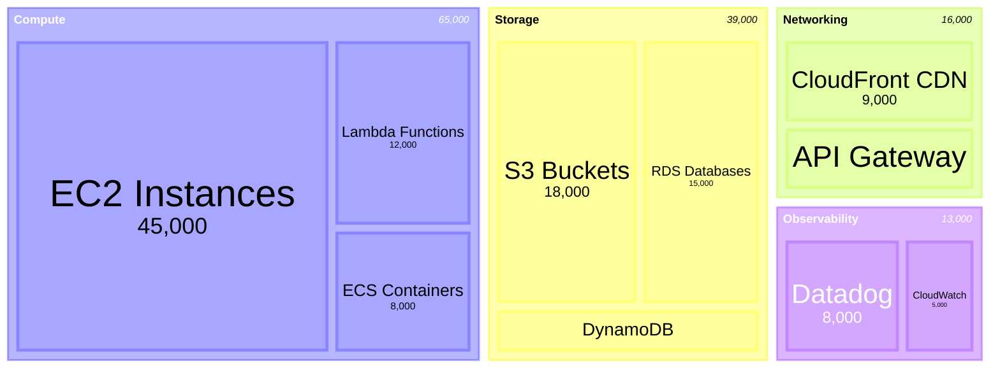
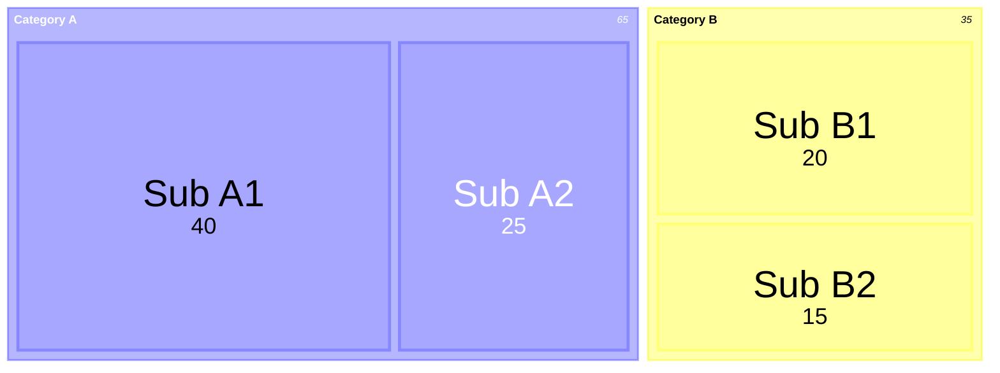

<!-- 来源：https://github.com/SuperiorByteWorks-LLC/agent-project |许可证：Apache-2.0 |作者：Clayton Young / Superior Byte Works, LLC (Boreal Bytes) -->

# 树形图

> **返回[样式指南](../mermaid_style_guide.md)** — 首先阅读样式指南以了解表情符号、颜色和可访问性规则。

* *语法关键字：** `treemap-beta`
* *美人鱼版本：** v11.12.0+
* *最适合：**分层数据比例、预算细分、磁盘使用情况、投资组合构成
* *何时不使用：**简单的扁平比例（使用[Pie](pie.md)）、基于流程的分层结构（使用[Sankey](sankey.md))

> ⚠️ **辅助功能：** 树形图 **不** 支持 `accTitle`/`accDescr`。始终在代码块正上方放置一个描述性的_斜体_ Markdown 段落。
>
> ⚠️ **GitHub 支持：** 树形图非常新 - 在使用之前验证它在您的目标 GitHub 版本上呈现。

- --

## 示例图

_Treemap 显示按服务类别和特定服务细分的年度云基础设施成本，矩形大小与支出成正比：_

- --

## 提示

- 父节点（部分）使用引号文本：`"Section Name"`
- 叶节点添加值：`"Leaf Name": 123`
- 层次结构由以下方式创建**缩进**（空格或制表符）
- 值决定每个矩形的大小 — 较大的值 = 较大的区域
- 为了清晰起见，保持 **2–3 级**的嵌套
- 使用 `classDef` 和 `:::class` 语法来设置节点样式
- **始终**与屏幕上方的 Markdown 文本描述配对读者

- --

## 模板

_分层数据的描述以及比例代表什么：_

