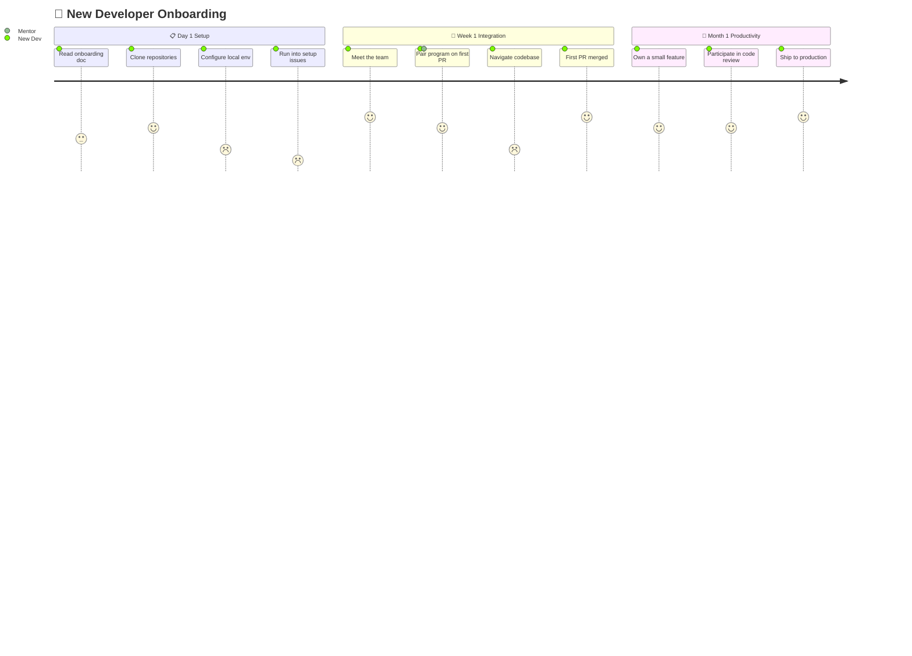
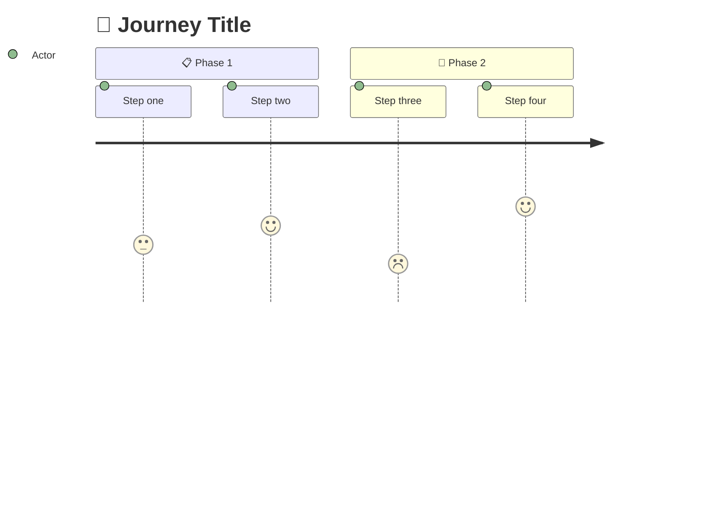
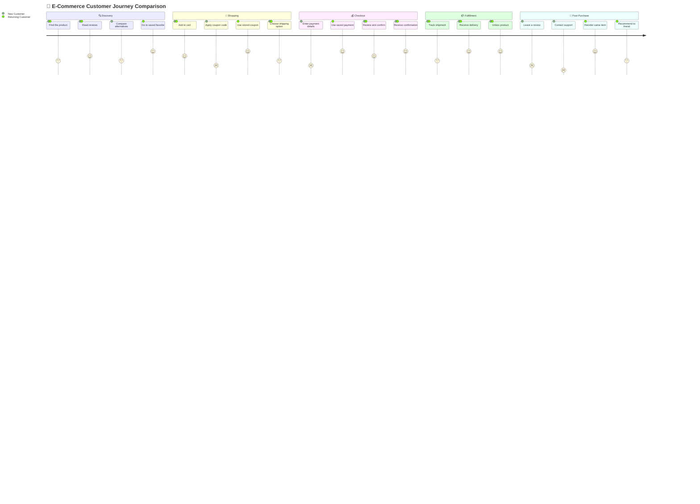

<!-- 来源：https://github.com/SuperiorByteWorks-LLC/agent-project |许可证：Apache-2.0 |作者：Clayton Young / Superior Byte Works, LLC (Boreal Bytes) -->

# 用户旅程

> **返回[样式指南](../mermaid_style_guide.md)** — 首先阅读样式指南以了解表情符号、颜色和可访问性规则。

* *语法关键字：** `journey`
* *最适合：**用户体验映射、客户旅程、流程满意度评分、入职流程
* *何时不使用：**没有满意度数据的简单流程（使用[流程图](flowchart.md)）、时间顺序事件（使用[时间轴](timeline.md)）

- --

## 示例图

- --

## 提示

- 分数：**1**=😤沮丧，**3**=😐中立，**5**=😄高兴
- 在分数后分配演员：`5 : Actor1, Actor2`
- 使用带有**表情符号前缀**的 `section` 按时间段或阶段进行分组
- 专注于 **痛点**（低分） - 这就是洞察力的所在
- 保持 **3–4 个部分**，每个部分 **3–4 个步骤**

- --

## 模板

- --

## 复杂示例

A 多人电子商务旅程，比较新客户与回头客的 5 个阶段。两位演员体验相同的流程，但满意度得分不同，准确揭示了首次用户体验需要投资的地方。

### 为什么有效

- **同一张地图上有两个角色** - 两个角色都出现在每个步骤中，而不是两个单独的图表。新客户 (2-3)和回头客 (4-5)之间的满意度差距在结账和购买后立即可见。
- **5 个部分遵循真正的漏斗** — 发现 → 购物 → 结账 → 履行 → 购买后。每个部分都讲述了一个关于新用户体验失败的地方的故事。
- **某些步骤是针对特定角色的** - “比较替代方案”仅适用于新客户，“重新订购相同商品”仅适用于回头客。这显示了共享旅程中的不同路径。
- **低分是可操作的见解** - 新客户在付款输入、优惠券申请和支持联系方面得分为 1-2。这些是可以提高转化率的具体用户体验投资。
