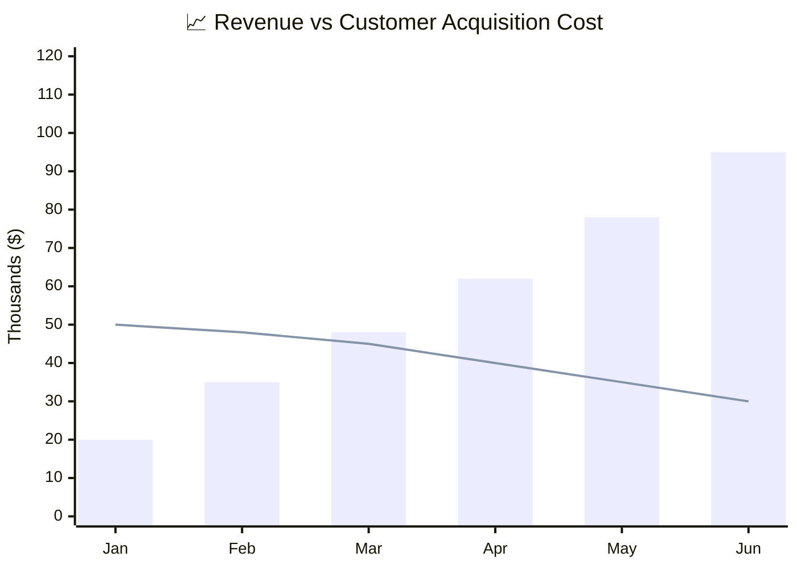
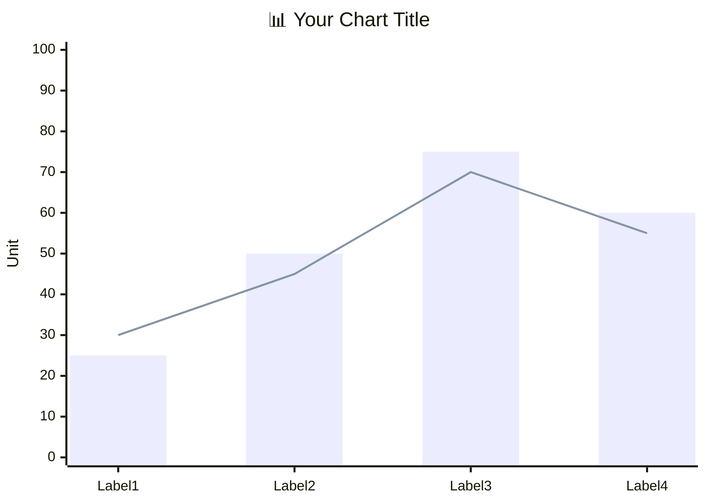

<!-- 来源：https://github.com/SuperiorByteWorks-LLC/agent-project |许可证：Apache-2.0 |作者：Clayton Young / Superior Byte Works, LLC (Boreal Bytes) -->

# XY Chart

> **返回[样式指南](../mermaid_style_guide.md)** — 首先阅读样式指南以了解表情符号、颜色和可访问性规则。

* *语法关键字：** `xychart-beta`
* *最适合：**数值数据可视化、随时间变化的趋势、条形图/折线图比较、指标仪表板
* *何时不使用：**比例细分（使用 [Pie](pie.md)）、定性比较（使用 [Quadrant](quadrant.md)）

> ⚠️ **辅助功能：** XY 图表**不**支持`accTitle`/`accDescr`。始终在代码块正上方放置描述性的_斜体_ Markdown 段落。

- --

## 示例图

_XY 图表比较六个月内的每月收入增长（条形）与客户获取成本（线），显示单位经济效益随着收入增长而提高，同时 CAC 稳定减少：_

- --

## 提示

- 组合 `bar` 和 `line` 在同一图表上显示不同的指标
- 在标题中使用**表情符号**以获得视觉效果： `"📈 Revenue Growth"`
- 使用引用的 `title` 和轴标签
- 使用 `min --> max`
 定义轴范围- 将数据点保持为 **6–12** 以提高可读性
- 多个 `bar` 或 `line` 条目创建分组系列
- **始终**与屏幕阅读器上面的详细 Markdown 文本描述配对

- --

## 模板

_X 轴、Y 轴、条形和线条代表的内容的描述以及关键见解：_

