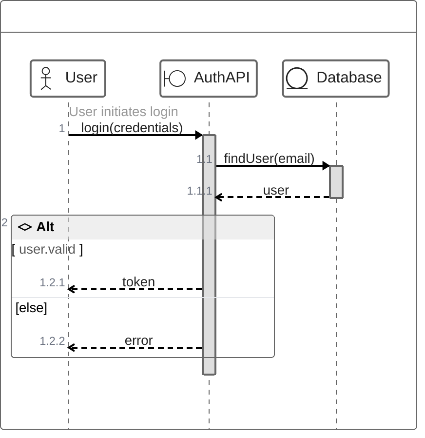
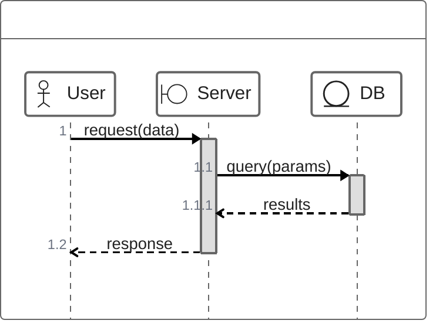

<!-- 来源：https://github.com/SuperiorByteWorks-LLC/agent-project |许可证：Apache-2.0 |作者：Clayton Young / Superior Byte Works, LLC (Boreal Bytes) -->

# ZenUML 序列图

> **返回[样式指南](../mermaid_style_guide.md)** — 首先阅读样式指南以了解表情符号、颜色和可访问性规则。

* *语法关键字：** `zenuml`
* *最适合：**类似代码的序列图、方法调用式交互、熟悉编程语法的开发人员
* *何时不使用：**对于大多数用例，首选标准[序列图](sequence.md) — ZenUML 需要外部插件，并且 GitHub 支持有限。

> ⚠️ **GitHub 支持：** ZenUML 需要`@mermaid-js/mermaid-zenuml`外部模块。它可能**无法在 GitHub 上原生呈现**。使用标准 `sequenceDiagram` 语法以实现 GitHub 兼容性。
>
> ⚠️ **辅助功能：**ZenUML **不**支持 `accTitle`/`accDescr`。始终在代码块正上方放置描述性的_斜体_ Markdown 段落。

- --

## 示例图

_ZenUML 序列图显示使用编程风格语法进行凭证验证和令牌生成的用户身份验证流程：_

- --

## 提示

- 在方法调用中使用**编程风格语法**：`A->B.method(args)`
- 大括号 `{}` 创建自然嵌套（激活栏）
- 控制流程：`if/else`、`while`、`for`、 `try/catch/finally`、`par`
- 参与者类型：`@Actor`、`@Boundary`、`@Entity`、`@Database`、`@Control`
- 上面带有 `//` 渲染的评论messages
- `return` 关键字绘制返回箭头
- **为了 GitHub 兼容性首选标准 `sequenceDiagram`**
- 仅当特别需要代码样式语法时才使用 ZenUML

- --

## 模板

_交互描述流程：_

