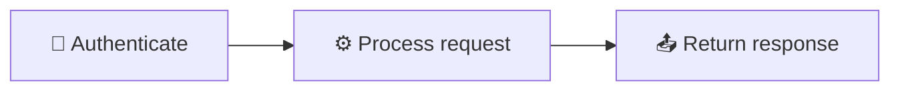
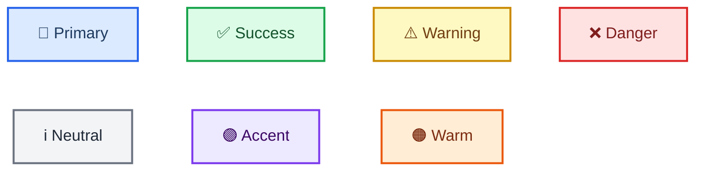

<!-- 来源：https://github.com/SuperiorByteWorks-LLC/agent-project |许可证：Apache-2.0 |作者：Clayton Young / Superior Byte Works, LLC (Boreal Bytes) -->

# 美人鱼图风格指南

> **对于 AI 代理：** 阅读此文件以了解所有核心样式规则。然后使用[图表选择表](#choosing-the-right-diagram)选择正确的类型并点击其链接 - 每种类型都有自己的文件，其中包含生产质量的示例、提示和复制粘贴模板。
>
> **对于人类：** 本指南 + 链接的图表文件确保您存储库中的每个美人鱼图表都可访问、专业，并在 GitHub 明暗模式下清晰呈现。从您的 `AGENTS.md` 或贡献指南中引用它。

* *目标平台：** GitHub Markdown（问题、PR、讨论、Wiki、`.md` 文件）
* *设计目标：** 最小的专业样式，在 GitHub 浅色和深色模式下呈现精美，可供屏幕阅读器访问，并以零视觉清晰地进行交流噪音。

- --

## 代理快速入门

1. **选择图表类型** → [选择表](#choosing-the-right-diagram)
2. **打开该类型的文件** → 复制模板，填写您的内容
3. **应用此文件中的样式** → 表情符号来自[批准的集合](#approved-emoji-set)，颜色来自[批准的调色板](#github-兼容的颜色-classes)
4. **添加辅助功能** → `accTitle` + `accDescr`（或不支持的类型的斜体 Markdown 段落）
5. **验证** → 在浅色模式、深色模式和屏幕阅读器下渲染

- --

## 核心原则

| ＃|原理|规则|
| --- | ------------------------------------------ | ------------------------------------------------------------------------------------------------------ |
| 1 | **各个尺度的清晰度** |简单的图表保持平坦。复杂的使用子图。非常复杂的部分分为概述+细节。 |
| 2 | **始终可访问性** |每个图表都有 `accTitle` + `accDescr`。没有例外。                                             |
| 3 | **主题中立** |没有 `%%{init}` 主题指令。无内联`style`。让 GitHub 自动主题化。                              |
| 4 | **语义清晰度** | `snake_case` 与标签匹配的节点ID。主动语态。句案。                                  |
| 5 | **一致的风格** |相同的表情符号 = 到处都相同的含义。相同的形状=相同的语义。                                    |
| 6 | **最低限度的专业才能** |一点表情符号+战略性粗体+可选的`classDef`——再也不会这样了。                                  |

- --

## 可访问性要求

* *每个图表必须包含 `accTitle` 和 `accDescr`：**

```
accTitle: Short Name 3-8 Words
accDescr: One or two sentences explaining what this diagram shows and what insight the reader gains from it
```

- `accTitle` — 3–8 个单词，纯文本，名称图
- `accDescr` — **单行** 1-2 个句子（GitHub 限制），解释目的和关键结构

* *不支持 `accTitle`/`accDescr` 的图表类型：** 思维导图、时间轴、象限图、Sankey、XY 图表、块、看板、数据包、架构、雷达、树形图。对于这些，请在代码块正上方放置一个描述性的_斜体_ Markdown 段落作为可访问的描述。

> **ZenUML 注意：** ZenUML 需要外部插件，并且可能无法在 GitHub 上呈现。首选标准 `sequenceDiagram` 语法。

- --

## 主题配置

### ✅ 做：无主题指令（GitHub 自动检测）



### ❌ 不做：内联样式或自定义主题

```
%% BAD — breaks dark mode
style A fill:#e8f5e9
%%{init: {'theme':'base'}}%%
```

- --

## 批准的表情符号集

每个节点一个表情符号，位于标签的开头。相同的表情符号 = 项目中所有图表的含义相同。

### 系统和基础设施

|表情符号 |意义|示例 |
| -----| --------------------------------- | ------------------------- |
| ☁️ |云/平台/托管服务| `[☁️ AWS Lambda]` |
| 🌐 |网络/网络/连接| `[🌐 API gateway]` |
| 🖥️ |服务器/计算机/机器| `[🖥️ Application server]` |
| 💾 |存储/数据库/持久化| `[💾 PostgreSQL]` |
| 🔌 |集成/插件/连接器| `[🔌 Webhook handler]` |

### 流程和操作

|表情符号 |意义|示例|
| -----| -------------------------------- | ------------------------- |
| ⚙️ |流程/配置/引擎 | `[⚙️ Build pipeline]` |
| 🔄 |循环/同步/重复过程| `[🔄 Retry loop]` |
| 🚀 |部署/启动/发布 | `[🚀 Ship to production]` |
| ⚡ |快速动作/触发/事件| `[⚡ Webhook fired]` |
| 📦 |包/工件/捆绑| `[📦 Docker image]` |
| 🔧 |工具/实用/维护| `[🔧 Migration script]` |
| ⏰ |预定/cron/基于时间| `[⏰ Nightly job]` |

### 人员与角色

|表情符号 |意义|示例|
| -----| ---------------------------- | -------------------- |
| 👤 |用户/人/演员| `[👤 End user]` |
| 👥 |团队/团体/组织 | `[👥 Platform team]` |
| 🤖 |机器人/代理/自动化| `[🤖 CI bot]` |
| 🧠 |智能/决策/AI | `[🧠 ML classifier]` |

### 状态与结果

|表情符号 |意义|示例|
| -----| ------------------------------------------- | ---------------------- |
| ✅ |成功/批准/完成 | `[✅ Tests passed]` |
| ❌ |失败/被阻止/被拒绝| `[❌ Build failed]` |
| ⚠️ |警告/小心/风险| `[⚠️ Rate limited]` |
| 🔒 |锁定/限制/保护| `[🔒 Requires admin]` |
| 🔐 |安全/加密/身份验证 | `[🔐 OAuth handshake]` |

### 信息与数据

|表情符号 |意义|示例|
| -----| ------------------------------------------- | -------------------- |
| 📊 |分析/指标/仪表板 | `[📊 Usage metrics]` |
| 📋 |清单/表格/库存| `[📋 Requirements]` |
| 📝 |文档/日志/记录| `[📝 Audit trail]` |
| 📥 |输入/接收/摄取| `[📥 Event stream]` |
| 📤 |输出/发送/发出| `[📤 Notification]` |
| 🔍 |搜索/审查/检查| `[🔍 Code review]` |
| 🏷️ |标签/标签/版本| `[🏷️ v2.1.0]` |

### 特定域

|表情符号 |意义|示例|
| -----| ------------------------------------------- | ----------------------- |
| 💰 |财务/成本/计费| `[💰 Invoice]` |
| 🧪 |测试/实验/质量保证 | `[🧪 A/B test]` |
| 📚 |文档/知识库 | `[📚 API docs]` |
| 🎯 |目标/目标/目的| `[🎯 OKR tracking]` |
| 🗂️ |类别/组织/存档| `[🗂️ Backlog]` |
| 🔗 |链接/参考/依赖 | `[🔗 External API]` |
| 🛡️ |防护/护栏/政策| `[🛡️ Rate limiter]` |
| 🏁 |开始/结束/里程碑| `[🏁 Sprint complete]` |
| ✏️ |编辑/修改/更新| `[✏️ Address feedback]` |
| 🎨 |设计/创意/UI | `[🎨 Design review]` |
| 💡 |想法/见解/灵感| `[💡 Feature idea]` |

### 表情符号规则

1. **起始位置：** `[🔐 Authenticate]` 不是 `[Authenticate 🔐]`
2. **每个节点最多一个** — 切勿堆叠
3. **一致性是强制性的** — 所有图表中相同的表情符号 = 相同的概念
4. **并非每个节点都需要** — 在受益于视觉区分的关键节点上使用
5. **没有装饰性表情符号：** 🎉 💯 🔥 🎊 💥 ✨ — 它们会增加噪音，没有意义

- --

## GitHub 兼容的颜色类

 * *仅在您真正需要颜色编码（多角色图、严重级别）时才使用**。首先优先选择形状+表情符号。

* *批准的调色板（在 GitHub 浅色和深色模式下测试）：**

|语义使用 | `classDef` 定义 |视觉|
| ---------------------- | ------------------------------------------------------------------------ | -------------------------------------------------- |
| **主要/行动** | `fill:#dbeafe,stroke:#2563eb,stroke-width:2px,color:#1e3a5f` |浅蓝色填充，蓝色边框，深海军蓝文字|
| **成功/积极** | `fill:#dcfce7,stroke:#16a34a,stroke-width:2px,color:#14532d` |浅绿色填充，绿色边框，深色森林文本|
| **警告/小心** | `fill:#fef9c3,stroke:#ca8a04,stroke-width:2px,color:#713f12` |浅黄色填充，琥珀色边框，深棕色文字|
| **危险/危急** | `fill:#fee2e2,stroke:#dc2626,stroke-width:2px,color:#7f1d1d` |浅红色填充，红色边框，深红色文字|
| **中立/信息** | `fill:#f3f4f6,stroke:#6b7280,stroke-width:2px,color:#1f2937` |浅灰色填充，灰色边框，近黑色文本 |
| **强调/突出** | `fill:#ede9fe,stroke:#7c3aed,stroke-width:2px,color:#3b0764` |浅紫色填充，紫色边框，深紫色文字|
| **温暖/商业** | `fill:#ffedd5,stroke:#ea580c,stroke-width:2px,color:#7c2d12` |浅桃色填充、橙色边框、深色铁锈色文本 |

* *实时预览 - 渲染的所有 7 个类：**



* *规则：**

1. 始终包含 `color:`（文本颜色） - 深色模式背景可以隐藏默认文本 
2. 使用 `classDef` + `class` — **从不**内联 `style` 指令
3. 每个图表最多 **3–4 种颜色类别**
4. **永远不要单独依赖颜色** — 始终与表情符号、形状或标签文本配对

- --

## 节点命名和标签

|规则| ✅ 好 | ❌ 不好 |
| -------------------- | -------------------------- | ----------------------------------- | --- | -----| -------------------------------------- | ---|
| `snake_case` ID | `run_tests`、`deploy_prod` | `A`、`B`、`node1` |
| ID 匹配标签 | `open_pr` → “公开公关”| `x` → “打开公关”|
|具体名称| `check_unit_tests` | `check` |
|表示动作的动词 | `run_lint`、`deploy_app` | `linter`、`deployment` |
|国家名词 | `review_state`、`error` | `reviewing`、`erroring` |
| 3–6 字标签 | `[📥 Fetch raw data]` | `[Raw data is fetched from source]` |
|主动语态 | `[🧪 Run tests]` | `[Tests are run]` |
|句格| `[Start pipeline]` | `[Start Pipeline]` |
|边缘标签 1–4 个字 | `-->                       | All green                           |     |`---> |所有测试均顺利通过 |     |

- --

## 节点形状

使用一致的形状来传达不带颜色的节点类型：

|形状|语法 |含义|
| ----------------- | ---------- | ---------------------------- |
|圆角矩形 | `([text])` |开始/结束/终端|
|矩形| `[text]` |流程/动作/步骤|
|钻石 | `{text}` |决定/条件|
|子程序| `[[text]]` |子流程/分组操作|
|气缸| `[(text)]` |数据库/数据存储|
|不对称 | `>text]` |事件/触发/外部|
|六角| `{{text}}` |准备/初始化|

- --

## 粗体文本

在每个节点的**一个**关键术语上使用`**bold**` - 读者的眼睛应该首先落在这个词上。

- ✅ `[🚀 **Gradual** rollout]` - 突出显示区别词
- ❌ `[**Gradual** **Rollout** **Process**]` — 全部粗体 = 无粗体
- 每个节点最多 1–2 个粗体术语。切勿将整个标签加粗。

- --

## 子图

子图是组织复杂图表的主要工具。他们创建可视化分组，帮助读者一目了然地解析结构。

```
subgraph name ["📋 Descriptive Title"]
    node1 --> node2
end
```

* *子图规则：**

- 带表情符号的引用标题：`["🔍 Code Quality"]`
- 按阶段、域、团队或层分组——无论创建最清晰的心智模型
- 每个子图 2-6 个节点是理想的；如果紧密相关，则最多 8 个
- 子图可以通过其内部节点之间的边相互连接
- 当真正澄清层次结构时，一级嵌套是可以接受的（例如，包含“API”和“Workers”子图的“后端”子图）。避免更深层次的嵌套。
- 为每个子图提供有意义的 ID 和标题 - `subgraph deploy ["🚀 Deployment"]` 不是 `subgraph sg3`

* *连接子图 - 选择正确的详细级别：**

当观众需要高级流程且内部细节可能是噪音时，请使用 **子图到子图** 边：

```
subgraph build ["📦 Build"]
    compile --> package
end
subgraph deploy ["🚀 Deploy"]
    stage --> prod
end
build --> deploy
```

 当观众需要准确了解哪个步骤交给哪个步骤时，请使用 **内部节点到内部节点** 边：

```
subgraph build ["📦 Build"]
    compile --> package
end
subgraph deploy ["🚀 Deploy"]
    stage --> prod
end
package --> stage
```

* *根据您的选择观众：**

|观众|通过 | 连接为什么|
| -------------------- | -------------------------------------- | ---------------------------------- |
|领导力/概述|子图→子图|他们需要阶段，而不是步骤|
|工程师/操作员|内部节点→内部节点|他们需要准确的切换点|
|混合/文档|两者都在单独的图表中|概览图 + 详细图 |

- --

## 管理复杂性

并非每个图都很简单，但这很好。目标是**各个规模的清晰度**——5 节点流程图和 30 节点系统图都应该易于理解。针对复杂性级别使用正确的策略。

### 复杂性层

|等级 |节点数 |策略|
| ---------------- | ----------- | ---------------------------------------------------------------------------------------------------------------------------------------------------------- |
| **简单** | 1–10 个节点 |平面图，无需子图 |
| **中等** | 10–20 个节点 | **使用子图**将相关节点分组为 2-4 个逻辑集群 |
| **复杂** | 20–30 个节点 | **子图是强制性的。** 3-6 个子图，每个子图都有明确的标题和目的。考虑一下概述+细节的方法是否会更清晰。          |
| **非常复杂** | 30+ 个节点 | **拆分为多个图表。** 创建显示子图级别关系的概览图，然后创建每个子图的详细图。用散文将它们联系起来。 |

### 何时使用子图与拆分为多个图

* *在以下情况下使用子图：**

- 组之间的连接对于理解至关重要（拆分会丢失该连接）
- 读者需要在一个地方查看完整情况（例如，部署管道、请求生命周期）
- 每个组有 2-6 个节点总共有3-5组

* *分成多个图，当：**

- 组大多是独立的（很少有跨组连接）
- 即使有子图，单个图也会超过~30个节点
- 不同的受众需要不同的视图（领导者的概述，工程师的详细信息）
- 图表太宽/太高，无法在不滚动的情况下阅读

* *在以下情况下使用概述+详细模式：**

- 您需要大局观和详细信息
- 概述显示具有关键连接的子图级块
- 每个详细图都会放大为一个具有完整内部结构的子图
- 链接它们：_“请参阅[管理复杂性](#managing-complexity)以获取完整的扩展指南。”_

### 任何规模的最佳实践

- **每个图一个主要流程方向** — `TB` 用于层次结构/流程，`LR` 用于管道/时间线。混合方向会让读者感到困惑。
- **决策点** - 每个子图保持≤3。如果单个子图有 4 个以上的决策，则它应该拥有自己的聚焦图。
- **边缘交叉** - 通过将紧密连接的节点分组在一起来最小化。如果边混乱地跨越多个子图，请重新组织分组。
- **标签保持简洁**，无论图大小如何 - 每个节点 3-6 个单词，每个边 1-4 个单词。复杂性来自结构，而不是冗长的标签。
- **颜色代码子图目的** - 在复杂图表中，使用 `classDef` 类在视觉上区分图层（例如，所有“数据”节点采用一种颜色，所有“API”节点采用另一种颜色）。即使在大型图表中，最多也有 3–4 个类。

### 组合多个图表

当单个图表不够时 - 多个受众、概述 + 详细需求或迁移前/后文档 - 请参阅 **[组合复杂图表集](mermaid_diagrams/complex_examples.md)** 以获取模式和生产质量示例，展示如何将流程图、序列、ER 图等组合到有凝聚力的文档中。

- --

## 选择正确的图表

阅读“最适合”列，然后点击链接到示例图、提示和模板的类型文件。

|您想展示... |类型 |文件|
| ---------------------------------------------------- | ---------------- | --------------------------------------------------- |
|流程/决策中的步骤| **流程图** | [流程图.md](mermaid_diagrams/流程图.md) |
|谁在何时与谁交谈 | **顺序** | [sequence.md](mermaid_diagrams/sequence.md) |
|类层次结构/类型关系 | **课程** | [class.md](mermaid_diagrams/class.md) |
|状态转换/生命周期| **状态** | [state.md](mermaid_diagrams/state.md) |
|数据库架构/数据模型| **呃** | [er.md](mermaid_diagrams/er.md) |
|项目时间表/路线图 | **甘特图** | [gantt.md](mermaid_diagrams/gantt.md) |
|整体的部分（比例）| **馅饼** | [pie.md](mermaid_diagrams/pie.md) |
| Git 分支/合并策略 | **Git 图表** | [git_graph.md](mermaid_diagrams/git_graph.md) |
|概念层次/头脑风暴| **思维导图** | [mindmap.md](mermaid_diagrams/mindmap.md) |
|随着时间的推移发生的事件（按时间顺序）| **时间表** | [时间线.md](mermaid_diagrams/timeline.md) |
|用户体验/满意度地图 | **用户旅程** | [user_journey.md](mermaid_diagrams/user_journey.md) |
|两轴优先级/比较| **象限** | [象限.md](mermaid_diagrams/象限.md) |
|需求追溯| **要求** | [要求.md](mermaid_diagrams/要求.md) |
|系统架构（放大vels）| **C4** | [c4.md](mermaid_diagrams/c4.md) |
|流量大小/资源分布| **桑基** | [sankey.md](mermaid_diagrams/sankey.md) |
|数字趋势（条形图+折线图）| **XY 图表** | [xy_chart.md](mermaid_diagrams/xy_chart.md) |
|组件布局/空间布置| **阻止** | [block.md](mermaid_diagrams/block.md) |
|工作项状态板 | **看板** | [kanban.md](mermaid_diagrams/kanban.md) |
|二进制协议/数据格式 | **数据包** | [数据包.md](mermaid_diagrams/数据包.md) |
|基础设施拓扑| **架构** | [架构.md](mermaid_diagrams/architecture.md) |
|多维度对比/技巧| **雷达** | [雷达.md](mermaid_diagrams/radar.md) |
|层级比例/预算| **树状图** | [treemap.md](mermaid_diagrams/treemap.md) |
|代码式序列（编程语法）| **ZenUML** | [zenuml.md](mermaid_diagrams/zenuml.md) |

* *选择最具体的类型。**不要默认使用流程图 - 将您的内容与为其设计的图表类型相匹配。序列图比流程图更好地传达服务交互。

- --

## 已知解析器陷阱

这些将节省您的调试时间：

|图表类型 |问题 |修复|
| ---------------- | ----------------------------------------------------------- | ------------------------------------------------------------------- |
| **架构** | `[]` 标签中的表情符号导致解析错误 |仅使用纯文本标签 |
| **架构** | `[]` 标签中的连字符解析为边缘运算符 | `[US East Region]` 不是 `[US-East Region]` |
| **架构** | `-->` 箭头语法对间距严格 |完全使用`lb:R --> L:api`格式|
| **要求** |带破折号的 `id` 字段 (`REQ-001`)可能会失败 |使用数字 ID：`id: 1` |
| **要求** |资本化风险/验证值可能会失败 |使用小写：`risk: high`、`verifymethod: test` |
| **C4** |长描述导致标签重叠 |将描述控制在 4 个字以内；使用 `UpdateRelStyle()` 进行偏移 |
| **C4** |标签中的表情符号渲染但看起来很奇怪 |在 C4 中跳过表情符号 — 渲染器有自己的图标 |
| **流程图** | `end` 这个词破坏了解析 |用引号引起来：`["End"]` 或使用 `end_node` 作为 ID |
| **桑基** |节点名称中没有表情符号 |解析器不支持它们 - 使用纯文本 |
| **ZenUML** |需要外部插件 |可能无法在 GitHub 上呈现 - 更喜欢 `sequenceDiagram` |
| **树状图** |非常新（v11.12.0+）|在使用 |
| 之前验证 GitHub 支持它**雷达** |需要 v11.6.0+ |使用前请确认 GitHub 支持 |

- --

## 质量检查表

### 每个图

- [ ] `accTitle` + `accDescr` 存在（或不支持的类型的斜体 Markdown 段落）
- [ ]管理复杂性：≤10 个节点平坦，10-30 个带子图， 30+ 分成多个图表
- [ ]如果 >10 个节点（按阶段、域、团队或层分组），则使用子图 
- [ ]每个子图 ≤3 个决策点 
- [ ]语义 `snake_case` IDs
- [ ]标签：3-6 个单词、主动语态、句子case
- [ ]边缘标签：1–4 个字
- [ ]形状一致，含义一致
- [ ]单一主流方向（`TB` 或 `LR`）
- [ ]无内联 `style`指令
- [ ]最小边缘交叉（如果混乱则重新组织分组）

### 如果使用颜色/表情符号/粗体

- [ ]使用 `classDef` + `class`
- [ ]文本`color:` 包含在每个 `classDef`
- [ ] ≤4 个颜色类别
- [ ]表情符号来自批准的集合，每个节点最多 1 个 
- [ ]每个节点最多 1-2 个单词加粗 
- [ ]从未通过颜色传达含义单独

### 合并之前

- [ ]在 GitHub **light** 模式下渲染
- [ ]在 GitHub **dark** 模式下渲染
- [ ]文档中所有图表中的表情符号含义一致

- --

## 测试

1. **GitHub：** 推送到分支 → 切换配置文件 → 设置 → 外观 → 主题
2. **VS 代码：** “Markdown 预览美人鱼支持”扩展 → `Cmd/Ctrl + Shift + V`
3. **实时编辑器：** [mermaid.live](https://mermaid.live/) — 粘贴并切换主题
4. **屏幕阅读器：** 验证 `accTitle`/`accDescr` 已公布（VoiceOver、NVDA、JAWS）

- --

## 资源

- [Markdown 风格指南](markdown_style_guide.md) — 包装图表的 Markdown 的格式、引用和文档结构
- [Mermaid 文档](https://mermaid.js.org/) · [实时编辑器](https://mermaid.live/) · [辅助功能](https://mermaid.js.org/config/accessibility.html) · [GitHub支持](https://github.blog/2022-02-14-include-diagrams-markdown-files-mermaid/) · [VS Code 扩展](https://marketplace.visualstudio.com/items?itemName=vstirbu.vscode-mermaid-preview)
