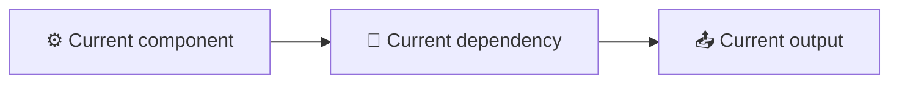
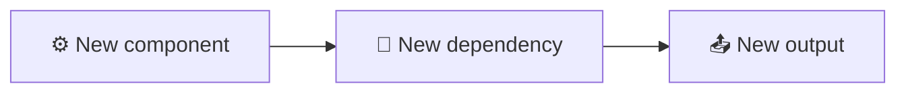

<!-- 来源：https://github.com/SuperiorByteWorks-LLC/agent-project |许可证：Apache-2.0 |作者：Clayton Young / Superior Byte Works, LLC (Boreal Bytes) -->

# 决策记录 (ADR/RFC)模板

> **返回 [Markdown 样式指南](../markdown_style_guide.md)** — 首先阅读样式指南以了解格式、引用和表情符号规则。

* *将此模板用于：** 架构决策记录(ADR)、征求意见 (RFC)、技术设计文件或任何需要记录其背景、考虑的选项和理由的决定。旨在让未来的团队不仅了解_什么_决定，而且_为什么_ - 并可以评估该决定是否仍然有效。

* *主要功能：**与明确权衡的结构化选项比较、决策矩阵、捕获收益和风险的后果部分以及决策生命周期的状态跟踪。

* *哲学：**决策比代码腐烂得更快。六个月后，有人会问“为什么我们要这样做？”如果答案是“没有人记得”，那么这个决定就是随机的。该模板使推理成为永久性的、可搜索的和可评估的。它还迫使作者真正考虑替代方案——如果你不能清楚地说明为什么拒绝选项B，那么你还没有做足够的分析。

- --

## 如何使用

1. 将此文件复制到您项目的`docs/decisions/`或`adr/`目录
2中。按顺序命名为：`001-use-postgresql-over-mongodb.md`
3. 将所有 `[bracketed placeholders]` 替换为您的内容 
4. **诚实地提出选项**——不要为了击垮稻草人而设立稻草人
5. 添加[美人鱼图](../mermaid_style_guide.md)用于架构比较、数据流变化或迁移路径

- --

## 模板

该行下面的所有内容都是模板。从这里复制：

- --

# [ADR-NNN]：[决定标题 - 清晰且具体]

|领域|值|
| ------------------- | ---------------------------------------------------------------------- |
| **状态** | [建议/接受/弃用/由 ADR-NNN 取代] |
| **日期** | [年-月-日] |
| **决策者** | [姓名或角色] |
| **咨询** | [向谁征求意见] |
| **通知** | [谁需要知道结果] |

- --

## 📋 Context

### 是什么促使了这个决定？

[描述需要做出决定的情况。发生了什么变化？出现了什么问题？什么机会出现了？具体 — 包括触发此问题的指标、事件或用户反馈。]

### 当前状态

[今天的情况如何。当前采用的架构、工具或流程是什么。如果有帮助，请提供图表。]

### 约束

- **[约束 1]：** [预算、时间表、团队规模、合规性要求等]
- **[约束 2]：** [技术约束、向后兼容性、SLA、等]
- **[约束 3]:** [组织约束、供应商锁定、技能差距等]

### 要求

此决策必须：

- [ ] [要求 1 — 具体且可衡量]
- [ ] [要求2]
- [ ] [要求 3]

- --

## 🔍 考虑的选项

### 选项 A：[名称]

* *说明：** [此选项的含义 — 2–3句子]

* *优点：**

- [有证据的具体好处]
- [另一个好处]

* *缺点：**

- [影响评估的具体缺点]
- [另一个缺点]

* *预计工作量：** [T 恤尺寸或天/周]
* *预计成本：** [如果相关 — 许可、基础设施、人员]

### 选项 B：[名称]

* *说明：** [此选项的含义]

* *优点：**

- [好处]
- [优点]

* *缺点：**

- [缺点]
- [缺点]

* *预计工作量：** [预计]
* *预计成本：** [如果相关]

### 选项 C: [名称] _(if适用）_

* *描述：** [此选项的含义]

* *优点：**

- [优点]

* *缺点：**

- [缺点]

* *估计工作量：** [估计]

### 决定矩阵

|标准|重量 |选项A |选项 B |选项C|
| --------------------------------------- | -------------- | ------------------- | -------- | -------- |
| [标准 1 — 例如，性能] | [高/中/低]| [得分或✅/⚠️/❌] | [评分] | [评分]|
| [标准 2 — 例如团队专业知识] | [体重]| [评分] | [评分] | [评分]|
| [标准 3 — 例如，迁移工作] | [重量]| [评分] | [评分] | [评分]|
| [标准 4 — 例如，长期成本] | [体重]| [评分] | [评分] | [评分]|
| [标准 5 — 例如社区/支持] | [体重]| [评分] | [评分] | [得分] |

- --

## 🎯 决策

* *我们选择选项[X]：[姓名]。**

[2-3 句话解释核心原理。是什么促成了这个决定？哪个标准最重要，为什么？]

### 为什么不是其他？

- **选项 [Y]被拒绝，因为：** [具体原因 - 不是“不够好”，而是“迁移工作将需要 3 个冲刺并延迟第二季度的启动”]
- **选项 [Z]被拒绝，因为：** [具体原因原因]

- --

## ⚡ 后果

### 正面

- [效益 1 — 哪些方面有所改善，具有预期影响]
- [效益 2]

### 负面

- [权衡 1 - 我们失去什么或变得更困难]
- [权衡 2]

### 风险

|风险|可能性 |影响 |缓解|
| -------- | -------------- | -------------- | --------------------- |
| 【风险1】| [低/中/高]| [低/中/高] | [我们将如何处理] |
| 【风险2】| [可能性]| [影响] | [缓解] |

### 实施影响

- --

## 📋 实施计划

|步骤|业主|目标日期 |状态|
| -------- | ------------- | ----------- | ---------------------------------- |
| [步骤1]| [个人/团队] | [日期] | [未开始/进行中/已完成] |
| [步骤2]| [个人/团队] | [日期] | [状态] |
| [步骤3]| [个人/团队] | [日期] | [状态] |

- --

## 🔗 参考资料

- [相关 ADR 或 RFC](../adr/ADR-001-agent-optimized-documentation-system.md)
- [外部文档或基准](https://example.com)
- [相关问题或讨论线程](../../docs/project/issues/issue-00000001-agentic-documentation-system.md)

- --

## 查看日志

|日期 |审稿人|结果|
| ------ | -------- | ----------------------------------------------------- |
| [日期] | [姓名] | [提议/批准/请求的更改] |

- --

_最后更新：[日期]_
