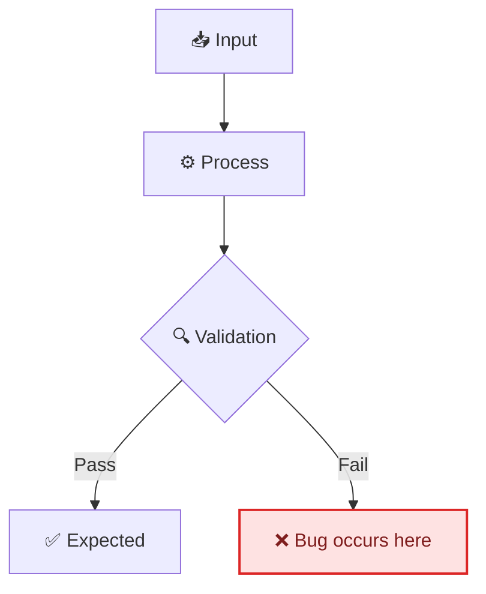
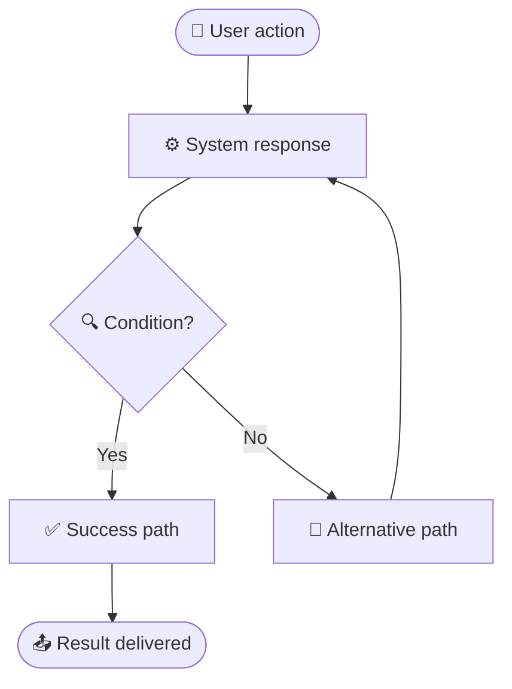

<!-- 来源：https://github.com/SuperiorByteWorks-LLC/agent-project |许可证：Apache-2.0 |作者：Clayton Young / Superior Byte Works, LLC (Boreal Bytes) -->

# 问题文档模板

> **返回 [Markdown 样式指南](../markdown_style_guide.md)** — 首先阅读样式指南以了解格式、引用和表情符号规则。

* *使用此模板用于：** 记录错误、功能请求、改进建议、事件或任何内容可跟踪的工作项作为持久的降价记录。该文件就是问题所在 - 从报告到调查、解决和吸取的经验教训的完整生命周期 - 采用可搜索、可移植和代码库一部分的格式。

* *关键功能：** 严重性/优先级分类、客户影响量化、预期与实际的再现步骤、调查日志、根本原因解决方案、功能请求的接受标准以及 SLA 跟踪。

* *理念：** 该文件是问题 — 不是 GitHub Issues，不是 Jira，不是 Linear。这些平台是通知和评论层。完整的生命周期——报告、调查、根本原因、修复和经验教训——都在这里，致力于存储库。

问题报告是报告者和解决者之间的合同。模糊的问题得到模糊的修复。最好的问题文档非常清晰，团队中的任何人（或任何人工智能代理）都可以拿起它们，理解问题，然后开始工作，而无需提出任何澄清问题。包括一切。假设阅读本文的人先前的上下文为零。

这就是 [一切都是代码](../markdown_style_guide.md#-everything-is-code)理念：任何代理或团队成员都可以仅通过文件访问来查找、读取和更新问题。没有API，没有代币，没有平台锁定。 `grep docs/project/issues/` 每次都比搜索 Jira 好。

- --

## 文件约定

```
docs/project/issues/issue-00000456-fix-session-timeout-race.md
docs/project/issues/issue-00000457-add-csv-export-filtering.md
docs/project/issues/issue-00000458-improve-onboarding-copy.md
```

- **目录：** `docs/project/issues/`
- **命名：** `issue-` + 问题编号用零填充到 8 位 + `-` + 短小写连字符描述
- **交叉引用：** 链接到元数据表中的实时问题跟踪器

- --

## 模板变体

此模板有两个变体 - 使用与您的问题类型匹配的部分：

- **[Bug 报告](#bug-report-template)** — 东西损坏、行为异常或崩溃
- **[功能请求](#feature-request-template)** — 应该存在的新内容

- --

## 错误报告模板

- --

# 问题-[编号]：[错误的简短描述]

|领域 |值|
| ---------------------- | ------------------------------------------------------------------------------------------------- |
| **问题** | `#NUMBER`（如果您的项目使用跟踪器 URL，请添加跟踪器 URL）|
| **类型** | 🐛 错误 |
| **严重性** | 🟢 低 / 🟡 中 / 🔴 高 / 💀 严重 |
| **优先** | P0 / P1 / P2 / P3 |
| **记者** | [名称] |
| **受让人** | [姓名或未分配] |
| **报告日期** | [年-月-日] |
| **状态** | [打开/进行中/已解决/关闭/不会修复] |
| **受影响的用户** | [计数或细分 - 例如，“~2,000 个免费用户”/“所有 API 使用者”] |
| **收入影响** | [无/间接/直接 - $N/天或 N% 的交易] |
| **解决于** | [PR-#NUMBER](../../docs/project/pr/pr-00000001-agentic-docs-and-monorepo-modernization.md)或 N/A |
| **解决问题的时间** | [N 小时/N 天 — 从报告到修复部署] |

- --

## 📋 摘要

[一段：什么被破坏了，谁受到了影响，以及影响有多严重。具体一点 — “用户无法登录”而不是“身份验证已损坏。”]

### 客户影响

|尺寸|评估|
| -------------------- | ------------------------------------------------------------------------------------- |
| **谁受到影响** | [用户细分、账户类型、地区——具体] |
| **有多少** | [计数、百分比或估计 — 例如，“~500 个企业帐户”] |
| **业务影响** | [收入、SLA 违规、流失风险、声誉 — 如果可能的话进行量化] |
| **存在解决方法** | [是 - 简要描述/否] |

- --

## 🔄 繁殖步骤

### 环境

|详情 |值|
| -------------------- | -------------------------------------------------------- |
| **版本/提交** | [应用程序版本、提交 SHA 或部署标签] |
| **环境** | [制作/演出/本地]|
| **操作系统/浏览器** | [例如，macOS 15.2、Chrome 122] |
| **账户类型** | [管理/标准/免费层 - 如果相关] |

### 重现 

1 的步骤。 [确切的步骤 1 — 准确地说：“导航到 /settings/profile”]
2. [确切步骤 2 —“单击‘保存’按钮”]
3. [确切步骤 3 —“观察错误”]

* *再现性：** [始终/间歇（~N% 尝试）/一次]

### 预期行为

[按照上述步骤操作时会发生什么。]

### 实际行为

[实际发生的情况。包括确切的错误消息、屏幕截图或日志输出。]

```
[Paste exact error message or log output here]
```

屏幕截图占位符：`docs/project/issues/images/issue-NUMBER-screenshot.png`

### 解决方法

[如果用户可以解决此错误，请描述如何解决。如果不存在解决方法，请注明“未知”。这有助于在修复过程中支持团队。]

- --

## 🔍 调查

### 根本原因

[实际导致错误的原因。请在调查期间填写，而不是在报告时填写。]

[如果根本原因涉及数据流或逻辑问题，请用图表表示：]



### 调查日志

|日期 |谁 |寻找|
| ------ | ------ | --------------------- |
| [日期] | [姓名] | [发现了什么] |
| [日期] | [姓名] | [下一个发现] |

<details>
<summary><strong>🔧 技术细节</strong></summary>

[堆栈跟踪、调试日志、数据库查询、配置差异 - 任何支持调查但对于主要内容来说过于冗长的内容文档。]

</details>

- --

## ✅ 解决方案

### 修复说明

[为修复错误而更改的内容。 PR 链接。]

* *修复于：** [PR-#NUMBER](../../docs/project/pr/pr-00000001-agentic-docs-and-monorepo-modernization.md)

### Verification

- [ ]修复已在 [环境]
- [ ]中验证添加回归测试
- [ ]未观察到副作用
- [ ]记者确认已修复

### 经验教训

[应该改变什么来防止此类错误？新测试？更好的验证？监控警报？流程变更？]

- --

## 🔗参考文献

- [相关问题](../../docs/project/issues/issue-00000001-agentic-documentation-system.md)
- [相关文档](https://example.com)
- [监控仪表板或警报](https://example.com)

- --

_最后更新：[日期]_

- --

- --

## 功能请求模板

- --

# 问题-[编号]：[功能标题 - 应该做什么存在]

|领域|值|
| ------------------ | ------------------------------------------------------------------------------------------------- |
| **问题** | `#NUMBER`（如果您的项目使用跟踪器 URL，请添加跟踪器 URL）|
| **类型** | ✨ 功能请求 |
| **优先** | P0 / P1 / P2 / P3 |
| **请求者** | [姓名或团队] |
| **受让人** | [姓名或未指定] |
| **请求日期** | [年-月-日] |
| **状态** | [已提议/已接受/进行中/已发货/已拒绝]|
| **目标发布** | [版本、冲刺或季度] |
| **发货** | [PR-#NUMBER](../../docs/project/pr/pr-00000001-agentic-docs-and-monorepo-modernization.md)或 N/A |

- --

## 📋 摘要

### 问题陈述

[此功能解决了什么用户问题或业务需求？谁遇到过这个问题？出现的频率如何？如果可用，请包括指标。]

### 建议的解决方案

[您想要构建的内容的高级描述。专注于_what_和_why_，而不是_how_ — 将实现细节留给构建者。]

### 用户故事

> 作为**[角色]**，我想要**[行动]**，以便**[利益]**。

- --

## 🎯 验收标准

该功能完成时：

- [ ] [具体的、可测试的标准 - “用户可以从仪表板将数据导出为 CSV”]
- [ ] [另一个标准 - “导出包括所有过滤结果，而不仅仅是当前页面”]
- [ ] [另一个标准 - “下载在 3 秒内开始”对于 10K 行以下的数据集”]
- [ ] [非功能 — “适用于移动视口 (375px+)”]
- [ ] [文档 — “项目文档中记录的 API 端点”]

- --

## 📐 Design

### 用户flow



### 样机/线框

[如果是可视的，请包含预期 UI 的样机或屏幕截图。如果不直观，请详细描述预期行为。]

### 技术考虑因素

- **[考虑因素 1]:** [对现有架构、数据模型或 API 的影响]
- **[考虑因素 2]:** [性能、可扩展性或安全影响]
- **[考虑因素 3]:** [对其他的依赖功能、服务或团队]

<详细信息>
<摘要><strong>📋实施说明</strong></摘要>

[实施者的更深入的技术背景 - 建议的方法、相关代码路径、数据库架构更改、API 合同、迁移策略。这可以节省构建者的发现时间。]

</details>

- --

## 📊 Impact

|尺寸|评估|
| ------------------- | ------------------------------------------- |
| **受影响的用户** | [有多少用户/什么细分] |
| **收入影响** | [直接、间接或无] |
| **工作量估计** | [T恤尺码：S/M/L/XL]|
| **依赖关系** | [所需的其他功能、团队或服务] |

### 成功指标

[您如何知道此功能在发布后是否成功？具体且可衡量。]

- **[指标 1]:** [当前基线] → [时间范围]
 内的 [目标]- **[指标 2]:** [当前基线] → [时间范围]

- --

## 🔗 参考文献

- [用户反馈或支持门票](https://example.com)
- [竞争分析](https://example.com)
- [相关功能请求](../../docs/project/issues/issue-00000001-agentic-documentation-system.md)
- [设计文档或ADR](../adr/ADR-001-agent-optimized-documentation-system.md)

- --

_最后更新：[日期]_
