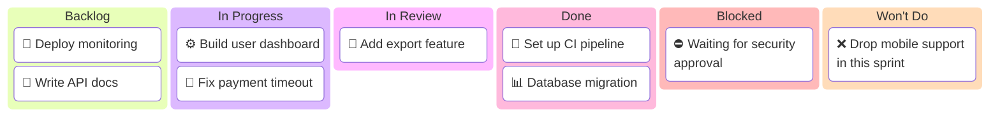

<!-- 来源：https://github.com/SuperiorByteWorks-LLC/agent-project |许可证：Apache-2.0 |作者：Clayton Young / Superior Byte Works, LLC (Boreal Bytes) -->

# 看板文档模板

> **返回 [Markdown 样式指南](../markdown_style_guide.md)** — 首先阅读样式指南以了解格式、引用和表情符号规则。

* *将此模板用于：** 跟踪工作项、冲刺板、项目任务管理、发布计划，或任何需要持久的、基于 Markdown 的工作状态视图的场景。该板是跟踪系统 - 您的存储库中的一个文件，随代码库一起发展。

* *主要功能：**视觉美人鱼看板图、具有状态跟踪的工作项表、WIP 限制、阻止的项目、明确的“不做”决策、老化指标、流程效率指标和历史吞吐量。

* *原理：**该板是一个文件。在您的分支中修改它，将其与您的 PR 合并。该板随着代码库的发展而发展——无需外部板工具。具有回购访问权限的任何人都可以看到看板，包括人工智能代理。

A 看板的工作是使工作可见。该模板有两个用途：(1)随着工作进展而更新的活动板，以及 (2)存档时的历史快照。美人鱼图提供即时视觉概览；表格给出了详细信息。他们一起回答：正在做什么？什么被阻止了？做了什么？接下来是什么？

 存档后，看板将成为已处理内容、已阻止内容和已完成内容的历史记录 - 所有这些都在 git 历史记录中，具有完整的归属和时间戳。这就是 [Everything is Code](../markdown_style_guide.md#-everything-is-code)理念：项目管理数据存在于存储库中、版本化且可移植。

- --

## 文件约定

```
docs/project/kanban/sprint-2026-w07-agentic-template-modernization.md
docs/project/kanban/release-v2.3.0-launch-readiness.md
docs/project/kanban/project-auth-migration-phase-1.md
```

- **目录：** `docs/project/kanban/`
- **命名：** 板范围前缀（`sprint-`、`release-`、`project-`）+标识符+短小写连字符描述
- **存档：** 当板完成后，将其保存在地方——就变成了历史记录

- --

## 模板

该行下面的都是模板。从这里复制：

- --

# [板名称] — 看板

_[范围：Sprint W07 2026 / 发布 v2.3.0 / 项目：身份验证迁移]_
_[团队/所有者] · 最后更新：[YYYY-MM-DD HH:MM]_

- --

## 📋 版块概述

* *期间：** [开始日期] → [结束日期]
* *目标：** [一句话 — 该版块的“完成”是什么样子？]
* *WIP 限制：** [“进行中”的最大项目 — 例如，每人 3 个，总共 6 个]

### 可视板

_看板，显示积压、进行中、审核、完成、阻止和不执行列中的当前工作分布：_



> ⚠️ 始终显示所有 6 列 — 即使某列没有项目，也将其包含在占位符。这使得董事会结构更加明确，并确保类别永远不会被遗忘。当列为空时，使用 [No items Yet]等占位符。

- --

## 🚦 Board Status

|专栏 |计数 |在制品限制 |状态|
| ------------------ | -----| --------- | ---------------------------------------------------------- |
| 📋 **积压** | [N] | — | [备注]|
| 🔄 **进行中** | [N] | [限制] | [🟢 低于限制 / 🟡 达到限制 / 🔴 超过限制] |
| 🔍 **审查中** | [N] | [限制] | [状态] |
| ✅ **完成** | [N] | — | 【本期】|
| 🚫 **被阻止** | [N] | — | [参见下面的封锁部分] |
| 🚫 **不会** | [N] | — | [明确拒绝并给出理由] |

> ⚠️ **始终包含所有 6 列** — 每列代表一个工作流程状态。即使 count 为 0，也保持该行可见。这样可以防止类别被忽视。

- --

## 📋 Backlog

_优先级从上到下。接下来要拉的是最上面的项目。如果为空，则至少包含一个占位符项。_

| ＃|项目 |优先|估计|受让人 |备注|
| --- | ----------------- | --------- | -------- | -------- | ----------------------- |
| 1 | [工作项标题] | 🔴高| [小号/中号/大号] | [人]| [上下文或依赖] |
| 2 | [工作项标题] | 🟡 中等 | [尺寸]| [人]| [备注]|
|     | _[还没有商品]_ |           |          |          |                         |

- --

## 🔄 进行中

_当前正在处理的项目。如果为空，则至少包含一个占位符项。_

|项目 |受让人 |开始 |预计 |栏目中的天数 |老化 |状态|
| ----------- | -------- | -------- | -------- | -------------- | -----| ---------------- |
| [工作项目] | [人]| [日期] | [日期] | [N] | 🟢 | 🟢 步入正轨|
|             |          |         |          |                |       | _[尚无商品]_ |

> 💡 **老化指示器：** 🟢 低于预期时间 · 🟡 符合预期时间 · 🔴 超过预期时间 — 老化红色的商品需要关注或重新确定范围。

> ⚠️ **WIP 限制：** [N] / [Limit]。 [低于限制/达到限制 — 拉出更多工作/超过限制 — 在开始新工作之前完成某些工作]

- --

## 🔍 正在审核中

_项目正在等待或正在代码审核中。如果为空，则至少包含一个占位符项。_

|项目 |作者 |审稿人|公关 |审核天数 |老化 |状态|
| ----------- | -------- | -------- | ------------------------------------------------------------------------------------------------ | -------------- | -----| ------------------------------------------------ |
| [工作项目] | [人]| [人]| [#NNN](../../docs/project/pr/pr-00000001-agentic-docs-and-monorepo-modernization.md) | [N] | 🟢 | [等待审核/请求更改/已批准] |
|             |          |          |                                                                                      |                |       | _[尚无项目]_ |

- --

## ✅ 已完成

_本期已完成。如果为空，则至少包含一个占位符项目。_

|项目 |受让人 |已完成 |周期时间|公关|
| ----------- | -------- | --------- | ---------- | ------------------------------------------------------------------------------------------------ |
| [工作项目] | [人]| [日期] | [N天] | [#NNN](../../docs/project/pr/pr-00000001-agentic-docs-and-monorepo-modernization.md) |
|             |          |           |            | _[此期间没有完成任何项目]_ |

- --

## 🚫 被阻止的

_无法继续进行的项目。始终至少包含占位符 - 被阻止的项目是高信号，永远不应该隐藏。_

|项目 |受让人 |自 | 被阻止被 | 阻止升级至 |解锁动作|
| ----------- | -------- | ------------- | ------------------------------------------------------- | ------------- | ---------------------- |
| [工作项目] | [人]| [日期] | [什么是阻碍——依赖性、决策、外部团队] | [人/团队] | [需要发生什么] |
|             |          |               |                                                         |               | _[没有被阻止的项目]_ |

> 🔴 **[N]个项目被阻止。** [解锁所需内容的摘要。]

- --

## 🚫 不会这样做

_明确超出本委员会期间的范围。捕获理由，使这些决策透明且可审计。如果为空，则包含占位符。_

|项目 |日期已定 |决策所有者|理由|重访触发器|
| ----------- | ------------ | -------------- | ---------------------------------------------------------- | ------------------------------------------------ |
| [工作项目] | [日期] | [人/团队] | 【为什么现在故意排除这一点】| [什么更改会重新打开此项目] |
|             |              |                | _[没有明确拒绝的物品]_ |                                      |

- --

## 📊 指标

### 本期

|公制|价值|目标|趋势|
| ---------------------------------- | -------- | -------- | -------- |
| **吞吐量**（已完成的项目）| [N] | [目标] | [↑/→/↓] |
| **平均周期时间**（开始→完成）| [N天] | [目标] | [↑/→/↓] |
| **平均交付周期**（创建 → 完成）| [N天] | [目标] | [↑/→/↓] |
| **平均审核时间** | [N天] | [目标] | [↑/→/↓] |
| **流动效率** | [N%] | [目标] | [↑/→/↓] |
| **被阻止的项目** | [N] | 0 | [↑/→/↓] |
| **违反 WIP 限制** | [N] | 0 | [↑/→/↓] |
| **物品老化呈红色** | [N] | 0 | [↑/→/↓] |

> 💡 **流程效率** = 主动工作时间 ÷ 总周期时间 × 100。健康的团队目标是 40%+。低于 15% 意味着项目大部分时间都在等待，而不是被处理。

<details>
<summary><strong>📊 历史吞吐量</strong></summary>

|期间 |已完成项目 |平均周期时间 |被封锁的日子|
| ------------------- | ---------------- | -------------- | ------------ |
| [上期3] | [N] | [N天] | [N] |
| [上期2] | [N] | [N天] | [N] |
| [上期1] | [N] | [N天] | [N] |
| **当前** | [N] | [N天] | [N] |

</details>

- --

## 📝 董事会注释

### 本期做出的决定

- **[日期]:** [决定和背景 - 例如，“降低优先级的身份验证重构以关注支付错误”]
- **[日期]：** [添加/更新不会以明确的理由和重新访问触发器做出决定]

### 上一期的结转

- [项目结转] — [为什么未完成和当前状态]

### 即将到来的依赖项

- [日期]：[影响此的外部依赖项、版本或事件板]

- --

## 🔗 参考资料

- [实时项目板](../../docs/project/kanban/sprint-2026-w08-crewai-review-hardening-and-memory.md) — 实时跟踪
- [上一页board](../../docs/project/kanban/sprint-2026-w07-agentic-template-modernization.md) — 上一期的快照
- [状态报告](../../docs/project/pr/pr-00000001-agentic-docs-and-monorepo-modernization.md) — 本报告的执行摘要period

- --

_下一次更新：[日期]·版主：[人/团队]_
