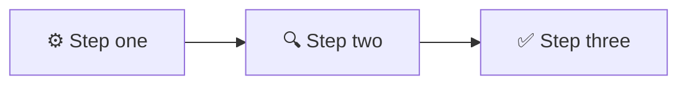

<!-- 来源：https://github.com/SuperiorByteWorks-LLC/agent-project |许可证：Apache-2.0 |作者：Clayton Young / Superior Byte Works, LLC (Boreal Bytes) -->

# 演示/简报模板

> **返回 [Markdown 样式指南](../markdown_style_guide.md)** — 首先阅读样式指南以了解格式、引用和表情符号规则。

* *将此模板用于：** 幻灯片式文档、研究演示文稿、简报、讲座、演练或任何传统上为 PowerPoint 的内容。旨在作为独立文档阅读良好，并可作为演讲者准备的演示笔记。

* *主要功能：**每个部分下可折叠的演讲者注释，从上下文到内容到操作项、图形标题和脚注引文的结构化流程。

- --

## 如何使用

1. 将此文件复制到您的项目
2. 将所有 `[bracketed placeholders]` 替换为您的内容 
3. 删除不适用的部分（但保留核心流程）
4. 根据需要添加/删除内容主题（📚内容下的 H3）
5. 所有格式均遵循 [Markdown 样式指南](../markdown_style_guide.md)
6. 添加[美人鱼图](../mermaid_style_guide.md)只要概念受益于视觉

- --

## 模板结构

演示遵循 6 部分流程。每个部分都有一个 H2，其中包含一个表情符号、内容和可选的可折叠演讲者备注。

```
1. 🏠 Housekeeping — Logistics, context, announcements
2. 📍 Agenda — What we'll cover, with time estimates
3. 🎯 Objectives — What the audience will walk away with
4. 📚 Content — The main body (multiple H3 topics)
5. ✍️ Action Items — What happens next, who owns what
6. 🔗 References — Citations, resources, further reading
```

- --

## 模板

该行下方的所有内容都是模板。从这里复制：

- --

# [演示文稿标题]

_[上下文行 — 项目、团队、日期或目的]_

- --

## 🏠 Housekeeping

- [物流项目或公告]
- [重要截止日期或提醒]
- [观众需要的任何先决条件]

<详细信息>
<摘要><strong>💬演讲者注释</strong></摘要>

- **时间：** 本节 2-3 分钟
- **语气：** 对话式，安排房间
- [有关公告上下文的具体说明]
- [过渡线：]“讲完了，这是我们今天的计划...”

</details>

- --

## 📍 议程

- [x]家政服务（3 分钟）
- [ ] [主题 1 名称]（10 分钟）
- [ ] [主题 2 名称]（15 分钟）
- [ ] [主题 3 名称]（15 分钟）
- [ ]行动项目和问答（10 分钟）

* *总计：** [预计时间]

<详细信息>
<摘要><strong>💬演讲者注释</strong></摘要>

- 在主题之间转换时参考此议程
- 如果在某个主题上运行时间较长，请记下您将要执行的内容压缩
- “我们在中点附近有一个自然的休息”
- 根据观众参与度调整时间——问题很好

</details>

- --

## 🎯目标

在本次演示之后，您将能够：

- **[动作动词]** [具体的、可衡量的结果]
- **[动作动词]** [具体的、可衡量的结果]
- **[动作动词]** [具体的、可衡量的结果]

<详细信息>
<摘要><强>💬 演讲者注释</strong></summary>

- 在整个演示过程中引用这些目标
- “这连接回我们的第一个目标......”
- 最后，重新审视：“让我们检查一下 - 我们是否实现了所有三个目标？”
- **强动作动词：**识别，分析，比较，评估，设计，实施，解释，区分，创建、应用

</details>

- --

## 📚 内容

### [主题1标题]

[打开上下文 - 为什么这很重要，它解决什么问题]

* *要点：**

- [第1点，简要说明说明]
- [第2点简要说明]
- [第3点简要说明]

图像占位符：`images/slide-[filename].png`
_图1：[此图像演示的内容]_

> 💡 **关键见解：** [观众应该记住的一句台词主题]

<详情>
<摘要><strong>💬讲者笔记</strong></summary>

### 教学策略

- **以一个问题开始：**“[吸引观众的问题]？”
- 采取 2-3 个回答
- “很好的思考。这实际上是如何运作的...”

### 核心解释（3-5 分钟）

- 从定义/概念开始
- 逐步进行
- 使用现实世界的例子：“[具体场景]”

### 常见误解

- **人们的想法：** [误解]
- **实际上是什么：** [现实]
- **如何解决它：** [重构]

### Transition

- “现在我们明白了[概念]，让我们看看它如何应用于..."

</details>

- --

### [主题2标题]

[上下文和解释]

* *方法比较：**

|方法|最适合 |权衡|
| ---------- | ---------- | --------- |
| [选项A] | [场景] | [优点/缺点] |
| [选项B] | [场景] | [优点/缺点] |
| [选项C] | [场景]| [赞成/反对] |



[图表显示内容及其重要性的说明]

<详细信息>
<摘要><strong>💬 演讲者备注</strong></摘要>

### 浏览每个选项 (5–6 min)

* *选项A：**

- “当[场景]时使用”
- “优点：[优点]”
- “缺点：[缺点]”

* *选项B：**

- “当[场景]"
- "优点：[优点]"
- "缺点：[缺点]"

### 决策练习

- 提问：“给定[场景]，你会选择哪个？”
- 回答，讨论推理
- “在实践中，专业人士根据[标准]进行选择”

### 真实示例

- “[公司/项目]选择选项B，因为[推理]”
- “结果是[结果]”
- “这很重要，因为[与观众]“[^1]

</details>

- --

### [主题3标题]

[上下文和解释]

* *流程：**

1. 【第一步附说明】
2. 【第二步附说明】
3. 【第三步附解释】

> ⚠️ **常见陷阱：** 【出现什么问题以及如何避免】

[支持该主题的更深入的解释、示例或数据]

<详细信息>
<摘要><strong>💬演讲者注释</strong></summary>

### 互动元素

- 在第2步暂停：“接下来会发生什么？”
- 在揭示步骤之前进行猜测3
- “为什么这很重要？因为[赌注]”

### 如果观众是高级

- 跳过基础知识，跳到：“[高级角度]”
- 挑战问题：“如果[场景改变]怎么办？”

### 如果观众感到困难

- 放慢速度，重复类比
- “想像[简单比较]”
- 在Q&A

### 中提供更多内容部分]

</详情>

- --

## ✍️ 行动项目

### 后续步骤

|行动|业主|由于|
| ---------------------- | ------------- | ------ |
| 【具体行动项目】| [人/团队] | [日期]|
| 【具体行动项目】| [人/团队] | [日期]|
| 【具体行动项目】| [人/团队] | [日期] |

### 要点

1. **【要点1】**——【一句话总结】
2. **【要点2】**——【一句话总结】
3. **[要点 3]** — [一句话摘要]

<详细信息>
<摘要><strong>💬 演讲者笔记</strong></summary>

- 明确浏览每个行动项目
- “谁拥有这个？何时到期？”
- “关于以下任何一项的问题这些？”
- 重新审视目标：“我们是否实现了全部三个目标？”
- “谢谢您的宝贵时间。我可以通过 [联系人]进行跟进。”

</details>

- --

## 🔗 参考文献

### 来源引用

_演示文稿中的所有脚注引用均收集于此：_

[^1]：[作者/组织]。 （[年]）。 “[标题]。” _[发布]_。 <https://example.com>

### 进一步阅读

- [资源标题](https://example.com) — 为什么这很有用
- [资源标题](https://example.com) — 它提供什么

### 提到的工具

- [工具名称](https://example.com) — 目的及获取方法

<details>
<summary><strong>💬演讲者笔记</strong></summary>

- "这些资源在共享文档中可以找到"
- "从[特定资源]开始——这是最实用的"
- "如果你想要要更深入，[特定资源]涵盖高级主题“

</details>

- --

_最后更新：[日期]_
