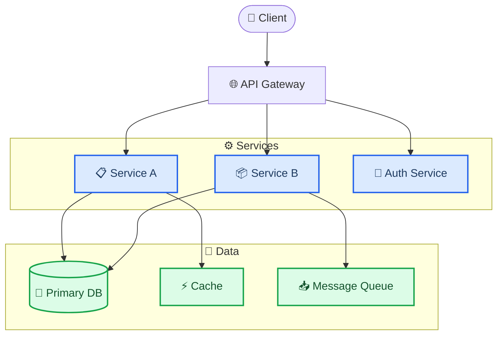
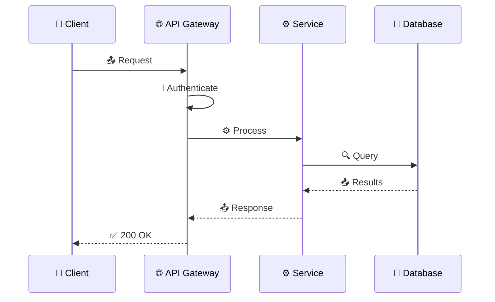

<!-- 来源：https://github.com/SuperiorByteWorks-LLC/agent-project |许可证：Apache-2.0 |作者：Clayton Young / Superior Byte Works, LLC (Boreal Bytes) -->

# 项目文档模板

> **返回 [Markdown 风格指南](../markdown_style_guide.md)** — 首先阅读风格指南以了解格式、引用和表情符号规则。

* *将此模板用于：** 软件项目、开源库、内部工具、API、平台、或任何需要用户和贡献者文档的产品。旨在让人们摆脱“这是什么？”的问题。 

  * *主要特点：** 快速入门，让人们在 5 分钟内运行，使用美人鱼图进行架构概述，API 参考结构，解决实际问题的故障排除部分，以及贡献指南。

  * *理念：** 最好的项目文档消除了阅读源代码来了解系统的需要。新团队成员应该在数小时而不是数周内提高工作效率。每个“这是如何工作的？”问题应该在本文档中有答案，或者只需点击一下即可。

- --

## 如何使用

1. 复制此文件作为您项目的主 `README.md` 或 `docs/index.md`
2. 将所有 `[bracketed placeholders]` 替换为您的内容 
3. 删除不适用的部分（CLI 工具可能会跳过 API 参考；库可能会跳过部署）
4. 添加 [美人鱼图](../mermaid_style_guide.md) — 特别是针对架构、数据流和请求生命周期
5. 保持快速入门极其简单 - 如果设置需要超过 5 个命令，请简化它

- --

## 模板

该行下面的所有内容都是模板。从这里复制：

- --

# [项目名称]

[一句话：它的作用以及为什么有人会使用它。]

[一句话：关键区别或价值主张。]

[]() []()

- --

## 📋 目录

- [快速启动](#-quick-start)
- [架构](#-architecture)
- [配置](#-configuration)
- [API 参考](#-api-reference)
- [部署](#-deployment)
- [疑难解答](#-疑难解答)
- [贡献](#-贡献)
- [参考](#-参考)

- --

## 🚀 快速入门

### 先决条件

|要求 |版本 |检查命令|
| ------------------ | ----------- | --------------------- |
| [运行时/语言] | ≥ [版本] | `[command] --version` |
| [数据库/服务] | ≥ [版本] | `[command] --version` |
| [工具] | ≥ [版本] | `[command] --version` |

### 安装并运行

```bash
# Clone the repository
git clone https://github.com/[org]/[repo].git
cd [repo]

# Install dependencies
[package-manager] install

# Configure environment
cp .env.example .env
# Edit .env with your values

# Start the application
[package-manager] run dev
```

* *验证是否有效：**

```bash
curl http://localhost:[port]/health
# Expected: {"status": "ok", "version": "[version]"}
```

> 💡 **首次安装问题？** 请参阅[疑难解答](#-疑难解答) 

- --

## 🏗️ 架构

### 系统概述

[2-3 句话解释高层架构 - 主要组件是什么以及它们如何交互。]



### 关键组件

|组件|目的|技术|
| ------------- | -------------- | ------------ |
| [组件 1] | [它的作用] | [技术栈] |
| [组件 2] | [它的作用] | [技术栈] |
| [组件 3] | [它的作用] | [技术栈] |

### 数据流

[描述主要请求生命周期——用户发出典型请求时会发生什么。]



<details>
<summary><strong>📋详细架构注释</strong></summary>

### 目录结构

```
[repo]/
├── src/
│   ├── api/          # Route handlers and middleware
│   ├── services/     # Business logic
│   ├── models/       # Data models and schemas
│   ├── config/       # Configuration and environment
│   └── utils/        # Shared utilities
├── tests/
│   ├── unit/
│   └── integration/
├── docs/             # Additional documentation
└── scripts/          # Build, deploy, and maintenance scripts
```

### 设计决策

- **[决策1]：** [为什么选择这种方法而不是其他方法。链接到 ADR（如果存在）。]
- **[决策 2]：** [为什么选择这种方法。]

</details>

- --

## ⚙️ 配置

### 环境变量

|变量|必填 |默认 |描述 |
| -------------- | -------- | ---------------- | --------------------------------------------------- |
| `DATABASE_URL` |是的 | — | PostgreSQL 连接字符串 |
| `REDIS_URL` |没有 | `localhost:6379` | Redis缓存连接|
| `LOG_LEVEL` |没有 | `info` |记录详细程度：`debug`、`info`、`warn`、`error` |
| `PORT` |没有 | `3000` | HTTP 服务器端口 |
| `[VAR_NAME]` | [是/否] | [默认] | [说明] |

### 配置文件

|文件|用途|
| ------------------------ | -------------------------------------------------------- |
| `.env` |本地环境变量（从未提交）|
| `config/default.json` |所有环境的默认设置|
| `config/production.json` |生产覆盖 |

- --

## 📡 API 参考

### 身份验证

所有 API 请求都需要在 `Authorization` 标头中包含不记名令牌：

```
Authorization: Bearer <token>
```

通过以下方式获取令牌`POST /auth/login`。令牌将在 [duration]后过期。

### 端点

#### `GET /api/[resource]`

* *说明：** [此端点返回的内容]

* *参数：**

|参数|类型 |必填 |描述 |
| --------- | -------- | -------- | ----------------------------------- |
| `limit` |整数 |没有 |最大结果（默认：20，最大：100）|
| `offset` |整数 |没有 |分页偏移|
| `[param]` | [类型] | [是/否] | [说明] |

* *响应：**

```json
{
  "data": [
    {
      "id": "uuid",
      "name": "Example",
      "created_at": "2026-01-15T10:30:00Z"
    }
  ],
  "meta": {
    "total": 42,
    "limit": 20,
    "offset": 0
  }
}
```

* *错误响应：**

|状态 |意义|当 |
| ------ | ------------ | ---------------------------- |
| `401` |未经授权 |令牌缺失或无效 |
| `403` |禁止 |权限不足|
| `404` |没有找到|资源不存在|
| `429` |限价|超过 [N]个请求/分钟 |

<详细信息>
<摘要><strong>📡其他端点</strong></摘要>

#### `POST /api/[resource]`

[请求正文、参数、响应格式]

#### `PUT /api/[resource]/:id`

[请求体、参数、响应格式]

#### `DELETE /api/[resource]/:id`

[参数、响应格式]

</详情>

- --

## 🚀 部署

### 生产部署

```bash
# Build
[package-manager] run build

# Run database migrations
[package-manager] run migrate

# Start production server
[package-manager] run start
```

### 环境要求

|要求 |生产|分期|
| ----------- | ---------- | -------- |
|中央处理器| [规格] | [规格] |
|内存| [规格] | [规格] |
|存储| [规格] | [规格] |
|数据库| [规格] | [规格] |

### 健康检查

|端点 |预计 |用途|
| ------------------- | -------- | ---------------------------------------------------- |
| `GET /health` | `200 OK` |基本活跃度|
| `GET /health/ready` | `200 OK` |完全准备就绪（数据库、缓存、依赖项）|

<details>
<summary><strong>🔧 CI/CD 管道详细信息</strong></summary>

[描述部署管道 - 构建步骤、测试阶段、部署目标、回滚过程。]

</details>

- --

## 🔧 故障排除

### 常见问题

#### 启动时“连接被拒绝”

* *原因：**数据库未运行或连接字符串不正确。

* *修复：**

1. 验证数据库正在运行：`[check-command]`
2. 检查`.env`
3中的`DATABASE_URL`。测试连接：`[test-command]`

#### “[具体错误消息]”

* *原因：**[触发此错误的原因]

* *修复：**

1. [步骤1]
2. [步骤 2]

#### 响应时间慢

* *原因：** [常见原因 - 缺少索引、缓存冷启动等]

* *修复：**

1. 检查缓存连接：`[command]`
2. 验证数据库索引：`[command]`
3. 查看查询模式的最新更改

### 获取帮助

- **错误报告：** [问题模板或流程的链接]
- **问题：** [讨论、Slack 频道或论坛的链接]
- **安全问题：** [电子邮件或私人披露流程]

- --

## 🤝 贡献

### 开发设置

```bash
# Fork and clone
git clone https://github.com/[your-fork]/[repo].git

# Install with dev dependencies
[package-manager] install --dev

# Run tests
[package-manager] test

# Run linter
[package-manager] run lint
```

### 工作流程

1. 从`main`创建分支：`git checkout -b feature/your-feature`
2. 按照代码风格（由 linter 强制执行）
3 进行更改。为新功能
4编写测试。运行完整的测试套件：`[package-manager] test`
5. 打开一个带有清晰描述的拉取请求

### 代码标准

- [语言/框架风格指南或linter配置]
- [测试覆盖率期望]
- [PR审查流程]
- [新功能的文档期望]

- --

## 🔗 参考资料

- [官方框架文档](https://example.com) — [哪个版本和哪些部分最相关]
- [API 规范](https://example.com) — [OpenAPI/Swagger 链接（如果适用）]
- [架构决策记录](../adr/) — [为什么做出关键决策]

- --

_最后更新：[日期] · 由[团队/所有者]维护_
