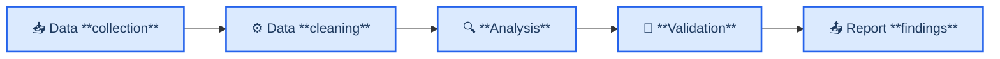
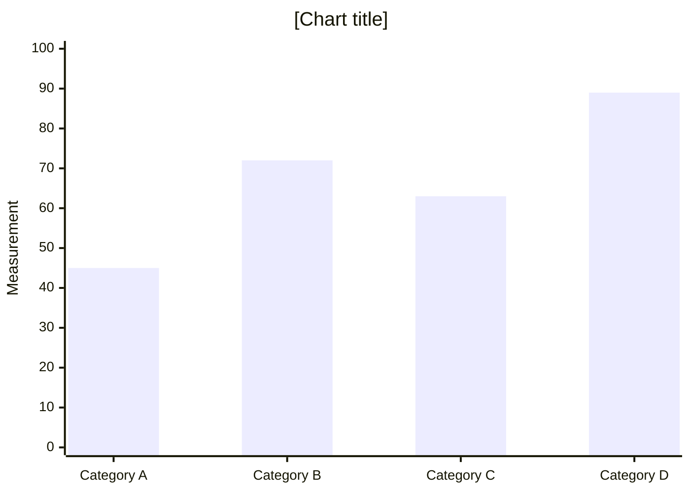

<!-- 来源：https://github.com/SuperiorByteWorks-LLC/agent-project |许可证：Apache-2.0 |作者：Clayton Young / Superior Byte Works, LLC (Boreal Bytes) -->

# 研究论文/技术分析模板

> **返回 [Markdown 风格指南](../markdown_style_guide.md)** — 首先阅读风格指南以了解格式、引用和表情符号规则。

* *将此模板用于：** 研究论文、技术分析、文献评论、数据驱动的报告、竞争分析、市场研究或任何围绕证据和方法建立的文件。专为大量引用、结构化论证和可重复的研究结果而设计。

* *主要特点：**用于快速评估的摘要、可信度的方法部分、带有支持数据/图表的研究结果、严格的脚注引用以及完整的参考文献部分。

* *哲学：**一份出色的研究文件可以让读者独立评估您的结论。展示你的作品。引用你的消息来源。提出反驳论据。读者应该相信你的发现，因为证据就在那里——而不是因为你这么说。

- --

## 如何使用

1. 将此文件复制到您的项目
2. 将所有 `[bracketed placeholders]` 替换为您的内容 
3. 调整章节——并非每篇论文都需要每个章节，但核心流程（摘要→引言→方法→发现→结论）应保持完整
4. **积极引用**——每项主张、每项统计数据、每项外部方法参考都带有 `[^N]` 脚注 
5. 为任何流程、架构、数据流或比较添加[美人鱼图](../mermaid_style_guide.md)

- --

## 模板结构

```
1. Abstract — What you did, what you found, why it matters (150-300 words)
2. 📋 Introduction — Problem statement, context, scope, research questions
3. 📚 Background — Prior work, literature review, industry context
4. 🔬 Methodology — How you did the research, data sources, approach
5. 📊 Findings — What you discovered, with evidence and diagrams
6. 💡 Analysis — What the findings mean, implications, limitations
7. 🎯 Conclusions — Summary, recommendations, future work
8. 🔗 References — All cited sources with full URLs
```

- --

## 模板

该行下面的所有内容都是模板。从这里复制：

- --

# [论文标题：描述性和具体性]

_[作者或团队]·[组织]·[日期]_

- --

## Abstract

[150-300字摘要，结构如下：**上下文**（关于问题空间的1-2个句子），**目标**（本文研究的内容），**方法**（如何进行研究），**主要发现**（最重要的结果），**意义** （为什么这很重要以及谁应该关心）。]

* *关键字：** [关键字 1]、[关键字 2]、[关键字 3]、[关键字 4]、[关键字 5]

- --

## 📋 简介

### 问题陈述

[存在什么问题？为什么这很重要？谁受到影响？具体 - 包括可用的指标。​​]

[问题的范围，带引用][^1]。

### 研究问题

本文研究：

1. **[RQ1]** — [具体的、可回答的问题]
2. **[RQ2]** — [具体的、可回答的问题]
3. **[RQ3]** — [具体的、可回答的问题]

### 范围和边界

- **范围内：** [本文涵盖的内容]
- **超出范围：** [本文故意排除的内容及其原因]
- **目标受众：** [谁将从这些中受益研究结果]

<详细信息>
<摘要><strong>💬上下文注释</strong></摘要>

- 为什么发起这项研究
- 组织背景或业务驱动因素
- 与先前内部工作的关系
- 塑造范围

</details>

- --

## 📚背景

### 行业背景

[该领域的当前状态。已知什么。既定的方法是什么。引用现有工作。]

[先前研究的主要发现][^2]。 [发现另一项相关研究][^3].

### 之前的工作

|研究/来源|关键发现|与我们工作的相关性 |
| ------------------- | ----------------- | --------------------- |
| [作者（年份）][^4] | [他们发现了什么] | [如何连接] |
| [作者（年份）][^5] | [他们发现了什么] | [如何连接] |
| [作者（年份）][^6] | [他们发现了什么] | [如何联系] |

### 当前知识的差距

[现有研究中缺少什么？还有什么问题没有得到解答？这是您的论文填补的空白。]

<details>
<summary><strong>📋扩展文献综述</strong></summary>

[深入讨论相关工作、历史背景、方法的演变以及先前研究人员使用的方法的详细比较。这种深度支持了论文的可信度，而又不会扰乱主流。]

</details>

- --

## 🔬方法论

### 方法

[描述你的研究方法——定性、定量、混合方法、实验、观察、案例研究，等]



### 数据来源

|来源 |类型 |规模/范围|征集期限|
| ---------- | -------------------------------- | ---------------------------------- | ----------------- |
| [来源1] | [调查/API/数据库/等] | [N 条记录/受访者] | [日期范围] |
| [来源2] | [类型] | [尺寸]| [日期范围] |

### 工具和技术

- **[工具1]** — [用途和版本]
- **[工具2]** — [用途和版本]
- **[分析框架]** — [为什么选择]

### 方法论

> ⚠️ **已知限制：** [坦白说明可能影响结果有效性的因素 - 样本量、选择偏差、时间限制、数据质量问题。这建立了信誉，而不是弱点。]

<details>
<summary><strong>🔧 详细方法</strong></summary>

### 数据收集协议

[如何收集数据的分步说明]

### 清理和预处理

[应用了哪些转换，排除了哪些转换以及原因]

### 统计方法

[具体测试、置信度、使用的软件]

### 再现性

[其他人如何复制这项研究——数据可用性、代码存储库、环境设置]

</details>

- --

## 📊 发现

### 发现1：【描述性标题】

【清楚地呈现发现结果。先得出结论，然后展示证据。]

[支持这一发现的数据][^7]:

|公制|之前 |之后 |更改|
| ---------- | -------- | -------- | -------- |
| [指标 1] | [价值] | [价值] | [+/- %] |
| [指标 2] | [价值] | [价值] | [+/- %] |

> 📌 **关键见解：** [这一发现的一句话要点]

### 发现 2：[描述性标题]

[介绍发现。如果发现涉及关系、过程或比较，请附上图表。]



[解释数据显示的内容及其重要性。]

### 发现 3：[描述性标题]

[提供支持性发现证据。]

<详细信息>
<摘要><strong>📊 支持数据表</strong></摘要>

[支持研究结果的详细数据表、原始数字、统计细目，但如果内联放置会中断阅读流程。想要验证的读者可以展开。]

</details>

- --

## 💡分析

### 解读

【调查结果意味着什么？回到你的研究问题。解释一下“那又怎样？”]

- **RQ1:** [发现 1 如何回答研究问题 1]
- **RQ2:** [发现 2 如何回答研究问题 2]
- **RQ3:** [发现 3 如何回答研究问题 3]

### 含义

* *对于[观众1]：**

- [这对他们意味着什么以及他们应该考虑采取什么行动]

* *对于[观众 2]：**

- [这对他们意味着什么以及他们应该考虑采取什么行动]

### 与之前的工作比较

[您的发现与背景部分引用的研究相比如何？它们是否证实、反驳或扩展了先前的工作？]

### 局限性

[读者应该牢记哪些注意事项？哪些因素可能会影响普遍性？诚实 - 这是建立可信度的地方。]

<details>
<summary><strong>💬讨论笔记</strong></summary>

- 数据的替代解释
- 观察到的边缘情况或异常值
- 更多数据将加强结论的领域
- 潜在混淆变量

</details>

- --

## 🎯结论

### 总结

[3-5句话。重述问题，总结主要发现，并陈述主要建议。跳到本节的读者应该了解整篇论文的价值。]

### 推荐

1. **[建议 1]** — [具体、可操作。做什么，谁应该做，预期影响]
2. **[建议 2]** — [具体、可操作]
3. **[建议3]** — [具体，可操作]

### 未来的工作

- [研究方向1] — [它将调查什么以及为什么重要]
- [研究方向2] — [它将调查什么以及为什么重要]

- --

## 🔗参考文献

_本文引用的所有来源：_

[^1]：[作者/组织]。 （[年]）。 “[标题]。” _[发布]_。 <https://example.com>

[^2]：[作者/组织]。 （[年]）。 “[标题]。” _[发布]_。 <https://example.com>

[^3]：[作者/组织]。 （[年]）。 “[标题]。” _[发布]_。 <https://example.com>

[^4]：[作者/组织]。 （[年]）。 “[标题]。” _[发布]_。 <https://example.com>

[^5]：[作者/组织]。 （[年]）。 “[标题]。” _[发布]_。 <https://example.com>

[^6]：[作者/组织]。 （[年]）。 “[标题]。” _[发布]_。 <https://example.com>

[^7]：[作者/组织]。 （[年]）。 “[标题]。” _[发布]_。 <https://example.com>

- --

_最后更新时间：[日期]_
